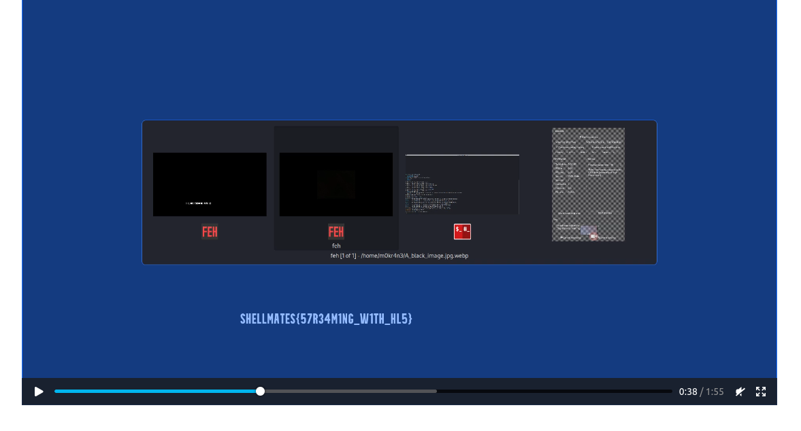

# Strom
Category: Forensics

## Description
Stroms have always been a sight to behold, with their powerful winds, thunderous roars, and stunning lightning displays. However, with technology, we can now witness the raw power of these natural events in new and immersive ways, allowing us to experience their majesty in a whole new light.

Author: `m0kr4n3`

Attachments: [strom.pcapng](attachments/strom.pcapng)

# Write-up
- To begin, we opened the attachment using Wireshark, a network protocol analyzer.
- Through careful analysis of the captured logs, we identified a series of HTTP network packets.
- To extract the HTTP contents, we utilized the `File -> Export Objects -> HTTP` menu in Wireshark and saved all the files.
- In order to easily access and view the extracted files, we set up a basic web server.
- By hosting the files on the web server, we were able to navigate to the corresponding web page.
- Upon visiting the web page, we were greeted with a simple interface featuring a media player positioned in the center.
- Initially, the media player appeared to be streaming content that displayed only a blank screen.
- However, upon closer inspection, we noticed that at the 38-second mark, several frames briefly revealed the flag.

Flag: `SHELLMATES{57R34M1NG_W1TH_HL5}`
