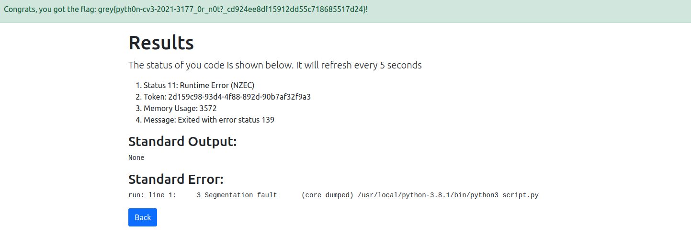

# CrashPython
Category: Misc

## Description
I am hosting an uncrashable Python executor API. Crash it to get the flag.

- Junhua

[http://34.124.157.94:5000](http://34.124.157.94:5000)

Attachments: [dist.zip](attachments/dist.zip)

## Write-up
- Upon examining the source code, it appeared that our user input was being sent to `judge0` for Python code execution.
- The flag would only be displayed if the following conditions were met:
```
status == 11 and message == "Exited with error status 139" and "Segmentation fault" in stderr
```
- The most straightforward approach was to send a `SIGSEV` signal to our own process.
- We could achieve this by using the following Python code:
```
import os
os.kill(os.getpid(), 11)
```
- However, since the word `os` was banned, we needed to modify the payload to meet the requirements:
```
__import__(chr(111)+chr(115)).kill(__import__(chr(111)+chr(115)).getpid(), 11)
```



Flag: `grey{pyth0n-cv3-2021-3177_0r_n0t?_cd924ee8df15912dd55c718685517d24}`

PS: Interesting article posted on Discord after the CTF, [https://codegolf.stackexchange.com/questions/4399/shortest-code-that-raises-a-sigsegv](https://codegolf.stackexchange.com/questions/4399/shortest-code-that-raises-a-sigsegv)
