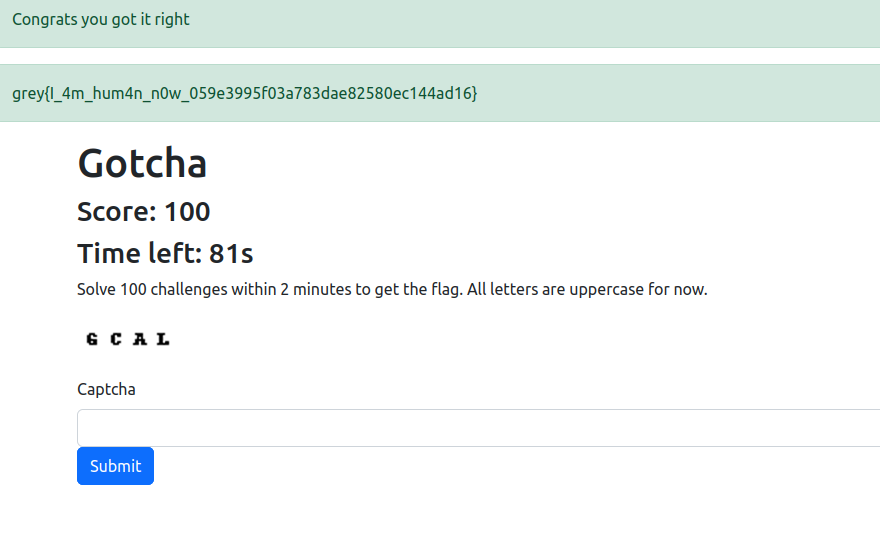

# Gotcha
Category: Misc

## Description
I have designed my own Captcha. If you solve it fast enough I'll give you my flag. Can you help me test it?

- Junhua

Link for Europe instance:

[http://34.116.250.170:5003](http://34.116.250.170:5003)

[http://34.124.157.94:5003](http://34.124.157.94:5003)

## Write-up
- Our objective was to solve 100 captchas within a time limit of 2 minutes.
- Since the captchas appeared to be simple, we decided to develop a script that utilizes `pytesseract` for Optical Character Recognition (OCR) and `Selenium` for web automation. The script would automatically submit each solved captcha.
- You can find the script we created for solving the captchas [here](solution/solve.py).

Flag: `grey{I_4m_hum4n_n0w_059e3995f03a783dae82580ec144ad16}`
