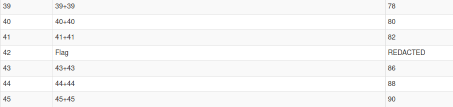
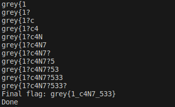
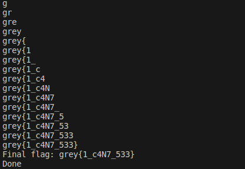

# 100 Questions 
Category: Web

## Description
I love doing practice papers! There are 100 questions, but the answers to some are more important than others...

[http://34.126.139.50:10512](http://34.126.139.50:10512)

Alternative URLs: 

[http://34.126.139.50:10513](http://34.126.139.50:10513)

[http://34.126.139.50:10514](http://34.126.139.50:10514)

[http://34.126.139.50:10515](http://34.126.139.50:10515)

Attachments: [dist.zip](attachments/dist.zip)

## Write-up
- Upon examining the source code, we discovered that this challenge revolved around a simple question and answer web application.
- The questions were fetched from a database in `database.db`, and the answers were checked against the same database.
- Since the `database.db` file was provided, it made sense to inspect its contents.
- We utilized a SQLite viewer, such as [https://inloop.github.io/sqlite-viewer/](https://inloop.github.io/sqlite-viewer/), to quickly examine the file's content.
- While inspecting the questions, we noticed that the answer to question `42` appeared to be the flag:



- Our objective was to extract the answer for question `42`.
- Here is the logic for answer verification:
```
# check answer
cursor = db.execute(f"SELECT * FROM QNA WHERE ID = {qn_id} AND Answer = '{ans}'")
result = cursor.fetchall()
correct = True if result != [] else False
```
- In essence, if the query produces a result, the answer is considered `Correct`.
- Since user input isn't validated, we can manipulate our query to return a row if the answer starts with a specific string.
- To accomplish this, we developed a Python script that systematically brute-forced every printable ASCII character, gradually appending it to our answer whenever the query yielded a result.
- The script used to leak the flag one character at a time can be found [here](solution/solve.py).



- The improved script without dirty fixes can be found [here](solution/solve2.py).



Flag: `grey{1_c4N7_533}`.
