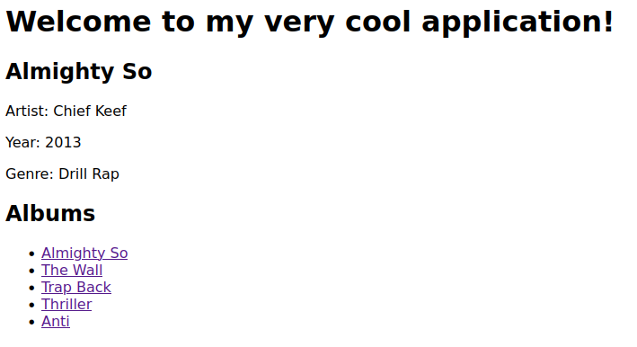
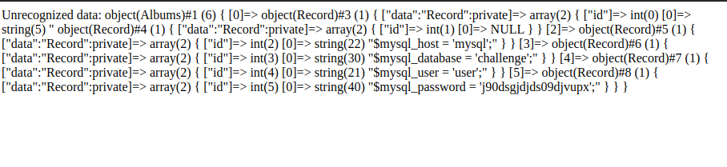
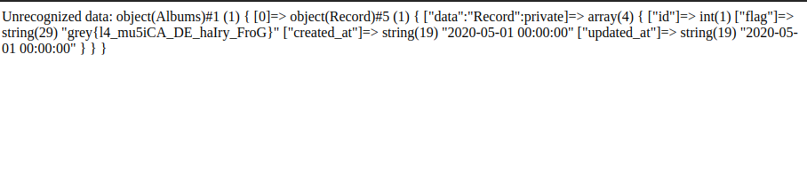

# View My Albums
Category: Web

## Description
My RateYourMusic competitor will take off any day now. I just need to add rating... and CSS... and images... and a bunch of other things

[http://34.124.157.94:10555/](http://34.124.157.94:10555/)

Attachments: [view-my-albums-dist.zip](attachments/view-my-albums-dist.zip)

## Write-up
- Upon accessing the provided URL, we encountered a straightforward web application that allows users to view album details.



- Our attention was drawn to the `prefs` cookie, which contained serialized user preferences.
- Upon analyzing the codebase, our initial approach involved attempting to exploit a Local File Inclusion (LFI) vulnerability. The line `<h1><?php include("greetings/$prefs->language"); ?></h1>` in `index.php` piqued our interest.
- This could be achieved by manipulating the `language` attribute within the serialized user `prefs`.
- However, our attempts were thwarted by the following check right after `prefs` deserialization:
```
if (!in_array($prefs->language, $allowed_langs)) {
    $prefs->language = "en";
}
```
- This check could be bypassed using type juggling, but we were only able to fix the language value as `true`, not an arbitrary value.
- After investing a considerable amount of time in exploring this potential vulnerability, we decided to explore other attack vectors.
- In the `Albums.php` file, we discovered that the `Albums` class implemented the `__debugInfo()` magic method. This meant that when we used `var_dump()` on an `Albums` object, we could access all the records in its `store`.
- Within the codebase, three types of stores were implemented: `MysqlRecordStore`, `JsonRecordStore`, and `CsvRecordStore`. The `MysqlRecordStore` can retrieve all records from the specified database, while the `JsonRecordStore` and `CsvRecordStore` can retrieve records from the specified file.
- Therefore, we crafted a serialized cookie that contained an instance of the `Albums` class initialized with a `CsvRecordStore` that read the contents of `db_creds.php`.
- Since `prefs` was an instance of `Albums` and not `UserPrefs`, the following code block would execute when accessing `index.php`:
```
if (isset($_COOKIE['prefs'])) {
    $prefs = unserialize($_COOKIE['prefs']);
    echo $prefs instanceof UserPrefs;
    if (!($prefs instanceof UserPrefs)) {
        echo "Unrecognized data: ";
        var_dump($prefs);
        exit;
    }
}
```
- This logic would result in a `var_dump()` of our malicious `Albums(CsvRecordStore)` object, leaking the contents of `db_creds.php`.



- With the leaked `db_creds.php`, we could then provide a malicious `Album(MysqlRecordStore)` object, where `MysqlRecordStore` was initialized with the leaked database credentials and the `flag` table.
- The subsequent `var_dump()` would reveal the entire contents of the `flag` table, exposing the flag.



- The PHP script to generate both payloads can be found [here](solution/solve.php).

Flag: `grey{l4_mu5iCA_DE_haIry_FroG}`
