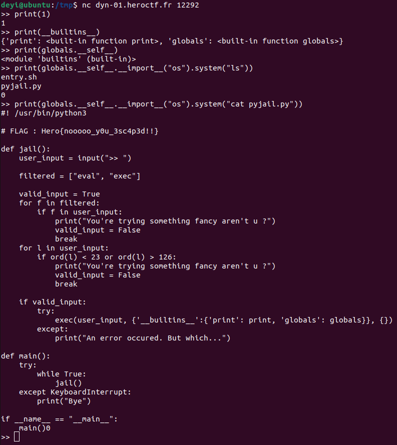

# Pyjail
Category: Misc

## Description
Welcome in jail. If it's not your first time, you should be out quickly. If it is your first rodeo, people have escape before you... I'm sure you'll be fine.

\> Deploy on [deploy.heroctf.fr](https://deploy.heroctf.fr/)

Format : **Hero{flag}**

Author : **Log_s**

## Write-up
- We began by executing the statement `print(1)`, which resulted in the output of `1`. This indicates that the input we provide is being `exec`-uted by the program.
- To understand the available built-in functions, we examined them by executing `print(__builtins__)`. It became evident that the built-ins were quite restricted in this Python environment, with only `print` and `globals` functions.
- However, we noticed that both the `print` and `globals` functions are part of the Python `builtins` module. This means we can reference the module from either of these two functions using the `__self__` attribute.
- With access to the `builtins` module, we could utilize the `__import__` function to import the `os` module. By calling the `system` function from `os` with the argument `ls`, we were able to execute the system command to list files.
- This action revealed the existence of a file named [`pyjail.py`](solution/pyjail.py). To view its contents, we modified the argument of the system function to `cat pyjail.py`.
- The command used was:
```
print(globals.__self__.__import__("os").system("cat pyjail.py"))
```



Flag: `Hero{nooooo_y0u_3sc4p3d!!}`
