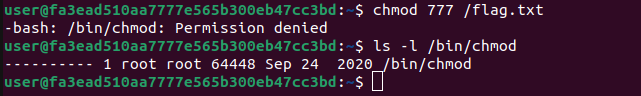

# Chm0d
Category: System

## Description
Catch-22: a problematic situation for which the only solution is denied by a circumstance inherent in the problem.

Credentials: `user:password123`

\> Deploy on [deploy.heroctf.fr](https://deploy.heroctf.fr/)

Format : **Hero{flag}**

Author : **Alol**

## Write-up
- Upon accessing the remote server, we discovered a flag file located at `/flag.txt`.
```
user@fa3ead510aa7777e565b300eb47cc3bd:~$ ls -l /
total 76
drwxr-xr-x   1 root root 4096 May 12 11:43 bin
drwxr-xr-x   2 root root 4096 Apr  2 11:55 boot
drwxr-xr-x   5 root root  340 May 16 07:15 dev
drwxr-xr-x   1 root root 4096 May 16 07:15 etc
----------   1 user user   40 May 12 11:43 flag.txt
drwxr-xr-x   1 root root 4096 May 12 11:43 home
drwxr-xr-x   1 root root 4096 May 12 11:43 lib
drwxr-xr-x   2 root root 4096 May  2 00:00 lib64
drwxr-xr-x   2 root root 4096 May  2 00:00 media
drwxr-xr-x   2 root root 4096 May  2 00:00 mnt
drwxr-xr-x   2 root root 4096 May  2 00:00 opt
dr-xr-xr-x 194 root root    0 May 16 07:15 proc
drwx------   2 root root 4096 May  2 00:00 root
drwxr-xr-x   1 root root 4096 May 16 07:16 run
drwxr-xr-x   1 root root 4096 May 12 11:43 sbin
drwxr-xr-x   2 root root 4096 May  2 00:00 srv
dr-xr-xr-x  13 root root    0 May 12 19:18 sys
drwxrwxrwt   1 root root 4096 May 12 11:43 tmp
drwxr-xr-x   1 root root 4096 May  2 00:00 usr
drwxr-xr-x   1 root root 4096 May  2 00:00 var
```
- Unfortunately, the permissions on the file were set to `000`, which means we were unable to read its contents. We attempted to change the permissions using the `chmod` utility, but to our dismay, the `chmod` utility itself had permissions set to `000` too.

- We came across a StackExchange [post](https://unix.stackexchange.com/a/83864) that explained the `chmod` utility is essentially a wrapper for the `chmod` system call, and any programming language with a `chmod` wrapper could achieve the same result.
- Fortunately, the server had a Perl interpreter, so we were able to utilize a Perl command to change the permissions of `/flag.txt`.
- The command we used was: `perl -e 'chmod 0755, "/flag.txt"'`.
- By executing this command, we successfully changed the permissions of `/flag.txt`, allowing us to read its contents and obtain the flag.

Flag: `Hero{chmod_1337_would_have_been_easier}`
