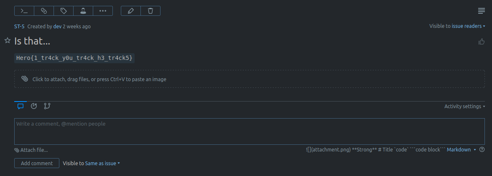

# IMF#1: Bug Hunting 
Category: System

## Description
Tracking bugs can be tidious, if you're not equiped with the right tools of course...

\> Deploy on [deploy.heroctf.fr](https://deploy.heroctf.fr/)

Format : **Hero{flag}**

Author : **Log_s**

## Write-up
- When we accessed the server through SSH (`ssh bob@dyn-02.heroctf.fr -p 11232`), we found a file named `welcome.txt` in the home directory of the user. The file contains the following content:
```
Hi Bob!

Welcome to our firm. I'm Dave, the tech lead here. We are going to be working together on our app.

Unfortunately, I will be on leave when you arrive. So take the first few days to get familiar with our infrastructure, and tools.

We are using YouTrack as our main issue tracker. The app runs on this machine (port 8080). We are both going to use the "dev" account at first, but I will create a separate account for you later. There is also an admin account, but that's for our boss. The credentials are: "dev:aff6d5527753386eaf09".

The development server with the codebase is offline for a few days due to a hardware failure on our hosting provider's side, but don't worry about that for now.

We also have a backup server, that is supposed to backup the main app's code (but it doesn't at the time) and also the YouTrack configuration and data.

Only I have an account to access it, but you won't need it. If you really have to see if everything is running fine, I made a little utility that run's on a web server.

The command to check the logs is:
curl backup

The first backups might be messed up a bit, a lot bigger than the rest, they occured while I was setting up YouTrack with it's administration account.

Hope you find everything to you liking, and welcome again!

Dave
```
- It appears that there is a web server running on port `8080` of the remote server.
- However, since we can only access the remote server through SSH port `11232`, we can establish another SSH connection with port forwarding to access the internal web server hosted on port `8080`.
- In a separate terminal, we can execute the following command: `ssh -L 1337:localhost:8080 bob@dyn-02.heroctf.fr -p 11232`.
- This command sets up a tunnel that forwards traffic from our local port `1337` to the remote server's port `8080`.
- With the tunnel established, we can now access the internal web server by opening our browser and navigating to [http://localhost:1337](http://localhost:1337).
- Upon accessing the URL, we are presented with an IntelliJ YouTrack dashboard.
- To gain access to the account, we can use the provided credentials in `welcome.txt`, which is `dev:aff6d5527753386eaf09`.
- After successfully logging in, we can see 5 issues on the dashboard.

- One of these issues contains the flag in the description.


Flag: `Hero{1_tr4ck_y0u_tr4ck_h3_tr4ck5}`
