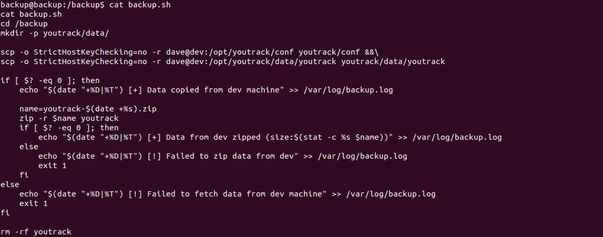
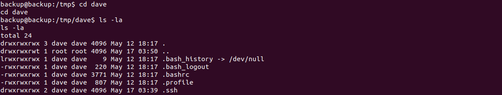
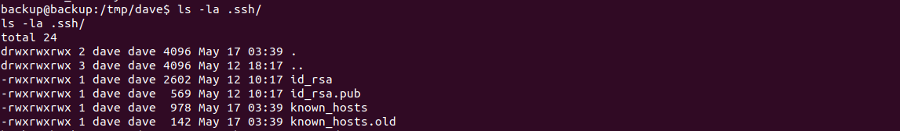

# IMF#3: admin:admin
Category: System

## Description
I already looked there didn't I ?

\> Deploy on [deploy.heroctf.fr](https://deploy.heroctf.fr/)

Format : **Hero{flag}**

Author : **Log_s**

## Write-up
- Following the completion of [IMF#2: A woman's weapon](../system-imf-2/README.md) and gaining access to the `/backup` directory, we set out to uncover the next step in the third challenge. Our objective was to find a way to access the `dave` user, whose home directory was located at `/home/dave` and potentially contained valuable information.
- During our investigation, we discovered the existence of the file `/backup/backup.sh`, which contained commands to copy the contents of `/opt/youtrack` to `/backup` using the `dave` user.

- Recognizing that the script was likely executed periodically by `cron` to perform backups of the `youtrack` content, we devised a plan to overwrite the entire file and exploit the `rsync` command. Our aim was to copy the files in `dave`'s home directory to `/tmp`, a location accessible to all users.
- To accomplish this, we executed the following command to overwrite the file: `echo "rsync -e \"ssh -o StrictHostKeyChecking=no\" -ar --chmod=Du=rwx,Dg=rwx,Do=rwx,Fu=rwx,Fg=rwx,Fo=rwx /home/dave/* /tmp/" > /tmp/backup.sh`.
- After a certain period of time, we obtained a list of all files in `/tmp`, including hidden files, from `dave`'s home directory.

- Among the leaked files, a notable discovery was dave's `.ssh` private key.

- To acquire this file, we used `scp` to securely copy it from the `backup` server to our local machine via the `dev` server.
- In a separate terminal, we authenticated ourselves to the remote server (`dev`) using `dave`'s private key. Before proceeding with authentication, we ensured that the private key file had the correct permissions by executing the command: `chmod 600 id_rsa`.
- The authentication command we used was: `ssh -i id_rsa dave@dyn-02.heroctf.fr -p 11232`.
- Once successfully authenticated on the remote `dev` server, we discovered a `flag.txt` file within `dave`'s home directory.
- By examining the content of the file, we unveiled the flag.

Flag: `Hero{pl41nt3xt_p4ssw0rd_4nd_s5t1_b1t_much_41nt_1t?}`
