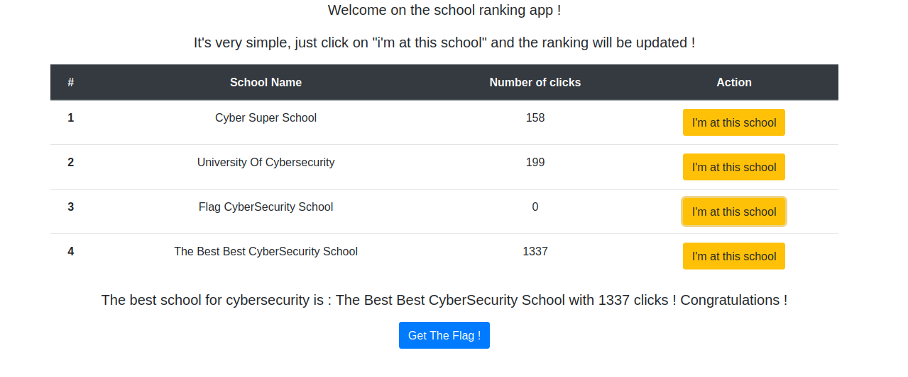
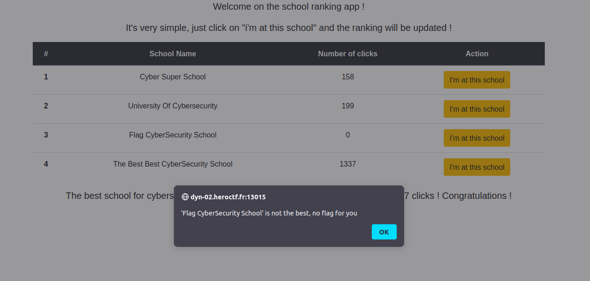
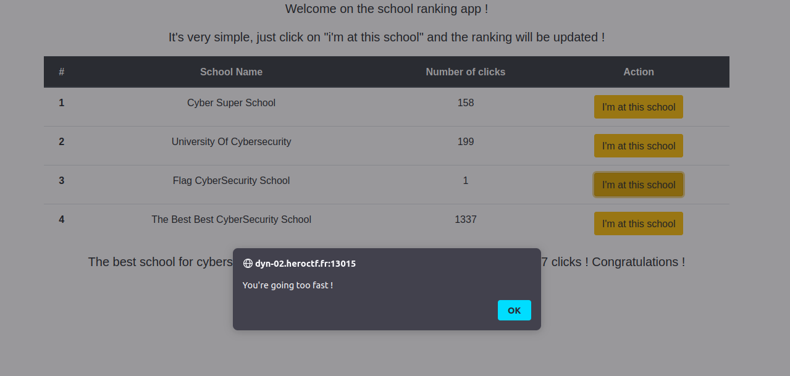
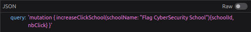

# Best Schools
Category: Web

## Description
An anonymous company has decided to publish a ranking of the best schools, and it is based on the number of clicks on a button! Make sure you get the 'Flag CyberSecurity School' in first place and you'll get your reward!

\> Deploy on [deploy.heroctf.fr](https://deploy.heroctf.fr/)

Format : **Hero{flag}**

Author : **Worty**

## Write-up
- Upon navigating to the challenge URL, we are presented with a page displaying a button labeled `Get Flag`.

- Our objective is to obtain the highest number of clicks possible before we can click on the `Get Flag` button.

However, there is a "rate limit" in place, preventing us from continuously providing multiple clicks.

- By inspecting the network traffic, we discovered that each click results in a GraphQL request being sent to the server.

- After studying a resource on exploiting GraphQL, available [here](https://blog.assetnote.io/2021/08/29/exploiting-graphql/), we considered using batch GraphQL queries as a potential approach.
- Our goal was to achieve `1338` clicks or more, so we developed a Python script to generate a batch of queries. The [script]((solution/solve.py)) generates a batch of `1338 / 2` click queries. As such, we need to send the batch twice.
- To execute the batch queries, we used the following command:
```
python3 solve.py | curl -X POST -H "Content-Type: application/json" -d @- -o /dev/null -s "http://dyn-02.heroctf.fr:13015/graphql"
```
- After sending two batches of queries, we successfully obtained a sufficient number of clicks to access the flag through the `Get Flag` button.

Flag: `Hero{gr4phql_b4tch1ng_t0_byp4ss_r4t3_l1m1t_!!}`
