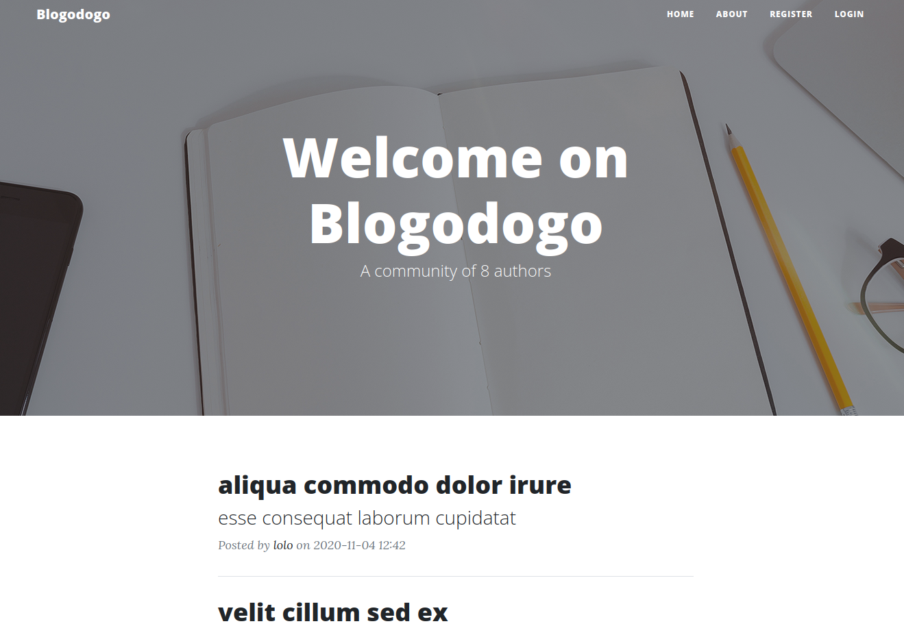

# Blogodogo 1/2 
Category: Web

## Description
Try to see the content of the secret note of the administator user.

You can deploy an instance on : [https://deploy.heroctf.fr](https://deploy.heroctf.fr)

Format : **Hero{flag}**

Author : **xanhacks**

Attachments: [blog.zip](attachments/blog.zip)

## Write-up
- After deploying an instance and accessing the provided URL, we discovered a blog interface displaying various posts.

- Upon further exploration, we came across the `admin`'s posts and noticed that the first post made was a secret draft.

- Unfortunately, we encountered an error message when attempting to access the draft, which stated, `You cannot see the draft of other users.`.
- To investigate further, we examined the source code, specifically the `./src/blogodogo/routes.py` file, where we found an interesting post preview route.
```
@bp_routes.route("/post/preview/<string:hash_preview>", methods=["GET"])
def preview_post(hash_preview):
    post = Posts.query.filter_by(hash_preview=hash_preview).first()

    if post:
        author = Authors.query.filter_by(id=post.author_id).first()
        return render_template("pages/post.html", title="Preview a post", post=post, author=author)

    flash("Unable to find the corresponding post.", "warning")
    return redirect(url_for('bp_routes.index'))
```
- Unlike the other routes, this particular route did not have a `@login_required` decorator, indicating that it was accessible to anyone.
- We realized that we could leverage this route to preview the `admin`'s secret draft post.
- However, accessing the route required a value from the respective post's `hash_preview` field.
- To understand how this value was generated, we examined the route responsible for adding a post.
```
@bp_routes.route("/add", methods=["GET", "POST"])
@login_required
def add_post():
    form = AddPostForm()
    if form.validate_on_submit():
        result = Posts.query.filter_by(slug=form.slug.data).first()
        if result:
            flash("Slug already exists.", "warning")
            return redirect(url_for('bp_routes.add_post')) 

        post = Posts(
            title=form.title.data,
            subtitle=form.subtitle.data,
            slug=form.slug.data,
            content=form.content.data,
            draft=True,
            hash_preview=generate_hash(),
            author_id=current_user.id
        )
        db.session.add(post)
        db.session.commit()
        flash("Post successfully added.", "success")
        return redirect(url_for('bp_routes.view_post', slug=post.slug))

    return render_template("pages/add_post.html", title="Add a post", form=form)
```
- From the provided logic, we observed that `hash_preview` was derived from the `generate_hash()` function. The function's logic is shown below:
```
def generate_hash(timestamp=None):
    """Generate hash for post preview."""
    if timestamp:
        seed(timestamp)
    else:
        seed(int(datetime.now().timestamp()))

    return randbytes(32).hex()
```
- Since the `timestamp` parameter was always `None`, the seed was initialized as `int(datetime.now().timestamp())`.
- By casting to an `int`, the seed was consistently set to the nearest second.
- Considering the draft was posted at `2:53 AM`, we devised a brute-force strategy to determine the seed's `timestamp` for the entire minute. We would iterate through each second within that minute and make requests to the post preview route to identify the successful `timestamp`.
- The script we developed for this purpose can be found [here](solution/solve.py).
- After discovering the appropriate URL by identifying the successful `timestamp`, we navigated to the page and successfully obtained the flag.

Flag: `Hero{pr3333vi333wwwws_5973791}`
