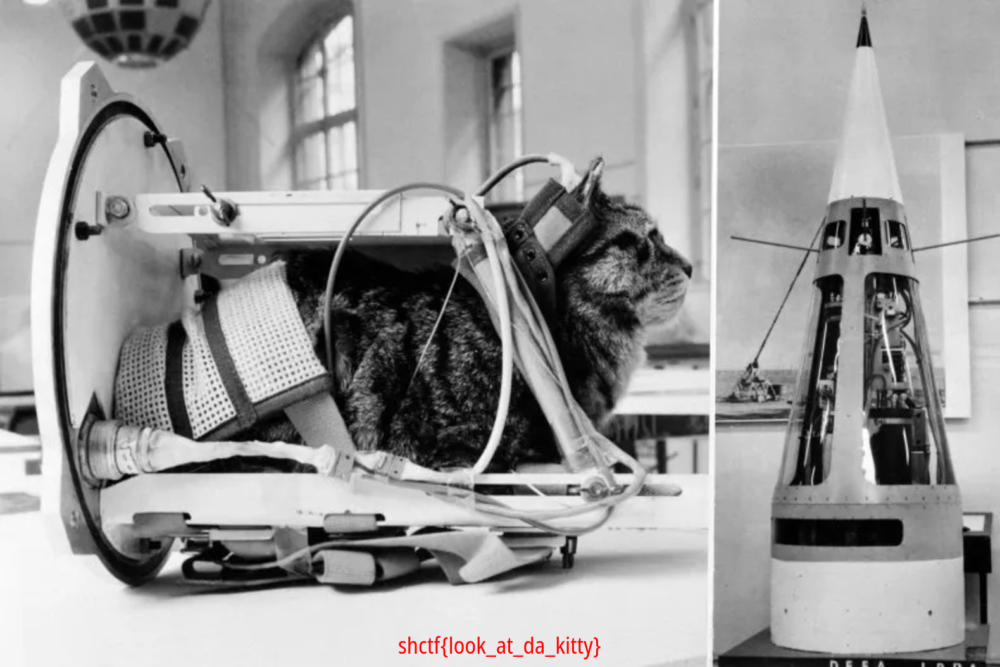

# Félicette
Category: Forensics

## Description
a cat in space, eating a croissant, while starting a revolution.

MD5 (chall.jpg.pcap) = 8408b3176d9f974c03f919d36d48770a

Attachments: [chall.jpg.pcap](attachments/chall.jpg.pcap)

## Write-up
- Each ICMP packet contains a `data` field.
- Upon examining the `data` field of the initial ICMP packets, it was found to correspond to the byte array: `ff d8 ff 00`.
- This byte array aligns with the magic number commonly associated with JPEG files. It suggests that each ICMP packet's `data` field might represent a single byte from a JPEG file.
- It is possible to export these ICMP `data`bytes and save it as an image file.
- To retrieve the data field from all ICMP packets and store it in a file, the [script](solution/solve.sh) or the following command can be executed:
```
tshark -r chall.jpg.pcap -Y "icmp" -T fields -e data | tr -d '\n' | xxd -r -p > cat.jpg
````

[`cat.jpg`](solution/cat.jpg)


Flag: `shctf{look_at_da_kitty}`
