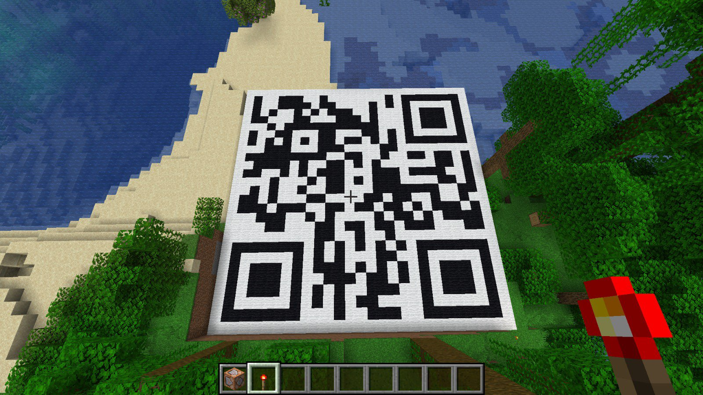

# Gamer Redux
Category: Misc

## Description
Author: `nhwn`

My friend, David, was last online 7 years ago, but it appears he left behind a weird file for me. Can you recover his message?

Attachments: [gamer-redux.zip](attachments/gamer-redux.zip)

## Write-up
- This challenge assumes the usage of a Minecraft client.
- The provided file appears to contain a Minecraft command for a command block.
- Create a command block in the Minecraft world and set its command to the content of the file. Activate it using redstone.
- The Minecraft world will render an area that resembles a QR code.
- Only the "black" pixels of the QR code are visible when the player is in close proximity to that specific tile, while the rest appear as "white" pixels.
- By analyzing the code, we can observe the use of `black_wools` and `white_wools`. It seems that `black_wool` is set when the player is within a certain range, otherwise it is automatically set to `white_wool`.
- By modifying the `white_wool` to `black_wool`, the entire QR code is revealed.
- Decoding the QR code reveals the flag.

[`qr.jpg`](solution/qr.jpg)

Flag: `gigem{cr33p3r_4w_m4444n}`
