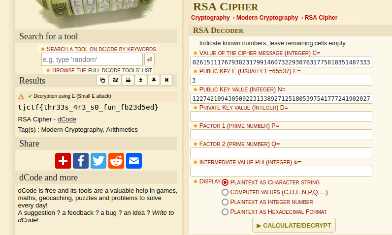

# baby-rsa
Category: Crypto

## Description
small numbers for small messages

Attachments: [output.txt](attachments/output.txt)

## Write-up
The given challenge provides us with the necessary information to carry out the decryption process.

By utilizing [Dcode's RSA Cipher](https://www.dcode.fr/rsa-cipher), we can easily decrypt the encrypted message and obtain the flag.

Flag: `tjctf{thr33s_4r3_s0_fun_fb23d5ed}`
