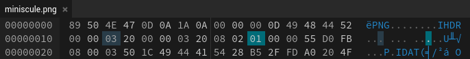

# miniscule
Category: Forensics

## Description
my friend did something really weird to my picture! she swears that it's the same image, but it's half the size and won't open! can you figure out why it's broken?

Attachments: [miniscule.png](attachments/miniscule.png)

## Write-up
Based on the challenge description, it appears that the attached file is broken or corrupted. It seems necessary to manually fix the PNG chunks in order to resolve the issue. To accomplish this, it is crucial to have knowledge about the PNG file specification. An excellent resource is available at [https://ctf-wiki.mahaloz.re/misc/picture/png/](https://ctf-wiki.mahaloz.re/misc/picture/png/).

To determine the specific problem with the PNG file, we can execute the command `pngcheck -v miniscule.png` to perform a verification.

This is the following output:

```
File: miniscule.png (217173 bytes)
  chunk IHDR at offset 0x0000c, length 13:  invalid compression method (1)
ERRORS DETECTED in miniscule.png
```

Upon examining the image file using a hex editor, it becomes evident that the compression method specified in the `IHDR` chunk was mistakenly set to `1`.



However, the correct default value for this field should be `0`. To rectify this issue, it is necessary to modify the compression method to `0` and update the checksum for the `IDHR` chunk. Consequently, the hex representation of the modified image should resemble the following:


After implementing these changes, we can once again execute the `pngcheck` command to validate the image for any remaining errors.

```
File: miniscule.png (217173 bytes)
  chunk IHDR at offset 0x0000c, length 13
    800 x 800 image, 24-bit RGB, non-interlaced
  chunk IDAT at offset 0x00025, length 217116
    zlib: compression header fails checksum
    zlib: inflate error = -3 (data error)
ERRORS DETECTED in miniscule.png
```

Upon analyzing the provided output, it becomes apparent that there are two main issues with the image. Firstly, the checksum in the `IDAT` chunk is incorrect. Secondly, there is a zlib inflate problem.

A closer examination of the `IDAT` chunk, as highlighted in the following image, reveals that it begins with the bytes `28 B5 2F FD`.


Referring to [https://en.wikipedia.org/wiki/List_of_file_signatures](https://en.wikipedia.org/wiki/List_of_file_signatures), this byte sequence corresponds to the ZST file type, which indicates Zstandard compressed data.

To rectify the image, the following steps need to be followed:
1. Decompress the ZST data.
2. Deflate the decompressed data using Zlib.
3. Insert the deflated data into the PNG's `IDAT` chunk.
4. Correct the `IDAT` chunk's size and checksum.

Since it is known that the ZST data consists of `217116` or `0x0003501C` bytes, these number of bytes can be exported starting from the address `0x29`. The exported ZST file can be accessed [here](solution/exported.zst).

To decompress the ZST data, the command `zstd -d exported.zst` can be executed, resulting in the generation of a decompressed file named `exported`.

Next, the decompressed data should be deflated using Zlib with the command `zlib-flate -compress < exported > deflated`, which produces a file named `deflated`. The command `wc -c deflated` reveals that the deflated Zlib data comprises `262269` or `0x0004007D` bytes.

Subsequently, the deflated data should be manually inserted back into the PNG file, ensuring that the `IDAT` chunk size is set to `0x0004007D` and the checksum is updated to `0x632D6392`.

With these modifications implemented, the broken image should be fixed. The corrected image file can be accessed [here](solution/miniscule-fixed.png).


Flag: `tjctf{zlib_compression_bad_9c8b342}`
