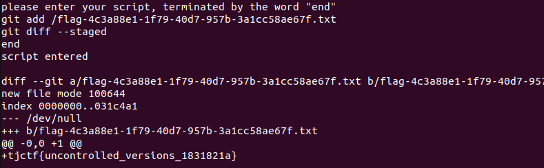

# gish
Category: Misc

## Description
git + sh = gish

[Instancer](https://instancer.tjctf.org/challenge/gish)

Attachments: [bin.zip](attachments/bin.zip)

## Write-up
After extracting the provided attachment and analyzing the `Dockerfile`, it becomes apparent that the flag is located at `/flag-$(cat /proc/sys/kernel/random/uuid).txt`.

Examining the `run.py` script, it is evident that the program accepts a batch of commands separated by newlines. Each command line must begin with `git`, and the batch concludes with a line containing only `end`.

To retrieve the flag using only `git` commands, a strategy can be devised involving two steps, each requiring a separate session on the server.

The first step entails creating an empty `.git` repository at the root directory (`/`) by executing the command `git init /`. Subsequently, running `git status` will display all the unstaged files, which should include the flag file, thereby disclosing the complete filename.

Here are the commands for the first step:

```
git config --global user.name "test"
git config --global user.email "test@test.com"
git init /
git status
end
```

Executing these commands will produce the following output:


Moving on to the second step, the flag file needs to be added to the staging area, and the changes made in staging should be viewed using `git diff --staged`.

Here are the commands for the second step:

```
git add /flag-4c3a88e1-1f79-40d7-957b-3a1cc58ae67f.txt
git diff --staged
end
```

Executing these commands will result in the following output:



Flag: `tjctf{uncontrolled_versions_1831821a}`
