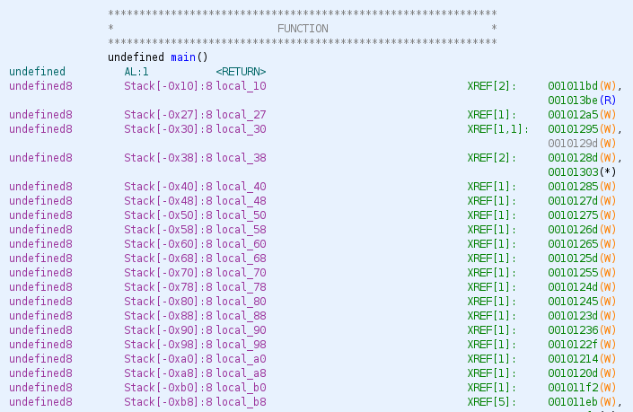
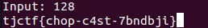

# flip-out
Category: Pwn

## Description
My friend made this app with a flag in it...

`nc tjc.tf 31601`

Attachments: [chall](attachments/chall)

## Write-up
Let's proceed with analyzing the binary using Ghidra. This is the generated pseudocode for the `main()` function:

```
undefined8 main(void)

{
  uint uVar1;
  FILE *__stream;
  undefined8 uVar2;
  long in_FS_OFFSET;
  undefined8 local_b8;
  undefined8 local_b0;
  undefined8 local_a8;
  undefined8 local_a0;
  undefined8 local_98;
  undefined8 local_90;
  undefined8 local_88;
  undefined8 local_80;
  undefined8 local_78;
  undefined8 local_70;
  undefined8 local_68;
  undefined8 local_60;
  undefined8 local_58;
  undefined8 local_50;
  undefined8 local_48;
  undefined8 local_40;
  undefined8 local_38;
  undefined local_30;
  undefined7 uStack_2f;
  undefined uStack_28;
  undefined8 local_27;
  long local_10;
  
  local_10 = *(long *)(in_FS_OFFSET + 0x28);
  setbuf(stdout,(char *)0x0);
  local_b8 = 0x20676e6968746f4e;
  local_b0 = 0x6820656573206f74;
  local_a8 = 0x4e202e2e2e657265;
  local_a0 = 0x7420676e6968746f;
  local_98 = 0x656820656573206f;
  local_90 = 0x2e2e2e6572;
  local_88 = 0;
  local_80 = 0;
  local_78 = 0;
  local_70 = 0;
  local_68 = 0;
  local_60 = 0;
  local_58 = 0;
  local_50 = 0;
  local_48 = 0;
  local_40 = 0;
  local_38 = 0;
  local_30 = 0;
  uStack_2f = 0;
  uStack_28 = 0;
  local_27 = 0;
  __stream = fopen("flag.txt","r");
  if (__stream == (FILE *)0x0) {
    printf("Cannot find flag.txt.");
    uVar2 = 1;
  }
  else {
    fgets((char *)&local_38,0x19,__stream);
    fclose(__stream);
    printf("Input: ");
    __isoc99_scanf(&DAT_0010202d,&local_b8);
    uVar1 = atoi((char *)&local_b8);
    if ((int)uVar1 < 129) {
      printf("%s",(long)&local_b8 + (long)(int)(uVar1 & 0xff));
      uVar2 = 0;
    }
    else {
      uVar2 = 0;
    }
  }
  if (local_10 != *(long *)(in_FS_OFFSET + 0x28)) {
                    /* WARNING: Subroutine does not return */
    __stack_chk_fail();
  }
  return uVar2;
}
```

From the pseudocode, we can observe that the program reads the content of the `flag.txt` file and stores it in the `local_38` variable.

Additionally, the user input is read and saved into the `local_b8` variable. It is then casted as a signed integer and stored in `uVar1`. If `uVar1` is less than `129`, the program will print the string content at the memory location `&local_b8 + (uVar1 & 0xff)`. The `uVar1 & 0xff` operation ensures that the offset added to `local_b8` is at most 1 byte in size. Since our input should be less than `129`, we can ignore the `& 0xff` part.

To make the program print the string content stored in the `local_38` variable, i.e. our flag, we need to ensure that `&local_b8 + uVar1 == &local_38`. The stack layout in the following image illustrates the variables involved:



By observing the difference from `&local_b8` to `&local_38` (which is `0x80` or `128`), we can conclude that specifying the input as `128` will yield the flag.



Flag: `tjctf{chop-c4st-7bndbji}`
