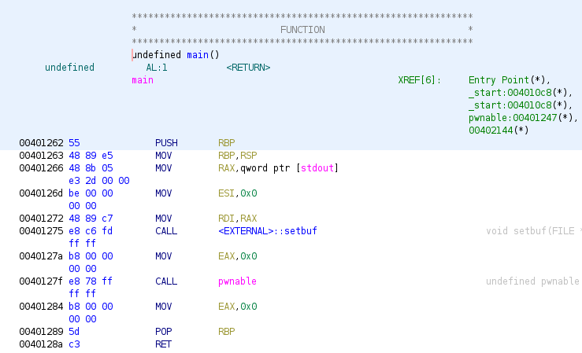
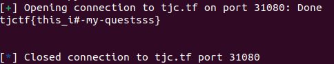

# groppling-hook
Category: Pwn

## Description
Gropple to safety?

`nc tjc.tf 31080`

Attachments: [main.c](attachments/main.c), [out](attachments/out), [Dockerfile](attachments/Dockerfile)

## Write-up
From the provided files, it appears that the `Dockerfile` does not contain any particularly interesting information, and the `out` file seems to be the compiled version of `main.c`.

This is the `file` output of `out`:

```
out: ELF 64-bit LSB executable, x86-64, version 1 (SYSV), dynamically linked, interpreter /lib64/ld-linux-x86-64.so.2, BuildID[sha1]=b7d22afe68311e0fc37476096b1ba580d502242f, for GNU/Linux 4.4.0, not stripped
```

And this is the `checksec` output of `out`:

```
Arch:     amd64-64-little
RELRO:    Partial RELRO
Stack:    No canary found
NX:       NX enabled
PIE:      No PIE (0x400000)
```

Let's focus on examining `main.c`:

```
#include "stdio.h"
#include <stdlib.h>

void laugh()
{
	printf("ROP detected and denied...\n");
	exit(2);
}

void win()
{
	FILE *fptr;
	char buf[28];
	// Open a file in read mode
	fptr = fopen("flag.txt", "r");
	fgets(buf, 28, fptr);
	puts(buf);
}

void pwnable()
{
	char buffer[10];
	printf(" > ");
	fflush(stdout);

	read(0, (char *)buffer, 56);

	/* Check ret */
	__asm__ __volatile__("add $0x18, %rsp;"
						 "pop %rax;"
						 "cmp $0x0401262, %rax;"
						 "jle EXIT;"
						 "cmp $0x040128a, %rax;"
						 "jg EXIT;"
						 "jmp DONE;"
						 "EXIT:"
						 "call laugh;"
						 "DONE: push %rax;");
	return;
}

int main()
{
	setbuf(stdout, NULL);

	pwnable();

	return 0;
}
```

In the `main()` function, we can observe that it executes `pwnable()`, which reads user input, performs some assembly instructions, and then returns to `main()`. It seems that our ultimate goal is to call `win()`, but the normal execution flow does not reach that point.

Upon closer inspection of the `pwnable()` function, we can identify a stack overflow vulnerability. It allows reading up to `56` bytes, while the buffer can only hold a maximum of `10` bytes.

If we analyze the assembly instructions that are executed before `pwnable()` returns, we notice that it checks our return address and redirects to `laugh()` if our return address falls outside the range of `0x0401262` to `0x040128a`. Therefore, our return address must be within that range. In Ghidra, we can see that this range covers the entire `main()` function.



Considering that the `main()` function contains a `ret` instruction, which essentially performs "pop rip" followed by "jmp rip", we can make `pwnable()` return to `0x040128a`, and the `ret` instruction at `0x040128a` will return to `win()` at `0x004011b3`.

Thus, our input should consist of:
1. `18` bytes of `nops` to overflow the entire buffer and overwrite the saved `rbp`.
2. The address `0x040128a`, which corresponds to the `ret` instruction in `main()` where `pwnable()` will return to.
3. The address `0x004011b3`, which marks the beginning of `win()` and is the location where the `ret` instruction in `main()` will return to.

The above input has been written as a pwntool script, which can be found [here](solution/solve.py).

When running the script, we obtain our flag:



Flag: `tjctf{this_i#-my-questsss}`
