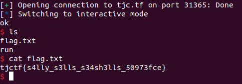

# shelly
Category: Pwn

## Description
sally sells seashells by the seashore sally sells seashells by the seashore sally sells seashells by the seashore sally sells seashells by the seashore sally sells seashells by the seashore sally sells seashells by the seashore sally sells seashells by the seashore sally sells seashells by the seashore

`nc tjc.tf 31365`

Attachments: [chall](attachments/chall)

## Write-up
This is the `file` output of `chall`:

```
chall: ELF 64-bit LSB executable, x86-64, version 1 (SYSV), dynamically linked, interpreter /lib64/ld-linux-x86-64.so.2, BuildID[sha1]=b3f4f8c1f3f8da66609c33583b929fca79145905, for GNU/Linux 4.4.0, not stripped
```

And this is the `checksec` output of `chall`:

```
Arch:     amd64-64-little
RELRO:    Partial RELRO
Stack:    No canary found
NX:       NX disabled
PIE:      No PIE (0x400000)
RWX:      Has RWX segments
```

Let's analyze the program with Ghidra. The following snippet is the pseudocode generated for `main()`:

```
undefined8 main(void)

{
  char local_108 [256];
  
  setbuf(stdout,(char *)0x0);
  printf("0x%lx\n",local_108);
  fgets(local_108,512,stdin);
  i = 0;
  while( true ) {
    if ((510 < i) || (local_108[i] == '\0')) {
      puts("ok");
      return 0;
    }
    if ((local_108[i] == '\x0f') && (local_108[i + 1] == '\x05')) break;
    i = i + 1;
  }
  puts("nonono");
                    /* WARNING: Subroutine does not return */
  exit(1);
}
```

After analyzing the provided code, we can identify a buffer called `local_108` with a size of `256` bytes. The program first prints the address of the buffer, before it reads user input of up to `512` bytes and stores it in `local_108`. This immediately reveals a stack overflow vulnerability.

Since the stack is executable (as indicated by `NX disabled` in the `checksec` output), we can inject our shellcode into the stack and return to the start of our shellcode. However, there is a check in the code that looks for the presence of the `syscall` instruction:

```
if ((local_108[i] == '\x0f') && (local_108[i + 1] == '\x05')) break;
```

Fortunately, we can bypass this check by supplying a null byte (`0x00`) at the beginning of our input. The condition `(510 < i) || (local_108[i] == '\0') `allows us to prematurely return and avoid the `syscall` check. Since `fgets` does not terminate in the presence of a null byte, we do not need to worry about prefixing our input with a null byte.

In summary, our input should consist of:
1. A `0x00` byte to trigger the premature return and bypass the `syscall` check.
2. Our shellcode.
3. The remaining bytes needed to overwrite the saved `rbp` and the return address.

The above input has been written as a pwntool script, which can be found [here](solution/solve.py).

When running the script, we obtain our flag:



Flag: `tjctf{s4lly_s3lls_s34sh3lls_50973fce}`
