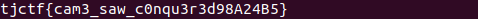

# maybe
Category: Rev

## Description
is this an easy rev challenge?? maybe .... just maybe ...

Attachments: [chall](attachments/chall)

## Write-up
The following code snippet is the pseudocode of `main()` in the `chall` binary generated by Ghidra:

```
undefined8 main(void)

{
  size_t sVar1;
  undefined8 uVar2;
  long in_FS_OFFSET;
  int local_6c;
  byte local_68 [72];
  long local_20;
  
  local_20 = *(long *)(in_FS_OFFSET + 0x28);
  puts("Enter your flag");
  fgets((char *)local_68,64,stdin);
  sVar1 = strlen((char *)local_68);
  if (sVar1 == 33) {
    local_6c = 4;
    while( true ) {
      sVar1 = strlen((char *)local_68);
      if (sVar1 - 1 <= (ulong)(long)local_6c) break;
      if ((local_68[local_6c] ^ local_68[local_6c + -4]) != flag[local_6c + -4]) {
        puts("you\'re def wrong smh");
        uVar2 = 1;
        goto LAB_00101257;
      }
      local_6c = local_6c + 1;
    }
    puts("you might be right??? you might be wrong.... who knows?");
    uVar2 = 0;
  }
  else {
    puts("bad");
    uVar2 = 1;
  }
LAB_00101257:
  if (local_20 != *(long *)(in_FS_OFFSET + 0x28)) {
                    /* WARNING: Subroutine does not return */
    __stack_chk_fail();
  }
  return uVar2;
}
```

From the provided code, it is evident that the program prompts the user to enter a flag, which can be up to `64` bytes in length, storing the input in the `local_68` buffer. However, subsequent conditions check if the length of the user input is exactly `33`. If it is not, the program terminates.

When the user input has a length of `33`, the program iterates over each character using `local_6c` as the iterator, starting from the fourth index of the input. The program proceeds to the next iteration only if the following condition is satisfied:

```
(local_68[local_6c] ^ local_68[local_6c + -4]) == flag[local_6c + -4]
```

The flag buffer is defined as follows:

```
flag = [0x12, 0x11, 0x00, 0x15, 0x0b, 0x48, 0x3c, 0x12, 0x0c, 0x44, 0x00, 0x10, 0x51, 0x19, 0x2e, 0x16, 0x03, 0x1c, 0x42, 0x11, 0x0a, 0x4a, 0x72, 0x56, 0x0d, 0x7a, 0x74, 0x4f, 0x00]
```

To obtain the flag, we can utilize the Z3 theorem prover to define the constraints of our problem and solve for the input that satisfies these constraints.

You can find the Python script that utilizes constraint solving with Z3 [here](solution/solve.py).

Upon running the script, we obtain the flag:



Flag: `tjctf{cam3_saw_c0nqu3r3d98A24B5}`
