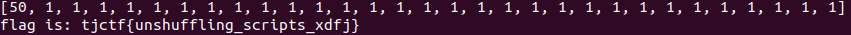

# scramble
Category: Rev

## Description
oops, i think my siblings messed with the line order a little. The first three lines are given

Attachments: [chal.py](attachments/chal.py)

## Write-up
My methodology for solving this problem involves grouping lines of code that share the same dependencies, specifically those that use the same variables. Within each group, I prioritize rearranging the lines in a logical manner, ensuring that lines without dependencies are placed first.

By following this approach, I aim to obtain the final "unscrambled" script. You can conveniently find the unscrambled script [here](solution/chal-fixed.py).

Flag: `tjctf{unshuffling_scripts_xdfj}`
