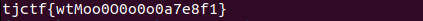

# wtmoo
Category: Rev

## Description
My cow keeps eating all my flags...

Attachments: [chall](attachments/chall)

## Write-up

The following code snippet is the pseudocode of `main()` in the `chall` binary generated by Ghidra:

```
undefined8 main(void)

{
  int iVar1;
  size_t sVar2;
  undefined8 uVar3;
  long in_FS_OFFSET;
  int local_60;
  undefined4 local_5c;
  char local_58 [32];
  char local_38 [40];
  long local_10;
  
  local_10 = *(long *)(in_FS_OFFSET + 0x28);
  printf("Enter text: ");
  fgets(local_58,32,stdin);
  sVar2 = strlen(local_58);
  local_58[sVar2 - 1] = '\0';
  strcpy(local_38,local_58);
  sVar2 = strlen(local_58);
  local_5c = (int)sVar2;
  local_60 = 0;
  do {
    if (local_5c <= local_60) {
      iVar1 = strcmp(local_58,"8.\'8*{;8m33[o[3[3[%\")#*\\}");
      if (iVar1 == 0) {
        printf("< %s >\n        \\   ^__^\n         \\  (oo)\\_______\n            (__)\\       )\\/ \\\n                ||----w |\n                ||     ||\n"
               ,local_38);
      }
      else {
        printf("< %s >\n        \\   ^__^\n         \\  (oo)\\_______\n            (__)\\       )\\/ \\\n                ||----w |\n                ||     ||\n"
               ,local_58);
      }
      uVar3 = 0;
LAB_00101427:
      if (local_10 != *(long *)(in_FS_OFFSET + 0x28)) {
                    /* WARNING: Subroutine does not return */
        __stack_chk_fail();
      }
      return uVar3;
    }
    if ((local_58[local_60] < 'a') || ('z' < local_58[local_60])) {
      if ((local_58[local_60] < 'A') || ('Z' < local_58[local_60])) {
        if ((local_58[local_60] < '0') || ('4' < local_58[local_60])) {
          if ((local_58[local_60] < '5') || ('9' < local_58[local_60])) {
            if ((local_58[local_60] != '{') && (local_58[local_60] != '}')) {
              puts("wtmoo is this guess???");
              printf("%c\n",(ulong)(uint)(int)local_58[local_60]);
              uVar3 = 1;
              goto LAB_00101427;
            }
          }
          else {
            local_58[local_60] = local_58[local_60] + -21;
          }
        }
        else {
          local_58[local_60] = local_58[local_60] + 43;
        }
      }
      else {
        local_58[local_60] = local_58[local_60] + 32;
      }
    }
    else {
      local_58[local_60] = local_58[local_60] + -60;
    }
    local_60 = local_60 + 1;
  } while( true );
}
```

Based on the provided pseudocode for `main()`, we can observe that it reads user input and stores it in the buffer `local_58`. Then, it iterates through each character in `local_58` and applies certain manipulations based on the character's ASCII value.

Here are the conditions and outcomes for each character:
1. If the character falls within the ASCII range of lowercase letters `a` to `z`, it subtracts `60` from the character.
2. If the character falls within the ASCII range of uppercase letters `A` to `Z`, it adds `32` to the character.
3. If the character falls within the ASCII range of digits `0` to `4`, it adds `43` to the character.
4. If the character falls within the ASCII range of digits `5` to `9`, it subtracts `21` from the character.
5. If the character falls within the ASCII range of `{` to `}`, it remains unchanged.
6. If the character doesn't meet any of the above conditions, the check fails and the program exits.

At the end, the program checks if the resulting buffer `local_58` is equal to the string `8.\'8*{;8m33[o[3[3[%\")#*\\}`. Therefore, if we provide the flag as input, it should undergo the manipulation process and result in that string.

We can write a script to reverse this process by iterating through each character in the resulting string and applying the reverse manipulation based on the conditions mentioned. At the end, we will obtain our flag.

The Python script that automates the reversing process can be found [here](solution/solve.py).



Flag: `tjctf{wtMoo0O0o0o0a7e8f1}`
