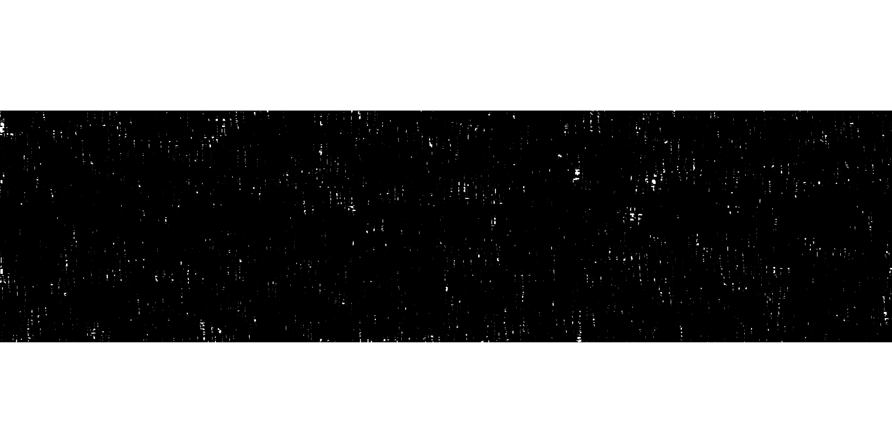

# hi
Category: Web

## Description
hi

[hi.tjc.tf](hi.tjc.tf)

## Write-up
Upon navigating to [https://hi.tjc.tf/](https://hi.tjc.tf/), we are greeted with the webpage shown in the screenshot:



There is nothing much to it. The following code snippet is the page's source:

```
<!DOCTYPE html>
<html lang="en">

<head>
    <meta charset="UTF-8">
    <meta http-equiv="X-UA-Compatible" content="IE=edge">
    <meta name="viewport" content="width=device-width, initial-scale=1.0">
    <title>hi</title>

    <style>
        body {
            margin: 0;
        }

        img,
        canvas {
            position: absolute;
            top: 0;
            left: 0;
            width: 100%;
            height: 100%;
            object-fit: contain;
        }

        img {
            z-index: -1;
        }

    </style>
</head>

<body>
    <canvas id="canvas"></canvas>

    

    <script>
        const canvas = document.getElementById('canvas');
        const ctx = canvas.getContext('2d');

        canvas.width = window.innerWidth;
        canvas.height = window.innerHeight;

        ctx.font = "48px serif";
        for (let i = 0; i < window.innerWidth * window.innerHeight / 100; i++) {
            ctx.fillText('hi', Math.random() * (window.innerWidth + 48) - 24, Math.random() * (window.innerHeight + 48) - 24);
        }
    </script>
</body>

</html>
```

When examining the source code of the webpage, we find a reference to an image. By accessing the image directly through its URL [https://hi.tjc.tf/secret-b888c3f2.svg](https://hi.tjc.tf/secret-b888c3f2.svg), we are able to view the flag, as depicted in the following screenshot:


Flag: `tjctf{pretty_canvas_577f7045}`
