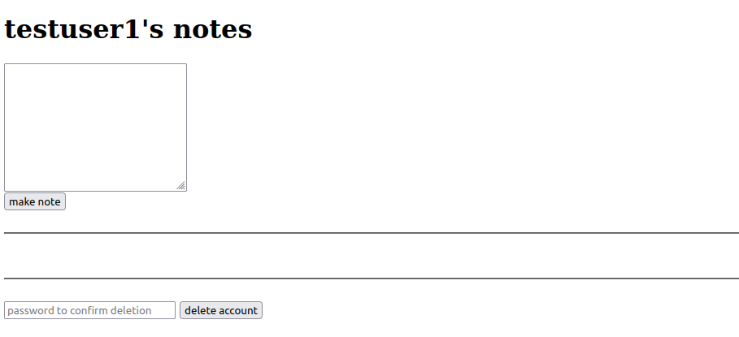
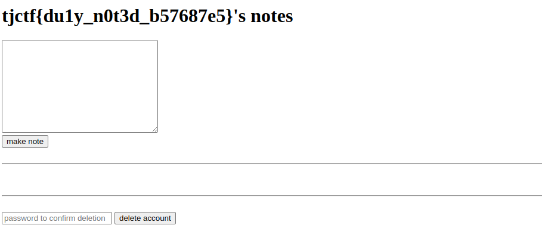

# notes
Category: Web

## Description
obligatory notes site?

[Instancer](https://instancer.tjctf.org/challenge/notes)

Attachments: [server.zip](attachments/server.zip)

## Write-up
When accessing the webpage via the URL, we encounter the login page:


We proceed to the registration page and successfully create an account, which redirects us to the index page:



On this page, it appears that we can create personal notes and delete our own account.

Let's analyze the source code.

We first come across the `/` endpoint, which renders the user's information, personal notes, and potentially the flag:

```
app.get('/', (req, res) => {
    if (!req.session.user_id) {
        return res.redirect('/login?e=login%20to%20make%20notes');
    }

    pool.query(`SELECT * FROM notes WHERE user_id = '${req.session.user_id}';`, (err, results) => {
        pool.query(`SELECT * FROM users WHERE id = '${req.session.user_id}';`, (err, users) => {
            res.render('index', { notes: results, user: users[0] || { username: flag } });
        });
    });
});
```

Upon examining the code, it seems to retrieve the current session user's information and personal notes, which are then used to render the index page. However, if the second query does not return any results (i.e. invalid user), the index page will render the flag as a user instead. This endpoint can only proceed to the SQL queries if it is a valid session, so we cannot simply navigate to this URL to obtain the flag.

Next, let's look at how the account deletion is handled:

```
app.post('/user/delete', (req, res) => {
    const id = req.session.user_id;

    pool.query(`DELETE FROM users WHERE id = '${id}' AND password = '${req.body.password}';`, (err, results) => {

        pool.query(`SELECT * FROM users WHERE id = '${id}' AND password != '${req.body.password}';`, (err, results) => {

            if (err)
                return res.redirect('/?e=an%20error%20occurred');

            if (results.length !== 0)
                return res.redirect('/?e=incorrect%20password');

            sessions[id].forEach(session => {
                session.destroy();
            });

            pool.query(`DELETE FROM notes WHERE user_id = '${id}';`, (err, results) => {
                if (err) {
                    res.json({ success: false, message: err });
                } else {
                    res.redirect('/');
                }
            });
        });
    });
});
```

This endpoint verifies the validity of the current session user before proceeding to delete the user matching the current session's user ID and the specified password. Afterward, it destroys the **current** user's session and deletes their personal notes. It is evident that these queries lack proper input validation and sanitization, making it susceptible to manipulation through malicious inputs (i.e. SQL injections).

More importantly, there seems to be a flaw in the backend logic. We can create two users, namely `testuser1` and `testuser2`, authenticate them on the server, and in the context of `testuser1`, attempt to delete `testuser2` through SQL injection. This action will delete the user information, personal notes, and the session information of the **current session user** (i.e., `testuser1`). Consequently, the `testuser2` account will no longer exist in the database, but its session will still persist. When we refresh the page as `testuser2`, it should fulfill the necessary requirements and display the flag.

The SQL query to delete another user's account can be formulated as follows:

```
' OR password = '<ANOTHER USER'S PASSWORD>
```

In summary, the steps to obtain the flag are as follows:
1. In browser 1, create `testuser1` with the password `testpw1`.
2. In browser 2, create `testuser2` with the password `testpw2`.
3. In browser 1, attempt to delete `testuser2` from the perspective of `testuser1` using SQL injection. Specify the query `' OR password = 'testpw2` in the password field to delete the account. This action removes the `testuser2` user but retains the `testuser2` session.
4. In browser 2, refresh the page, and the flag should be displayed.



Flag: `tjctf{du1y_n0t3d_b57687e5}`
