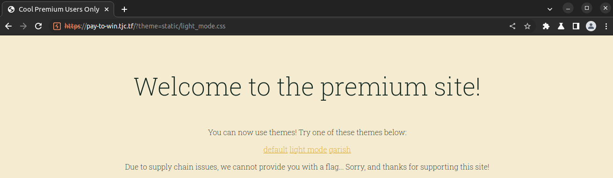

# pay-to-win
Category: Web

## Description
This service is wayyyyy to expensive. I can't afford that! I did hear that premium users get a flag though...

[pay-to-win.tjc.tf](https://pay-to-win.tjc.tf/)

Attachments: [server.zip](attachments/server.zip)

## Write-up
When we access the provided URL, we are presented with the following web page:


After entering a random name and logging in, we are redirected to the following page:


At first glance, there doesn't seem to be anything particularly interesting on this page. Therefore, we proceed to analyze the underlying codebase for potential vulnerabilities.

Upon examining the web application's code, we identify two noteworthy endpoints.

The first one is the index (`/`) route, which handles the main page:

```
@app.route('/')
def index():
    if request.cookies.get('data') is None or request.cookies.get('hash') is None:
        return redirect('/login')

    data = request.cookies.get('data')
    decoded = b64decode(data)
    data_hash = request.cookies.get('hash')
    payload = json.loads(decoded)

    if payload['username'] not in users:
        resp = make_response(redirect('/login'))
        resp.set_cookie('data', '', expires=0)
        resp.set_cookie('hash', '', expires=0)
        return resp

    actual_hash = hash(data + users[payload['username']])

    if data_hash != actual_hash:
        return redirect('/login')

    if payload['user_type'] == 'premium':
        theme_name = request.args.get('theme') or 'static/premium.css'
        return render_template('premium.jinja', theme_to_use=open(theme_name).read())
    else:
        return render_template('basic.jinja')
```

From the code snippet above, we can infer the following behavior of the index page:
1. It checks if the user is authenticated by verifying the presence of the `data` and `hash` cookies. If they are not set, the user is redirected to the login page (`/login`).
2. It creates and validates the login data with expected hash value.
3. If the validation fails, the user is redirected to the login page.
4. If the validation succeeds, the user is redirected to a page specific to their `user_type` as specified in the login data.

The second interesting endpoint is related to the login process:

```
@app.route('/login', methods=['POST'])
def post_login():
    username = request.form['username']

    if username not in users:
        users[username] = hex(random.getrandbits(24))[2:]

    resp = make_response(redirect('/'))
    data = {
        "username": username,
        "user_type": "basic"
    }

    b64data = b64encode(json.dumps(data).encode())
    data_hash = hash(b64data.decode() + users[username])
    resp.set_cookie('data', b64data)
    resp.set_cookie('hash', data_hash)
    return resp
```

In this code snippet, we can observe the creation of the `data` and `hash` fields in the cookie when a user logs in. Notably, each user is assigned a random hexadecimal value, presumably representing their user ID. This ID is then used, along with the login data, during the hashing process.

```
    users[username] = hex(random.getrandbits(24))[2:]
...
data_hash = hash(b64data.decode() + users[username])
```

Additionally, we learn that by default, when a user logs in, their `user_type` is set to `basic`. Our objective is to manipulate the login data to have a `user_type` of `premium` instead of `basic`, which will grant us access to the premium page.

To achieve this, we need to modify the login data and specify a `user_type` of `premium` without compromising the integrity of the data which will result in a hash mismatch and failed validation. This can be accomplished by logging in with a custom hash value corresponding to the manipulated login data and user's ID which were needed during the hashing process.

Given the final hash value obtained after logging in, we can perform a brute-force attack on the 24-bit (2^24 iterations) user ID and check against the final hash. The iteration that matches the hash corresponds is the user's ID.


Since we know the final hash value sent after logining, we can do a bruteforce of 24 bits (2 ** 24 iterations), and check against our final hash. The iteration that matches will be our user's id.

The Python script [get-user-id.py](solution/get-user-id.py) automates the brute-forcing process to determine the user's ID based on the provided hash.

Output of `get-user-id.py`:

```
User ID: 9213427
Done
```

With the user's ID retrieved, we can generate the premium cookie content using [get-payload.py](solution/get-payload.py), which allows us to escalate the user's privilege.

Output of `get-payload.py`

```
Base64 login data: eyJ1c2VybmFtZSI6ICJ0ZXN0IiwgInVzZXJfdHlwZSI6ICJwcmVtaXVtIn0=
Premium hash: cfeb63173a8e2df60c554c2da769d5fb9cdf72fa0b0da54444bce99a63c37f4b
```

We can modify our cookie with the obtained information to gain premium access.


Upon accessing the premium page, we notice that it appears to have limited functionality, mainly the ability to change themes.




By examining the URLs of the above two images, we observe that they reference local files using the `theme` query parameter. This suggests a potential vulnerability related to local file inclusion.

To verify this vulnerability, we analyze the premium page template:

```
<!DOCTYPE html>
<html lang="en">
<style> {{ theme_to_use }} </style>
<head>
  <meta charset="UTF-8">
  <meta http-equiv="X-UA-Compatible" content="IE=edge">
  <meta name="viewport" content="width=device-width, initial-scale=1.0">
  <title>Cool Premium Users Only</title>
</head>
<body>
  <p class="title">Welcome to the premium site!<p>
  <p>You can now use themes! Try one of these themes below:</p>
  <a href='/?theme=static/premium.css'>default</a>  <a href='/?theme=static/light_mode.css'>light mode</a>  <a href='/?theme=static/garish.css'>garish</a>
  <p>Due to supply chain issues, we cannot provide you with a flag... Sorry, and thanks for supporting this site!</p>
</body>
</html>
```

Based on the code snippet, the endpoint renders the template using `return render_template('premium.jinja', theme_to_use=open(theme_name).read())`, where `theme_to_use` is populated with the contents of the specified file.

By specifying the path to our flag file, we can retrieve the following image:


Upon inspecting the page source, we find our flag injected between the `<style> `tags:


Flag: `tjctf{not_random_enough_64831eff}`
