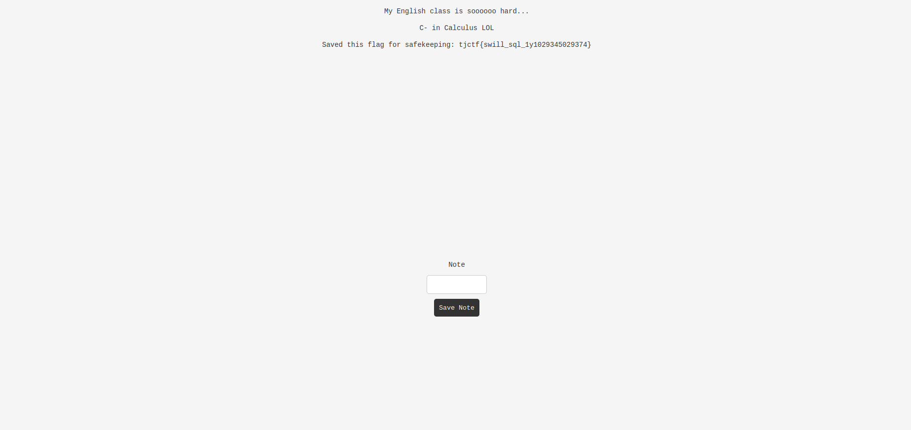

# swill-squill
Category: Web

## Description
ezsql

[Instancer](https://instancer.tjctf.org/challenge/swill-squill)

Attachments: [server.zip](attachments/server.zip)

## Write-up
Upon visiting the website, we are presented with the webpage shown in the screenshot:


After examining the provided codebase, we discovered that the flag is stored as an admin's note in the database, as indicated in the `app.py` file:

```
def create_db():
    conn = sqlite3.connect(':memory:')
    c = conn.cursor()

    c.execute(
        'CREATE TABLE users (name text, grade text)')

    c.execute(
        'CREATE TABLE notes (description text, owner text)')

    c.execute('INSERT INTO users VALUES (?, ?)',
              ('admin', '12'))
    c.execute('INSERT INTO notes VALUES (?, ?)',
              ('My English class is soooooo hard...', 'admin'))
    c.execute('INSERT INTO notes VALUES (?, ?)',
              ('C- in Calculus LOL', 'admin'))
    c.execute('INSERT INTO notes VALUES (?, ?)',
              ("Saved this flag for safekeeping: "+flag, 'admin'))

    conn.commit()

    return conn
```

The codebase also includes two endpoints for user registration and rendering user posts:

```

@app.route('/register', methods=['POST'])
def post_register():
    name = request.form['name']
    grade = request.form['grade']

    if name == 'admin':
        return make_response(redirect('/'))

    res = make_response(redirect('/api'))
    res.set_cookie("jwt_auth", generate_token(name))

    c = conn.cursor()
    c.execute("SELECT * FROM users WHERE name == '"+name+"';")

    if c.fetchall():
        return res

    c = conn.cursor()
    c.execute('INSERT INTO users VALUES (?, ?)',
              (name, grade))
    conn.commit()

    return res


@app.route('/api', methods=['GET'])
def api():
    name = load_token(request.cookies.get('jwt_auth'))['name']

    c = conn.cursor()

    string = "SELECT description FROM notes WHERE owner == '" + name + "';"
    c.execute(string)

    return render_template("notes.jinja", notes=[html.escape(a[0]) for a in c.fetchall()])
```

Both of these endpoints are vulnerable to SQL injections due to the lack of input validation. By registering with the input `' OR '1'='1`, we can exploit this vulnerability. The server will generate a JWT token with our malicious name, bypassing the following check and redirecting us to `/api`:

```
c.execute("SELECT * FROM users WHERE name == '"+name+"';")

if c.fetchall():
    return res
```

Furthermore, when redirected to the `/api` endpoint to retrieve the user's posts, the server loads our JWT token and uses our name as part of an SQL query, unintentionally retrieving all notes from the database:

```
name = load_token(request.cookies.get('jwt_auth'))['name']

c = conn.cursor()

string = "SELECT description FROM notes WHERE owner == '" + name + "';"
c.execute(string)
```



Flag: `tjctf{swill_sql_1y1029345029374}`
