# Level 01 - Navigating the Digital Labyrinth

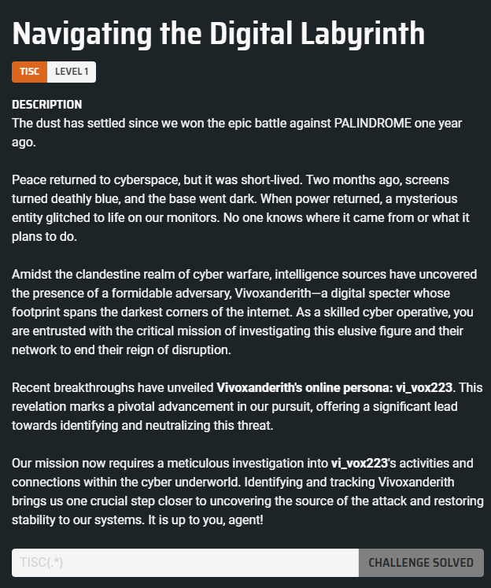

## Solution

From the challenge description, it seems we need to trace the digital footprint of user `vi_vox223`. Tools like [WhatsMyName](https://whatsmyname.app/) can quickly provide an overview of platforms used by this user.

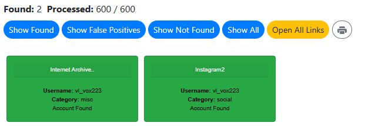

By navigating to the user's Instagram profile and reviewing their stories/highlights, I found some interesting posts:

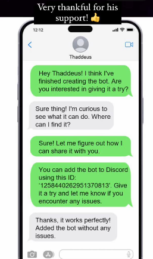

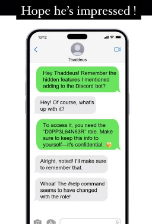

These posts revealed a Discord Bot ID (`1258440262951370813`) and a role (`D0PP3L64N63R`) used to interact with hidden features.

Following the [discord.js](https://discordjs.guide/preparations/adding-your-bot-to-servers.html#bot-invite-links) guide, we can create a test Discord server and attempt to add the bot. This can be done by navigating to the following link:
[https://discord.com/api/oauth2/authorize?client_id=1258440262951370813&permissions=0&scope=bot%20applications.commands](https://discord.com/api/oauth2/authorize?client_id=1258440262951370813&permissions=0&scope=bot%20applications.commands)

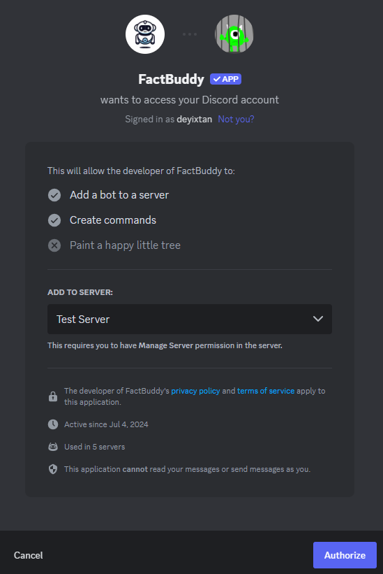

After successfully adding the bot, we can interact with it in our Discord server:

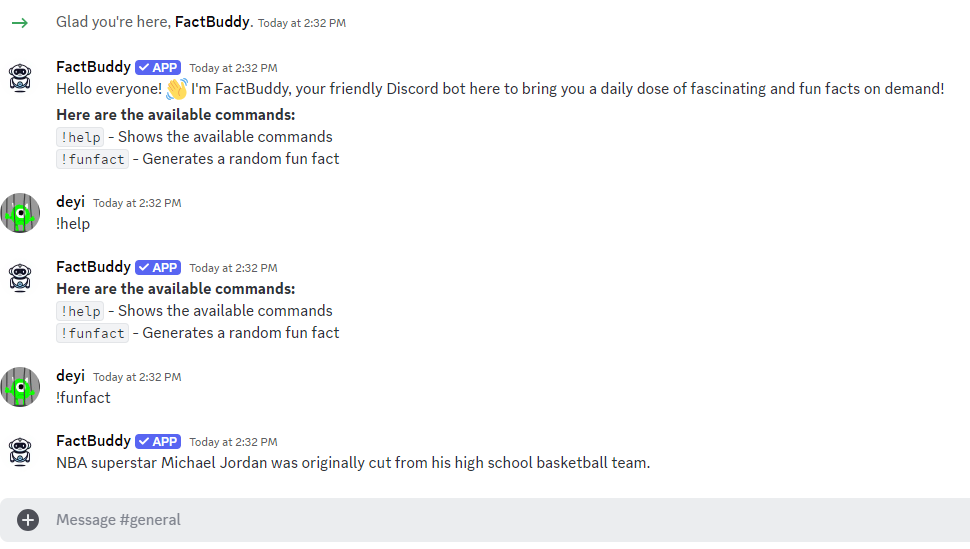

Next, we update our server settings to add the `D0PP3L64N63R` role to our user and check for hidden features:

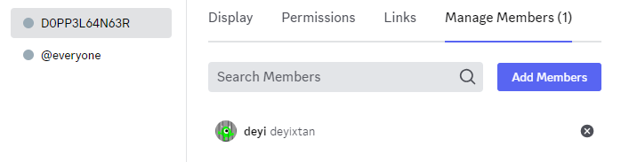

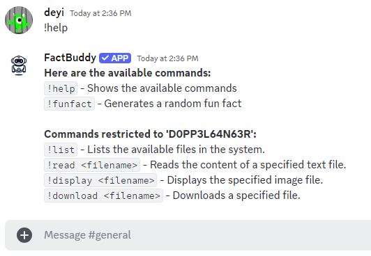

Listing the available files yielded the following result:

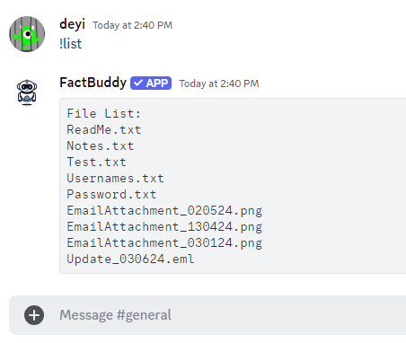

Using the `!read` and `!display` commands on `.txt` and `.png` files provided no useful information. However, the file `Update_030624.eml` was downloaded using `!download Update_030624.eml`. I uploaded this file to EML Reader to parse and view the email message:

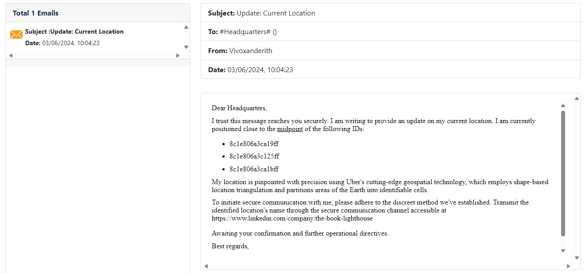

The email refers to Uber's cutting-edge geospatial technology, which is likely a reference to [H3Geo](https://h3geo.org/). By supplying the three geospatial points (`8c1e806a3ca19ff`, `8c1e806a3c125ff`, `8c1e806a3ca1bff`) into the website, we obtain the following location:

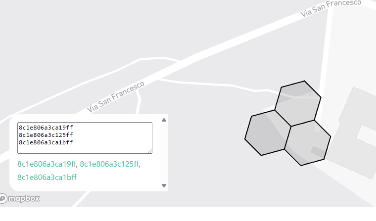

Cross-referencing this location with Google Maps, the midpoint corresponds to **Quercia secolare**.

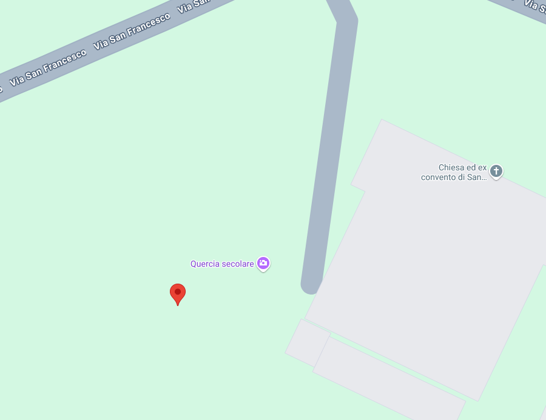

The next step involves finding the secure communication channel, which is mentioned in a post on [The Book Lighthouse](https://www.linkedin.com/company/the-book-lighthouse) LinkedIn page. The post refers to a Telegram Bot with the handle `@TBL_DictioNaryBot`. By sending the midpoint name (Quercia secolare) to the Telegram Bot, we receive the flag.

The flag is `TISC{OS1N7_Cyb3r_InV35t1g4t0r_uAhf3n}`.
