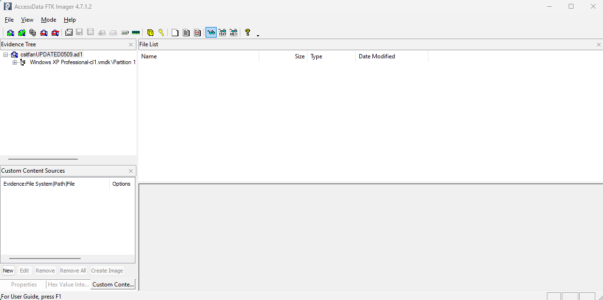
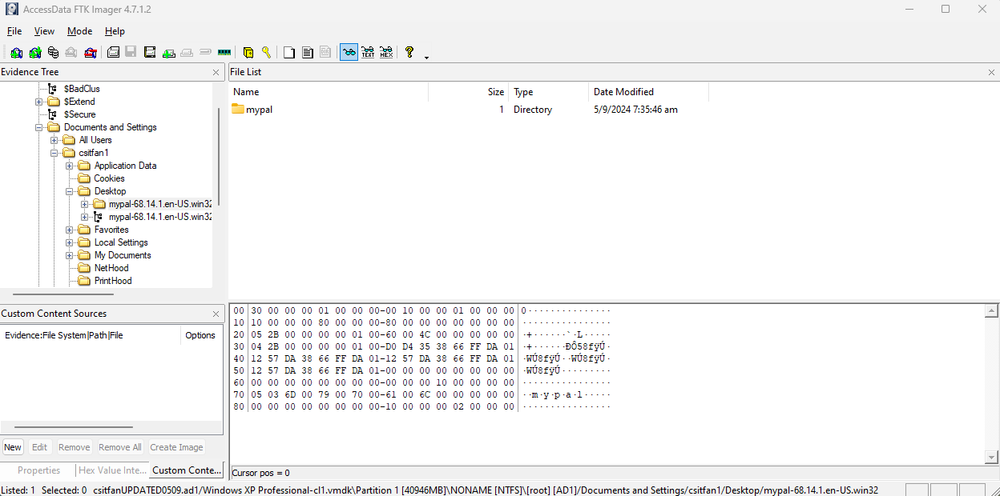
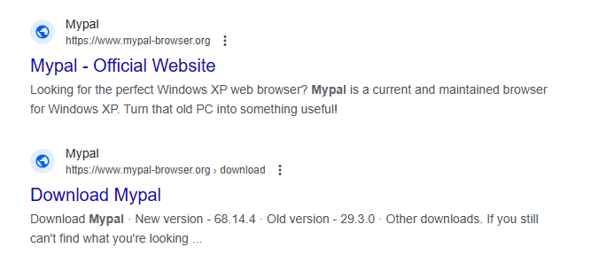
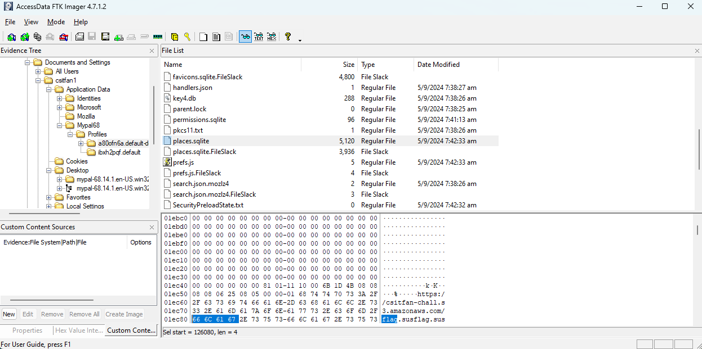
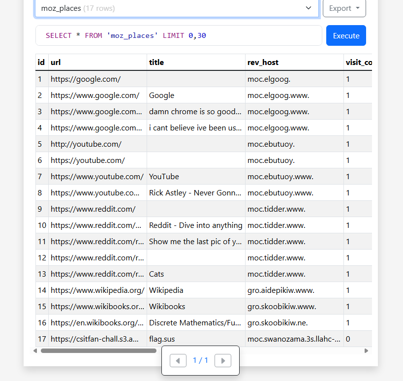

# Level 03 - Digging Up History


## Preparing the Environment

We are provided with an encrypted archive `disk.zip` and a `metadata.txt` file that contains the archive's checksum as well as the key to decrypt it.

After extracting the archive, we obtain a file named `csitfanUPDATED0509.ad1`. The `.ad1` file extension indicates that it is a forensic image format compatible with FTK Imager. To proceed with forensic analysis, we can open FTK Imager, navigate to `File -> Decrypt AD1 Image`, and use the key provided in `metadata.txt` to decrypt the `.ad1` file.



## Forensics Analysis

The challenge title suggests focusing on "history," which narrows down the investigation to areas like browser history or log files that record past user activities.

After exploring the disk, a user named `csitfan1` was found. In the user's home directory, there was a folder called `mypal`.



A quick search revealed that Mypal is a web browser designed for Windows XP:



Digging deeper, I located the application data for the Mypal browser at `Documents and Settings/csitfan1/Application Data/mypal`. Inside this directory, there were two user profiles, but only one appeared to be actively used. I then searched through the files for `TISC{` and `flag` within the file contents. The search returned a hit in the `places.sqlite` file.



I exported the sqlite file and uploaded it to [https://inloop.github.io/sqlite-viewer/](https://inloop.github.io/sqlite-viewer/) for further investigation. In the `moz_places` table, the last entry seemed suspicious, containing a link to [https://csitfan-chall.s3.amazonaws.com/flag.sus](https://csitfan-chall.s3.amazonaws.com/flag.sus).



Navigating to this link downloaded a file called `flag.sus`, which contained the following encoded content:

```
VElTQ3t0cnUzXzFudDNybjN0X2gxc3QwcjEzXzg0NDU2MzJwcTc4ZGZuM3N9
```

After decoding the content using Base64, the flag was revealed.

The flag is: `TISC{tru3_1nt3rn3t_h1st0r13_8445632pq78dfn3s}`
