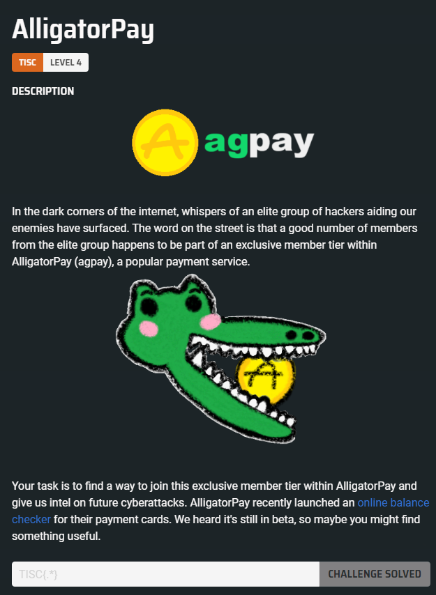
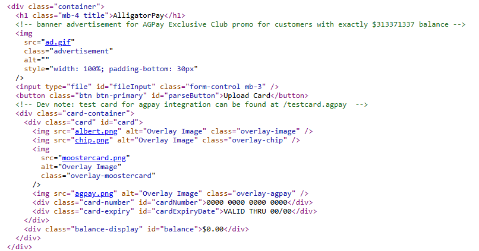
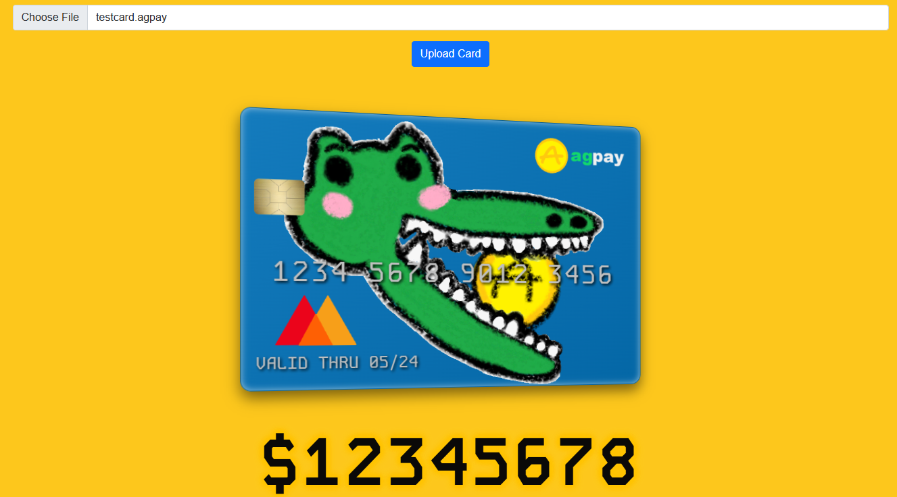
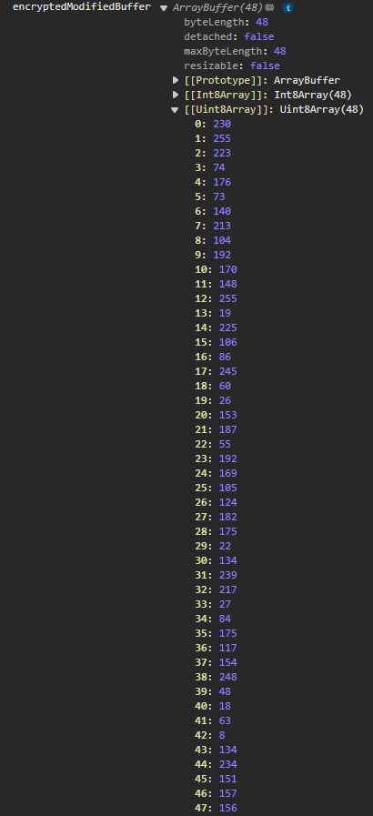
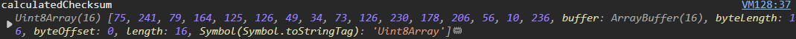

# Level 04 - AlligatorPay



## Solution

This is the challenge website:


We are provided with a test card, as indicated by a comment found in the page source:


Upon uploading the test card:


The card is parsed by the website, and the card details are then rendered.

Here is the logic for parsing the AlligatorPay card:

```js
async function parseFile() {
  const fileInput = document.getElementById("fileInput");
  const file = fileInput.files[0];
  if (!file) {
    alert("Please select a file");
    return;
  }

  const arrayBuffer = await file.arrayBuffer();
  const dataView = new DataView(arrayBuffer);

  const signature = getString(dataView, 0, 5);
  if (signature !== "AGPAY") {
    alert("Invalid Card");
    return;
  }
  const version = getString(dataView, 5, 2);
  const encryptionKey = new Uint8Array(arrayBuffer.slice(7, 39));
  const reserved = new Uint8Array(arrayBuffer.slice(39, 49));

  const footerSignature = getString(dataView, arrayBuffer.byteLength - 22, 6);
  if (footerSignature !== "ENDAGP") {
    alert("Invalid Card");
    return;
  }
  const checksum = new Uint8Array(arrayBuffer.slice(arrayBuffer.byteLength - 16, arrayBuffer.byteLength));

  const iv = new Uint8Array(arrayBuffer.slice(49, 65));
  const encryptedData = new Uint8Array(arrayBuffer.slice(65, arrayBuffer.byteLength - 22));

  const calculatedChecksum = hexToBytes(SparkMD5.ArrayBuffer.hash(new Uint8Array([...iv, ...encryptedData])));

  if (!arrayEquals(calculatedChecksum, checksum)) {
    alert("Invalid Card");
    return;
  }

  const decryptedData = await decryptData(encryptedData, encryptionKey, iv);

  const cardNumber = getString(decryptedData, 0, 16);
  const cardExpiryDate = decryptedData.getUint32(20, false);
  const balance = decryptedData.getBigUint64(24, false);

  document.getElementById("cardNumber").textContent = formatCardNumber(cardNumber);
  document.getElementById("cardExpiryDate").textContent = "VALID THRU " + formatDate(new Date(cardExpiryDate * 1000));
  document.getElementById("balance").textContent = "$" + balance.toString();
  console.log(balance);
  if (balance == 313371337) {
    function arrayBufferToBase64(buffer) {
      let binary = "";
      const bytes = new Uint8Array(buffer);
      const len = bytes.byteLength;
      for (let i = 0; i < len; i++) {
        binary += String.fromCharCode(bytes[i]);
      }
      return window.btoa(binary);
    }

    const base64CardData = arrayBufferToBase64(arrayBuffer);

    const formData = new FormData();
    formData.append("data", base64CardData);

    try {
      const response = await fetch("submit", {
        method: "POST",
        body: formData,
      });

      const result = await response.json();
      if (result.success) {
        alert(result.success);
      } else {
        alert("Invalid Card");
      }
    } catch (error) {
      alert("Invalid Card");
    }
  }
}
```

And here is the data decryption logic:

```js
async function decryptData(encryptedData, key, iv) {
  const cryptoKey = await crypto.subtle.importKey("raw", key, { name: "AES-CBC" }, false, ["decrypt"]);
  const decryptedBuffer = await crypto.subtle.decrypt({ name: "AES-CBC", iv: iv }, cryptoKey, encryptedData);
  return new DataView(decryptedBuffer);
}
```

It appears that our goal is to increase the card balance to exactly `$313371337`. Achieving this specific balance will trigger the logic that submits a request to `/submit`, which may lead us to the flag.

Based on the above code snippets, we can map out the structure of the AlligatorPay card:

- `bytes[0:5]`: Header signature, must be equal to `AGPAY`
- `bytes[5:7]`: Card version
- `bytes[7:39]`: Encryption key
- `bytes[39:49]`: Reserved
- `bytes[49:65]`: Encryption IV
- `bytes[65:113]`: Encrypted data (includes card number, expiry date, and balance)
- `bytes[113:119]`: Footer signature, must be equal to `ENDAGP`
- `bytes[119:135]`: Encrypted Data Checksum

To simplify working with this challenge, we can intercept the `decryptData()` function by modifying its implementation in the browser's JavaScript console.

By updating `decryptData()`, we can manipulate the decrypted data to set the balance to `$313371337`, then re-encrypt the data and generate a new checksum. Each time a card is uploaded, this function is triggered, providing us with the necessary byte buffers to replace the encrypted data (`bytes[65:113]`) and checksum (`bytes[119:135]`).

The modified decryptData() function is shown below:

```js
async function decryptData(encryptedData, key, iv) {
  // add encrypt operation
  const cryptoKey = await crypto.subtle.importKey("raw", key, { name: "AES-CBC" }, false, ["encrypt", "decrypt"]);
  const decryptedBuffer = await crypto.subtle.decrypt({ name: "AES-CBC", iv: iv }, cryptoKey, encryptedData);

  // modify balance
  const uintBuffer = new Uint8Array(decryptedBuffer);
  uintBuffer[28] = 18;
  uintBuffer[29] = 173;
  uintBuffer[30] = 170;
  uintBuffer[31] = 201;

  // encrypt buffer
  const encryptedModifiedBuffer = await crypto.subtle.encrypt(
    { name: "AES-CBC", iv: iv },
    cryptoKey,
    uintBuffer.buffer
  );

  // generate checksum
  const calculatedChecksum = hexToBytes(
    SparkMD5.ArrayBuffer.hash(new Uint8Array([...iv, ...new Uint8Array(encryptedModifiedBuffer)]))
  );

  console.log("encryptedModifiedBuffer", encryptedModifiedBuffer);
  console.log("calculatedChecksum", calculatedChecksum);

  return new DataView(decryptedBuffer);
}
```

Uploading the `testcard.agpay` will return the following result:





We can run the following Python script, which uses both output buffers to create a new card (`elitecard.agpay`) with the card balance as `$313371337` while ensuring the correct checksum:

```python
encrypted_data_buffer = [230, 255, 223, 74, 176, 73, 140, 213, 104, 192, 170, 148, 255, 19, 225, 106, 86, 245, 60, 26, 153, 187, 55, 192, 169, 105, 124, 182, 175, 22, 134, 239, 217, 27, 84, 175, 117, 154, 248, 48, 18, 63, 8, 134, 234, 151, 157, 156]
checksum_buffer = [75, 241, 79, 164, 125, 126, 49, 34, 73, 126, 230, 178, 206, 56, 10, 236]

card_content = bytearray()
with open("testcard.agpay", "rb") as file:
    card_content = bytearray(file.read())

for i in range(65, 65 + len(encrypted_data_buffer)):
    card_content[i] = encrypted_data_buffer[i - 65]

n = len(card_content)
for i in range(n - 16, n):
    card_content[i] = checksum_buffer[i - (n - 16)]

with open("elitecard.agpay", "wb") as file:
    file.write(card_content)
```

Uploading the newly generated card triggered the `/submit` request and returned the flag as the response.

The flag is `TISC{533_Y4_L4T3R_4LL1G4T0R_a8515a1f7004dbf7d5f704b7305cdc5d}`
