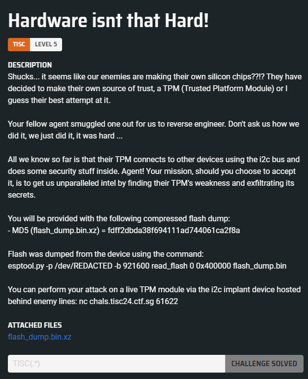
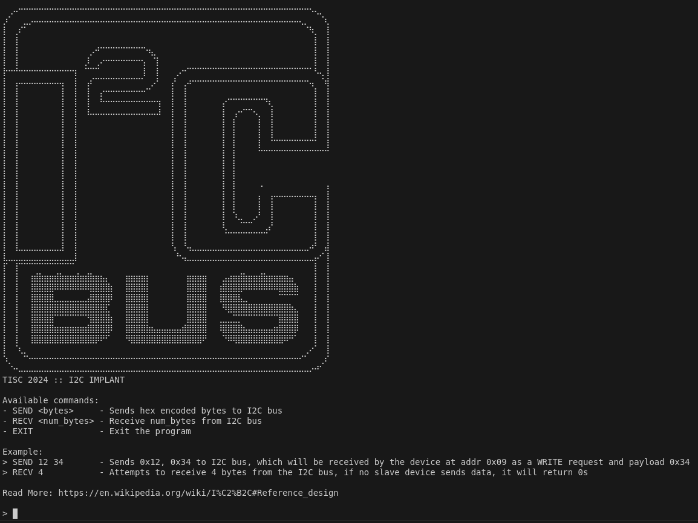
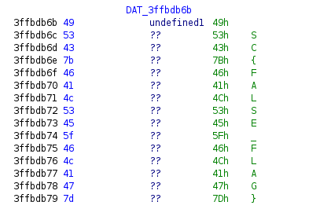
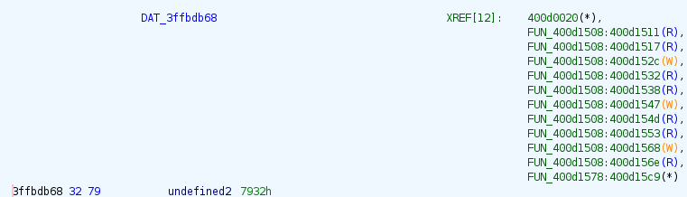
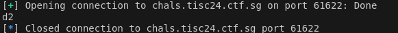
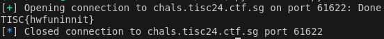

# Level 05 - Hardware isnt that Hard!



## Analysis

From the challenge description, we are provided with a flash dump generated using `esptool.py`, along with the address and port needed to communicate with the I2C implant device via `nc`. If we connect to our implant device using `nc`, we receive the following output, which describes the available commands and shown examples on how to use them:



### Understanding how to send data to the I2C bus

The `nc` server also provided an example and a link to the [I2C Reference Design](https://en.wikipedia.org/wiki/I%C2%B2C#Reference_design) to guide us in interacting with the I2C bus.

As quoted:

> The controller is initially in controller transmit mode by sending a START followed by the 7-bit address of the target it wishes to communicate with, which is finally followed by a single bit representing whether it wishes to write (0) to or read (1) from the target.

This means we need to identify two bytes to communicate with the slave: the address of the slave and the data to be sent to the I2C bus. We will send two requests to our implant: one with byte `x` (write) and one with byte `x + 1` (read). The final step is determining which data byte we should send to the I2C bus.

Here is the format:

```
SEND <7-bit slave addr><0 as the last bit><data byte> // implant sends data to the slave
SEND <7-bit slave addr><1 as the last bit> // implant recvs data from the slave
RECV <no. of bytes> // recvs data from the implant
```

With this information, it becomes straightforward to figure out the slave address by brute-forcing the entire first byte of the `SEND` command and observing the response.

### Reversing `flash_dump.bin`

We can attempt to reverse-engineer the flash dump for further analysis, which will hopefully help us determine the correct data byte to send.

We can decompress the attached `.xz` archive using the following command:

```sh
xz --decompress flash_dump.bin.xz
```

As mentioned in the challenge description, the flash dump was created using `esptool.py` with the following command:

```sh
esptool.py -p /dev/REDACTED -b 921600 read_flash 0 0x400000 flash_dump.bin.
```

According to this [article](https://jmswrnr.com/blog/hacking-a-smart-home-device), the tool [esp32knife](https://github.com/BlackVS/esp32knife) supports reformatting the binary partition image for the application into an ELF format. This conversion helps Ghidra better understand the input binary, making the analysis process easier.

The command to convert `flash_dump.bin` into an ELF file is as follows:

```sh
esp32knife.py --chip=esp32 load_from_file flash_dump.bin
```

Output:

```
Prepare output directories:
- removing old directory: parsed
- creating directory: parsed
Reading firmware from: flash_dump.bin
Warning: some reserved header fields have non-zero values. This image may be from a newer esptool.py?
Writing bootloader to: parsed/bootloader.bin
Bootloader image info:
=================================================================================
Warning: some reserved header fields have non-zero values. This image may be from a newer esptool.py?
Image version: 1
Entry point: 400805f0
real partition size: 18992
secure_pad: None
flash_mode: 2
flash_size_freq: 47
3 segments

Segment 1 : len 0x00540 load 0x3fff0030 file_offs 0x00000018 include_in_checksum=True BYTE_ACCESSIBLE,DRAM,DIRAM_DRAM
Segment 2 : len 0x0368c load 0x40078000 file_offs 0x00000560 include_in_checksum=True CACHE_APP
Segment 3 : len 0x00e10 load 0x40080400 file_offs 0x00003bf4 include_in_checksum=True IRAM
Checksum: f9 (valid)
Validation Hash: 92a2d60d63e987bbf4d53c262c9380526f73766f436d7673804a06132db94064 (valid)
Warning: some reserved header fields have non-zero values. This image may be from a newer esptool.py?
Segment at addr=0x3fff0030 => {'BYTE_ACCESSIBLE', 'DIRAM_DRAM', 'DRAM'} => .dram0.data
Segment at addr=0x40078000 => {'CACHE_APP'} => .iram_loader.text
Segment at addr=0x40080400 => {'IRAM'} => .iram0.text

Adding program headers
prg_seg 0 : 3fff0030 00000540 rw .dram0.data
prg_seg 1 : 40078000 0000368c rx .iram_loader.text
prg_seg 2 : 40080400 00000e10 rwx .iram0.text
Program Headers:
Type  Offset    VirtAddr  PhysAddr  FileSize  MemSize  Flg Align
 1    000001c1  3fff0030  3fff0030  00000540  00000540  6  1000
 1    00000701  40078000  40078000  0000368c  0000368c  5  1000
 1    00003d8d  40080400  40080400  00000e10  00000e10  7  1000

Writing ELF to parsed/bootloader.bin.elf...
=================================================================================

Partition table found at: 8000
Verifying partitions table...
Writing partitions table to: parsed/partitions.csv
Writing partitions table to: parsed/partitions.bin
PARTITIONS:
   0  nvs      DATA:nvs   off=0x00009000 sz=0x00005000  parsed/part.0.nvs
      Parsing NVS partition: parsed/part.0.nvs to parsed/part.0.nvs.cvs
      Parsing NVS partition: parsed/part.0.nvs to parsed/part.0.nvs.txt
      Parsing NVS partition: parsed/part.0.nvs to parsed/part.0.nvs.json
   1  otadata  DATA:ota   off=0x0000e000 sz=0x00002000  parsed/part.1.otadata
   2  app0     APP :ota_0 off=0x00010000 sz=0x00140000  parsed/part.2.app0
   3  app1     APP :ota_1 off=0x00150000 sz=0x00140000  parsed/part.3.app1
   4  spiffs   DATA:spiffs off=0x00290000 sz=0x00160000  parsed/part.4.spiffs
   5  coredump DATA:coredump off=0x003f0000 sz=0x00010000  parsed/part.5.coredump

APP PARTITIONS INFO:
=================================================================================
Partition  app0     APP :ota_0 off=0x00010000 sz=0x00140000
-------------------------------------------------------------------
Warning: some reserved header fields have non-zero values. This image may be from a newer esptool.py?
Image version: 1
Entry point: 40082980
real partition size: 275040
secure_pad: None
flash_mode: 2
flash_size_freq: 47
5 segments

Segment 1 : len 0x0d258 load 0x3f400020 file_offs 0x00000018 include_in_checksum=True DROM
  DROM, app data: secure_version = 0000 app_version=esp-idf: v4.4.6 3572900934 project_name=arduino-lib-builder date=Oct  4 2023 time=16:50:20 sdk=v4.4.6-dirty
Segment 2 : len 0x02d98 load 0x3ffbdb60 file_offs 0x0000d278 include_in_checksum=True BYTE_ACCESSIBLE,DRAM
Segment 3 : len 0x23c74 load 0x400d0020 file_offs 0x00010018 include_in_checksum=True IROM
Segment 4 : len 0x01388 load 0x3ffc08f8 file_offs 0x00033c94 include_in_checksum=True BYTE_ACCESSIBLE,DRAM
Segment 5 : len 0x0e204 load 0x40080000 file_offs 0x00035024 include_in_checksum=True IRAM
Checksum: b1 (valid)
Validation Hash: 031e80349dc3bc1767451a0fe50b7502c7ae687e566908e8a6ef682e4da19172 (valid)
Warning: some reserved header fields have non-zero values. This image may be from a newer esptool.py?
Segment at addr=0x3f400020 => {'DROM'} => .flash.rodata
Segment at addr=0x3ffbdb60 => {'BYTE_ACCESSIBLE', 'DRAM'} => .dram0.data
Segment at addr=0x3ffc08f8 => {'BYTE_ACCESSIBLE', 'DRAM'} => .dram0.data
Join segments 0x3ffbdb60 and 0x3ffc08f8
Segment at addr=0x40080000 => {'IRAM'} => .iram0.vectors
Segment at addr=0x400d0020 => {'IROM'} => .flash.text

Adding program headers
prg_seg 0 : 3f400020 0000d258 rw .flash.rodata
prg_seg 1 : 3ffbdb60 00004120 rw .dram0.data
prg_seg 2 : 40080000 0000e204 rx .iram0.vectors
prg_seg 3 : 400d0020 00023c74 rx .flash.text
Program Headers:
Type  Offset    VirtAddr  PhysAddr  FileSize  MemSize  Flg Align
 1    00000214  3f400020  3f400020  0000d258  0000d258  6  1000
 1    0000d46c  3ffbdb60  3ffbdb60  00004120  00004120  6  1000
 1    0001158c  40080000  40080000  0000e204  0000e204  5  1000
 1    0001f790  400d0020  400d0020  00023c74  00023c74  5  1000

Writing ELF to parsed/part.2.app0.elf...
Partition  app1     APP :ota_1 off=0x00150000 sz=0x00140000
-------------------------------------------------------------------
Failed to parse : parsed/part.3.app1
Invalid firmware image magic=0x0
=================================================================================
```

In the generated `parsed/` directory, we get the following list of files, but what we're interested is `part.2.app0.elf`:

```
bootloader.bin       bootloader.bin.map   bootloader.bin.seg3  part.0.nvs       part.0.nvs.txt  part.2.app0.elf   part.2.app0.seg1  part.2.app0.seg4  part.3.app1.info  part.5.coredump
bootloader.bin.elf   bootloader.bin.seg1  knife.log            part.0.nvs.cvs   part.1.otadata  part.2.app0.info  part.2.app0.seg2  part.2.app0.seg5  part.3.app1.map   partitions.bin
bootloader.bin.info  bootloader.bin.seg2  nvs_blob_data        part.0.nvs.json  part.2.app0     part.2.app0.map   part.2.app0.seg3  part.3.app1       part.4.spiffs
```

Now, we can load the `part.2.app0.elf` file into Ghidra for static analysis.

The first step is to identify the flag and work our way backward to determine what input triggers the logic affecting the flag. Within the `.data` section, we found the placeholder flag at `0x3ffbdb6a`:



If we search for cross-references to the flag, we find it in `FUN_400d1614`:

```c
void FUN_400d1614(uint param_1)

{
  byte bVar1;
  int iVar2;
  int iVar3;
  byte bVar4;
  uint uVar5;
  int iVar6;
  int in_WindowStart;
  undefined auStack_30 [12];
  uint uStack_24;

  memw();
  memw();
  uStack_24 = _DAT_3ffc20ec;
  FUN_400d36ec(0x3ffc1ecc,s_i2c_recv_%d_byte(s):_3f400163,param_1);
  iVar2 = (uint)(in_WindowStart == 0) * (int)auStack_30;
  iVar3 = (uint)(in_WindowStart != 0) * (int)(auStack_30 + -(param_1 + 0xf & 0xfffffff0));
  FUN_400d37e0(0x3ffc1cdc,iVar2 + iVar3,param_1);
  FUN_400d2fa8(iVar2 + iVar3,param_1);
  if (0 < (int)param_1) {
    uVar5 = (uint)*(byte *)(iVar2 + iVar3);
    if (uVar5 != 0x52) goto LAB_400d1689;
    memw();
    uRam3ffc1c80 = 0;
  }
  while( true ) {
    uVar5 = uStack_24;
    param_1 = _DAT_3ffc20ec;
    memw();
    memw();
    if (uStack_24 == _DAT_3ffc20ec) break;
    func_0x40082818();
LAB_400d1689:
    if (uVar5 == 0x46) {
      iVar6 = 0;
      do {
        memw();
        bVar1 = (&DAT_3ffbdb6a)[iVar6];
        bVar4 = FUN_400d1508();
        memw();
        *(byte *)(iVar6 + 0x3ffc1c80) = bVar1 ^ bVar4;
        iVar6 = iVar6 + 1;
      } while (iVar6 != 0x10);
    }
    else if (uVar5 == 0x4d) {
      memw();
      uRam3ffc1c80 = DAT_3ffbdb7a;
      memw();
    }
    else if ((param_1 != 1) && (uVar5 == 0x43)) {
      memw();
      bVar1 = *(byte *)(*(byte *)(iVar2 + iVar3 + 1) + 0x3ffbdb09);
      bVar4 = FUN_400d1508();
      memw();
      (&DAT_3ffc1c1f)[*(byte *)(iVar2 + iVar3 + 1)] = bVar1 ^ bVar4;
    }
  }
  return;
}
```

A quick glance we can make an educated guess that the infinite while loop signifies constantly waiting and reading input from the I2C bus, then each condition in the loop reads a byte and execute their own logic. Each condition checks on `uVar5` comparing to a single byte. This could likely answer our question of the data byte. As shown, the condition that compares `0x46` contains logic referencing our flag, `DAT_3ffbdb6a`:

```c
if (uVar5 == 0x46) {
    iVar6 = 0;
    do {
      memw();
      bVar1 = (&DAT_3ffbdb6a)[iVar6];
      bVar4 = FUN_400d1508();
      memw();
      *(byte *)(iVar6 + 0x3ffc1c80) = bVar1 ^ bVar4;
      iVar6 = iVar6 + 1;
    } while (iVar6 != 0x10);
  }
```

It appears that every byte of the flag is stored in `bVar1`, and it is being XOR-ed with `bVar4`, which is the output of `FUN_400d1508`.

This is what `FUN_400d1508` does:

```c
ushort FUN_400d1508(void)

{
  ushort uVar1;

  memw();
  memw();
  uVar1 = DAT_3ffbdb68 << 7 ^ DAT_3ffbdb68;
  memw();
  memw();
  memw();
  uVar1 = uVar1 >> 9 ^ uVar1;
  memw();
  memw();
  memw();
  DAT_3ffbdb68 = uVar1 << 8 ^ uVar1;
  memw();
  memw();
  return DAT_3ffbdb68;
}
```

This function performs a series of bitwise operations on `DAT_3ffbdb68`, then overwrites the value and returns it. `DAT_3ffbdb68` is 2 bytes long with the following value:



It should also be noted that there are numerous references to this address, meaning there is a chance that the value of `DAT_3ffbdb68` gets modified elsewhere and it may not start with `0x7932`.

The function `FUN_400d1508` returns a 2-byte result (`DAT_3ffbdb68`), but it is stored in a 1-byte variable (`bVar1`). This means the result from `FUN_400d1508` will be truncated, removing the most significant byte.

Through the placeholder flag, we know that the format of the flag starts with `TISC{`. So what we can do is once we get the encoded flag via `SEND XX 46`, we take the first byte of the encoded flag, XOR with `T` to figure out the LSB result of `FUN_400d1508`. Then we can just bruteforce the MSB such that when we call FUN_400d1508, our byte should give us `I`. Eventually we will get our flag.
As there could be more than one result when bruteforcing the MSB of the first byte, we can also check if that specific MSB leads us to `I`, `S` and `C` when applying the same algorithm.

Through the placeholder flag, we know that the flag format starts with `TISC{`. Once we obtain the encoded flag via `SEND XX 46`, we can take the first byte of the encoded flag and XOR it with `T` to figure out the least significant byte result of `FUN_400d1508`. Then, we can brute-force the most significant byte such that, when we call `FUN_400d1508`, our byte gives us `I`.

We repeat this process to reveal the full flag. If there is more than one result when brute-forcing the most significant byte of the first byte, we can verify it by checking if that specific MSB leads to `S`, and then to `C` using the same algorithm.

## Solution

The following script attempts to leak the slave address by iterating through the entire first byte of the `SEND` command and observing the response:

```python
from pwn import *

io = remote("chals.tisc24.ctf.sg", 61622)

io.recvuntil(b"Read More:")
io.recvuntil(b"> ")

# leak slave address
for i in range(0, 0xff):
    write_param_1 = hex(i)[2:].zfill(2)
    write_param_2 = 46
    io.sendline(f"SEND {write_param_1} {write_param_2}".encode())
    io.recvuntil(b"> ")

    read_param = hex(i + 1)[2:].zfill(2)
    io.sendline(f"SEND {read_param}".encode())
    io.recvuntil(b"> ")

    io.sendline(b"RECV 16") # just an arbitrary number
    result = io.recvuntil(b"> ").decode().split("\n")[0]
    if result != "00 00 00 00 00 00 00 00 00 00 00 00 00 00 00 00":
        print(write_param_1)
        break
```



Once we know the slave address, we can retrieve the encoded flag and apply the previously mentioned algorithm to leak the subsequent characters:

```python
from pwn import *

DAT_3ffbdb68 = 0x7932

def get_xor_key():
    global DAT_3ffbdb68
    uVar1 = (DAT_3ffbdb68 << 7 ^ DAT_3ffbdb68) & 0xffff
    uVar1 = (uVar1 >> 9 ^ uVar1) & 0xffff
    DAT_3ffbdb68 = (uVar1 << 8 ^ uVar1) & 0xffff
    return DAT_3ffbdb68

io = remote("chals.tisc24.ctf.sg", 61622)

io.recvuntil(b"Read More:")
io.recvuntil(b"> ")
io.sendline(b"SEND D2 46")
io.recvuntil(b"> ")
io.sendline(b"SEND D3")
io.recvuntil(b"> ")
io.sendline(b"RECV 16") # just an arbitrary number
encoded_bytes = io.recvuntil(b"> ").decode().split("\n")[0].split(" ")

# find msb xor key
initial_key_lsb = ord("T") ^ int(encoded_bytes[0], 16)
for i in range(0, 256):
    initial_key = (hex(i)[2:].zfill(2) + hex(initial_key_lsb)[2:].zfill(2))
    DAT_3ffbdb68 = int(initial_key, 16) & 0xffff
    key = get_xor_key()
    if (key & 0xff) ^ ord("I") == int(encoded_bytes[1], 16):
        # may have multiple results, ensure the next letter matches 'S'
        key = get_xor_key()
        if (key & 0xff) ^ ord("S") == int(encoded_bytes[2], 16):
            DAT_3ffbdb68 = int(initial_key, 16) & 0xffff
            break

# print flag
print("T", end="")
for i in range(1, 16):
    key = get_xor_key()
    print(chr((key & 0xff) ^ int(encoded_bytes[i], 16)), end="")
print()
```



The flag is `TISC{hwfuninnit}`.
