# Level 08 - Wallfacer

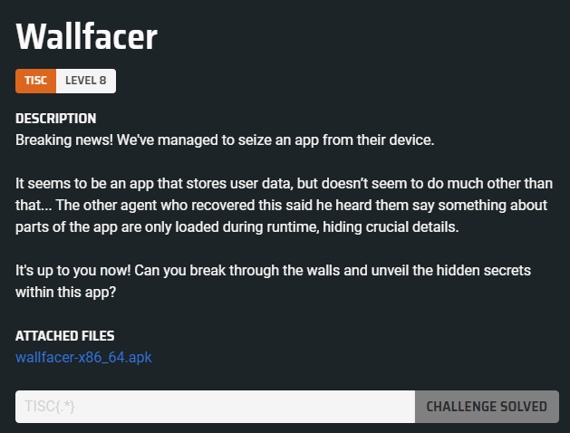

## Solution

Based on the challenge description, this appears to be an Android hacking challenge. We were given an APK file (`wallfacer-x86-64.apk`) and instructed to "break through the walls and unveil the hidden secrets."

We can open the APK in JADX to perform static analysis.

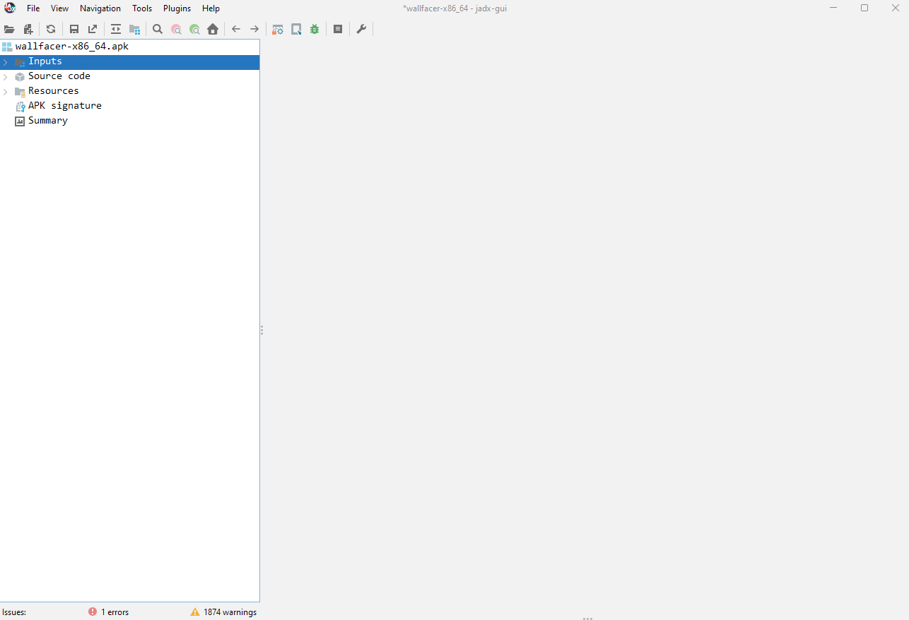

A good starting point is to explore the `AndroidManifest.xml` file, class files, and string references for anything interesting.

Looking at the `AndroidManifest.xml` file, we see two exported activities: `MainActivity` and `query`.

```xml
<activity
    android:name="com.wall.facer.query"
    android:exported="true"/>
<activity
    android:name="com.wall.facer.MainActivity"
    android:exported="true">
    <intent-filter>
        <action android:name="android.intent.action.MAIN"/>
        <category android:name="android.intent.category.LAUNCHER"/>
    </intent-filter>
</activity>
```

Since these two activities are exported, we should keep in mind that we can use intents to directly launch them and potentially discover more functionality in these activities.

This is the Java class for `MainActivity`:

```java
package com.wall.facer;

import android.os.Bundle;
import android.view.View;
import android.widget.EditText;
import defpackage.C0;

/* loaded from: classes.dex */
public class MainActivity extends C0 {
    public EditText y;

    @Override // defpackage.C0, defpackage.O3, android.app.Activity
    public final void onCreate(Bundle bundle) {
        super.onCreate(bundle);
        setContentView(R.layout.activity_main);
        this.y = (EditText) findViewById(R.id.edit_text);
    }

    public void onSubmitClicked(View view) {
        Storage.getInstance().saveMessage(this.y.getText().toString());
    }
}
```

This is the Java class for `Storage`:

```java
package com.wall.facer;

/* loaded from: classes.dex */
public class Storage {
    private static Storage instance;
    private String secretMessage;

    private Storage() {
    }

    public static synchronized Storage getInstance() {
        Storage storage;
        synchronized (Storage.class) {
            try {
                if (instance == null) {
                    instance = new Storage();
                }
                storage = instance;
            } catch (Throwable th) {
                throw th;
            }
        }
        return storage;
    }

    public synchronized String getMessage() {
        return this.secretMessage;
    }

    public synchronized void saveMessage(String str) {
        this.secretMessage = str;
    }
}
```

The `MainActivity` interacts with the `Storage` class, saving its input into the Storage's `secretMessage` variable.

This is the Java class for `query`:

```java
package com.wall.facer;

import android.content.Context;
import android.os.Bundle;
import android.util.Base64;
import android.util.Log;
import android.view.View;
import android.widget.EditText;
import defpackage.C0;
import javax.crypto.Cipher;
import javax.crypto.spec.IvParameterSpec;
import javax.crypto.spec.SecretKeySpec;

/* loaded from: classes.dex */
public class query extends C0 {
    public EditText y;
    public EditText z;

    @Override // defpackage.C0, defpackage.O3, android.app.Activity
    public final void onCreate(Bundle bundle) {
        super.onCreate(bundle);
        setContentView(R.layout.activity_query);
        this.y = (EditText) findViewById(R.id.key_text);
        this.z = (EditText) findViewById(R.id.iv_text);
    }

    public void onSubmitClicked(View view) {
        Context applicationContext = getApplicationContext();
        String obj = this.y.getText().toString();
        String obj2 = this.z.getText().toString();
        try {
            byte[] decode = Base64.decode(applicationContext.getString(R.string.str), 0);
            byte[] bytes = obj.getBytes();
            byte[] bytes2 = obj2.getBytes();
            Cipher cipher = Cipher.getInstance("AES/CBC/PKCS5Padding");
            cipher.init(2, new SecretKeySpec(bytes, "AES"), new IvParameterSpec(bytes2));
            Log.d(getString(R.string.tag), "Decrypted data: ".concat(new String(cipher.doFinal(decode))));
        } catch (Exception unused) {
            Log.e(getString(R.string.tag), "Failed to decrypt data");
        }
    }
}
```

Seems to be performing AES decrypt with specified IV and key. Nothing special...

Apart from that, there is not much more interesting information to exfiltrate from these 3 classes. Next, we can perform dynamic analysis using a rooted Android emulator to see what additional information we can gather.

To begin, we need to install Android Studio and set up a device using the Device Manager, ensuring we select a non-Google Playstore image. This will grant us root privileges.

Once the emulator is running, we can restart our `adbd` with root privileges by executing `adb root` in the terminal. After that, we can install the APK using the command `adb install`:


From there we can explore both activities using the application manager (via `adb shell am`):

We can view both activities using the following commands:

```sh
adb shell am start com.wall.facer/.MainActivity
# OR
adb shell am start com.wall.facer/.query
```

`MainActivity`:

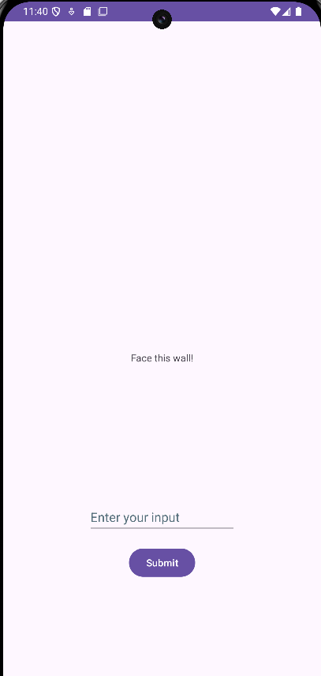

`query`:


Interacting with both activities does not seem to yield any response.

Upon carefully rereading the challenge description, it mentions that:

> The other agent who recovered this said he heard them say something about parts of the app are only loaded during runtime, hiding crucial details.

We can write some Frida scripts to attempt to intercept class loads to find out what is going on. Before doing that, however, we need to set up the `frida-server` in the Android emulator:

```sh
adb push .\frida-server-16.5.2-android-x86_64 /data/local/tmp
adb shell
cd /data/local/tmp
chmod +x ./frida-server-16.5.2-android-x86_64
./frida-server-16.5.2-android-x86_64
```

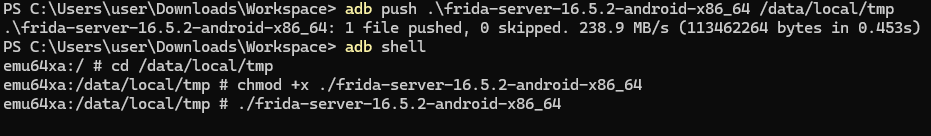

To intercept class loads we can write the following script `monitor_classes.js`:

```js
// monitor_classes.js
Java.perform(function () {
  var ClassLoader = Java.use("java.lang.ClassLoader");

  ClassLoader.loadClass.overload("java.lang.String").implementation = function (className) {
    console.log(className);
    return this.loadClass(className);
  };
});
```

Command:

```sh
frida -U -f com.wall.facer -l .\monitor_classes.js
```

Output:
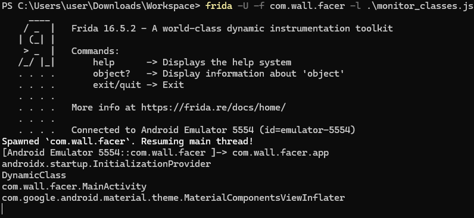

From the results, `DynamicClass` stands out as an unusual class that is being loaded. It cannot be found through static analysis, suggesting that it is likely encoded, then decoded and loaded during runtime. We can use `frida-dexdump` to find and dump the dex from memory, which will hopefully exfiltrate the `DynamicClass` as well.

This can be done by running the following command:

```sh
frida-dexdump -U -f com.wall.facer
```

Output:
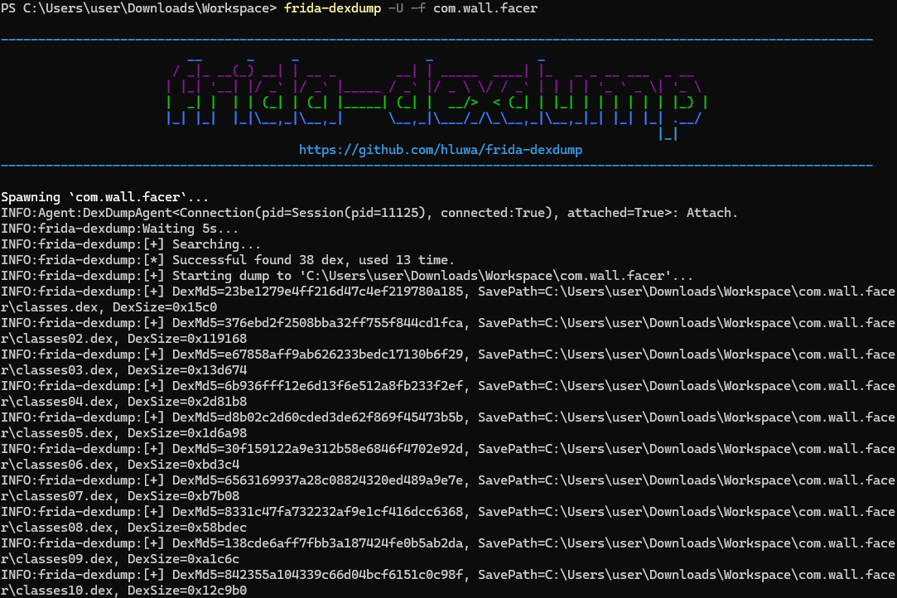

It successfully found and extracted numerous dex files. We can now observe each dex file in `JADX` for further analysis.

Upon opening the first dumped dex file, `classes.dex`, we immediately found `DynamicClass`:

This is the Java class for `DynamicClass`:

```java
package defpackage;

import android.content.Context;
import android.content.res.AssetManager;
import android.content.res.Resources;
import android.os.SystemClock;
import android.util.Base64;
import android.util.Log;
import java.io.File;
import java.io.FileOutputStream;
import java.io.IOException;
import java.io.InputStream;
import java.lang.reflect.InvocationTargetException;
import java.lang.reflect.Method;
import java.util.Arrays;
import java.util.Comparator;

/* loaded from: C:\Users\user\Downloads\Workspace\com.wall.facer\classes.dex */
public class DynamicClass {
    static final /* synthetic */ boolean $assertionsDisabled = false;
    private static final String TAG = "TISC";

    public static native void nativeMethod();

    public static void dynamicMethod(Context context) throws Exception {
        pollForTombMessage();
        Log.i(TAG, "Tomb message received!");
        File generateNativeLibrary = generateNativeLibrary(context);
        try {
            System.load(generateNativeLibrary.getAbsolutePath());
        } catch (Throwable th) {
            String message = th.getMessage();
            message.getClass();
            Log.e(TAG, message);
            System.exit(-1);
        }
        Log.i(TAG, "Native library loaded!");
        if (generateNativeLibrary.exists()) {
            generateNativeLibrary.delete();
        }
        pollForAdvanceMessage();
        Log.i(TAG, "Advance message received!");
        nativeMethod();
    }

    private static void pollForTombMessage() throws ClassNotFoundException, NoSuchMethodException, InvocationTargetException, IllegalAccessException {
        Class<?> cls;
        do {
            SystemClock.sleep(1000L);
            cls = Class.forName("com.wall.facer.Storage");
        } while (!DynamicClass$$ExternalSyntheticBackport1.m((String) cls.getMethod("getMessage", new Class[0]).invoke(cls.getMethod("getInstance", new Class[0]).invoke(null, new Object[0]), new Object[0]), "I am a tomb"));
    }

    private static void pollForAdvanceMessage() throws ClassNotFoundException, NoSuchMethodException, InvocationTargetException, IllegalAccessException {
        Class<?> cls;
        do {
            SystemClock.sleep(1000L);
            cls = Class.forName("com.wall.facer.Storage");
        } while (!DynamicClass$$ExternalSyntheticBackport1.m((String) cls.getMethod("getMessage", new Class[0]).invoke(cls.getMethod("getInstance", new Class[0]).invoke(null, new Object[0]), new Object[0]), "Only Advance"));
    }

    public static File generateNativeLibrary(Context context) throws ClassNotFoundException, NoSuchMethodException, InvocationTargetException, IllegalAccessException, IOException {
        AssetManager assets = context.getAssets();
        Resources resources = context.getResources();
        String str = new String(Base64.decode(resources.getString(resources.getIdentifier("dir", "string", context.getPackageName())) + "=", 0));
        String[] list = assets.list(str);
        Arrays.sort(list, new Comparator() { // from class: DynamicClass$$ExternalSyntheticLambda3
            @Override // java.util.Comparator
            public final int compare(Object obj, Object obj2) {
                int m;
                m = DynamicClass$$ExternalSyntheticBackport0.m(Integer.parseInt(((String) obj).split("\\$")[0]), Integer.parseInt(((String) obj2).split("\\$")[0]));
                return m;
            }
        });
        String str2 = new String(Base64.decode(resources.getString(resources.getIdentifier("base", "string", context.getPackageName())), 0));
        File file = new File(context.getFilesDir(), "libnative.so");
        Method method = Class.forName("Oa").getMethod("a", byte[].class, String.class, byte[].class);
        FileOutputStream fileOutputStream = new FileOutputStream(file);
        try {
            for (String str3 : list) {
                InputStream open = assets.open(str + str3);
                byte[] readAllBytes = open.readAllBytes();
                open.close();
                fileOutputStream.write((byte[]) method.invoke(null, readAllBytes, str2, Base64.decode(str3.split("\\$")[1] + "==", 8)));
            }
            fileOutputStream.close();
            return file;
        } catch (Throwable th) {
            try {
                fileOutputStream.close();
            } catch (Throwable th2) {
                Throwable.class.getDeclaredMethod("addSuppressed", Throwable.class).invoke(th, th2);
            }
            throw th;
        }
    }
}
```

Let's understand what `DynamicClass`'s `dynamicMethod` is doing.

As seen from the code, `dynamicMethod` calls `pollForTombMessage`, which constantly waits for `Storage`'s `secretMessage` to be set to `I am a tomb`. Afterward, it generates a shared object named `libnative.so` and loads it into memory. Once loaded, it attempts to delete the shared object, then calls `pollForAdvanceMessage`, which waits for `Storage`'s `secretMessage` to be set to `Only Advance`. Once `secretMessage` is set to `Only Advance`, it calls `nativeMethod`.

We can attempt to exfiltrate the file by hooking `File.delete()` and preventing the file from being deleted if its path contains `libnative.so`. Then, we can trigger the logic to generate the library and exfiltrate the shared object for analysis.

The following Frida script does that:

```js
// prevent_libnative_delete.js
Java.perform(function () {
  var File = Java.use("java.io.File");
  var Context = Java.use("android.content.Context");
  var Files = Java.use("java.nio.file.Files");
  var Paths = Java.use("java.nio.file.Paths");

  // Hook java.io.File.delete()
  File.delete.implementation = function () {
    var filePath = this.getAbsolutePath();
    if (filePath.endsWith("libnative.so")) {
      console.log("Preventing deletion of " + filePath);
      // Return false to indicate that the deletion failed
      return false;
    }
    // Call the original method for other files
    return this.delete();
  };
});
```

Before executing, we can set up `logcat` to observe logs with the `TISC` tag, which is used in `DynamicClass`. In another console, we can run `adb logcat -v brief "TISC *:S"` to monitor the logs.

Command to prevent deletion:

```sh
frida -U -f com.wall.facer -l .\prevent_libnative_delete.js
```

Output:

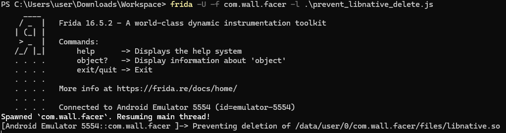

From here, we can exfiltrate `libnative.so` from `/data/user/0/com.wall.facer/files/libnative.so` for further analysis.

```sh
adb pull /data/data/com.wall.facer/files/libnative.so .
```

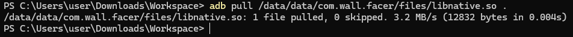

Let's observe the logs when we supply `I am a tomb` and `Only Advance` to see what the normal response looks like.

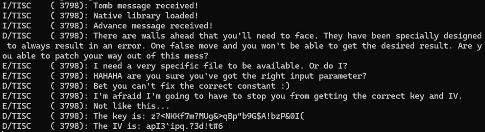

It seems there are a few "walls" as referenced in the output.

The first wall appears to be from:

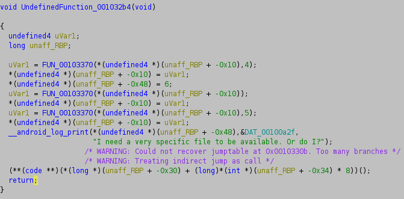

And the file that needs to exist seems to be `/sys/wall/facer`:

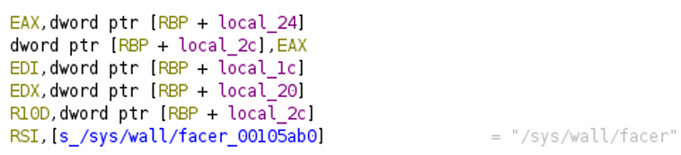

Instead of bypassing this check, we can patch the binary so that the string constant becomes `/tmp/wall/facer`. Afterward, we can create a file at `/tmp/wall/facer`.

The second wall appears to be from:

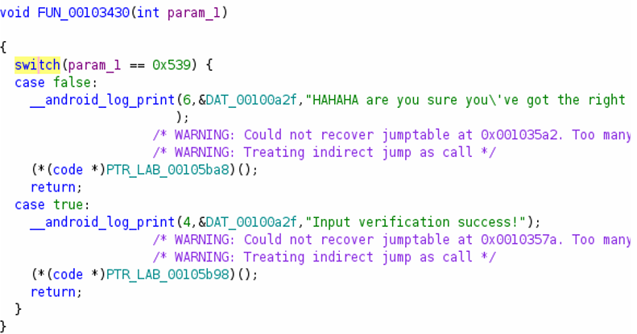

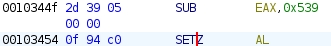

It appears that bypassing the check can be done with a simple flip in the condition. This can be achieved by patching `SETZ` to `SETNZ`.

The third wall appears to be from:

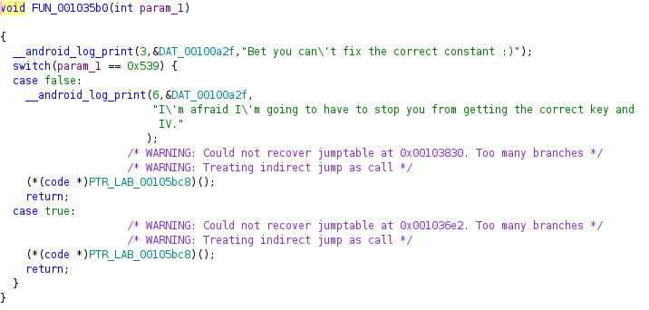

Similarly, we can flip the condition by patching `SETZ` to `SETNZ`.

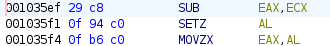

If you follow through the execution, you will eventually arrive at:

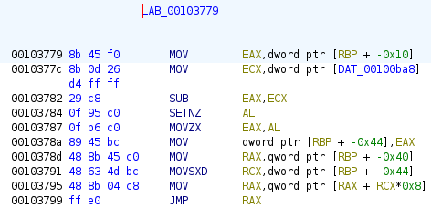

The `SETNZ` byte should also patch to `SETZ`.

The patches so far should cover all walls After patching `libnative.so`, we can push it to our emulator:

```sh
adb push libnative.so /data/local/tmp
```

Next, we can intercept the `getAbsolutePath` method called in `dynamicMethod` to return the path to our patched `libnative.so`, allowing us to load the patched version. The reason for hooking `getAbsolutePath` instead of `System.load` is due to issues encountered when trying to hook the latter method.

```js
// intercept-get-abs-path.js
Java.perform(function () {
  // Hook the java.io.File class
  var File = Java.use("java.io.File");

  // Hook the getAbsolutePath method
  File.getAbsolutePath.implementation = function () {
    // Call the original method to get the original absolute path
    var originalPath = this.getAbsolutePath();

    // Log the original path
    console.log("getAbsolutePath() called. Original Path: " + originalPath);

    // Modify the path if necessary (optional)
    // Example: If the path contains "libnative.so", redirect it to another location
    if (originalPath.indexOf("libnative.so") !== -1) {
      var modifiedPath = "/data/local/tmp/libnative.so";
      console.log("Modifying path to: " + modifiedPath);
      return modifiedPath; // Return the modified path
    }

    // Return the original path if no modification is needed
    return originalPath;
  };

  console.log("Hooked getAbsolutePath() successfully");
});
```

Command:

```sh
frida -U -f com.wall.facer -l .\intercept-get-abs-path.js
```

By supplying `I am a tomb` and `Only Advance` to the application, this will bypass all the walls and provide the correct key and IV.

From here, we can navigate to the `query` activity and submit the correct key and IV to obtain the flag.

```
D/TISC    (29338): The key is: eU9I93-L9S9Z!:6;:i<9=*=8^JJ748%%
D/TISC    (29338): The IV is: R"VY!5Jn7X16`Ik]
D/TISC    (29338): Decrypted data: The flag is: TISC{1_4m_y0ur_w4llbr34k3r_!i#Leb}
```

The flag is `TISC{1_4m_y0ur_w4llbr34k3r_!i#Leb}`.
